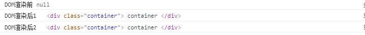

# vue3前置

## 01-为什么学vue3

> 目标：了解vue3现状，以及它的优点，展望它的未来

Vue3现状：

-  [vue-next](https://github.com/vuejs/vue-next/) 2020年09月18日，正式发布vue3.0版本。但是由于刚发布周边生态不支持，大多数开发者处于观望。
- 现在主流组件库都已经发布了支持vue3.0的版本，其他生态也在不断地完善中，这是趋势。
  - [element-plus](https://element-plus.org/#/zh-CN)   基于 Vue 3.0 的桌面端组件库 
  - [vant](https://vant-contrib.gitee.io/vant/v3/#/zh-CN)  vant3.0版本，有赞前端团队开源移动端组件库 
  - [ant-design-vue](https://2x.antdv.com/components/overview/)   Ant Design Vue 2.0版本，社区根据蚂蚁 ant design 开发


Vue3优点：

- 最火框架，它是国内最火的前端框架之一，[官方文档](https://v3.vuejs.org/)  [中文文档](https://v3.cn.vuejs.org/)
- 性能提升，运行速度事vue2.x的1.5倍左右
- 体积更小，按需编译体积比vue2.x要更小
- 类型推断，更好的支持Ts（typescript）这个也是趋势
- 高级给予，暴露了更底层的API和提供更先进的内置组件
- **★组合API (composition api)**  ，能够更好的组织逻辑，封装逻辑，复用逻辑


Vue3展望：

- 这是趋势，越来越多的企业将来肯定会升级到Vue3.0
- 大型项目，由于对Ts的友好越来越多大型项目可以用Vue3.0


**总结：** 为什么要学 vue3 ?

- 适应市场学习流行的技术提高提升自己竞争力，给自己加薪。


## 02-vite基本使用

> 目标：了解vite是什么，使用vite创建vue项目，用来学习vue3知识

vite是什么：[官方文档](https://cn.vitejs.dev/)

- 它是一个更加轻量（热更新速度快，打包构建速度快）的vue项目脚手架工具。
- 相对于vue-cli它默认安装的插件非常少，随着开发过程依赖增多，需要自己额外配置。
- **所以：** 在单纯学习vue3语法会使用它，后面做项目的时候我们还是使用vue-cli


vite基本使用：

- 创建项目 `npm init vite-app 项目名称`  或者 `yarn create vite-app 项目名称`
- 安装依赖 `npm i` 或者 `yarn `
- 启动项目 `npm run dev`  或者  `yarn dev`


**总结：** vite是什么？

- 使用vite创建项目学习vue3语法，使用vue-cli创建项目正式开发。


## 03-创建vue应用

> 目标：掌握如何创建vue3应用实例

基本步骤：

- 在main.js中导入createApp函数
- 定义App.vue组件，导入main.js
- 使用createApp函数基于App.vue组件创建应用实例
- 挂载至index.html的#app容器


落地代码：

`App.vue`

```vue
<template>
  <div class="container">
    我是根组件
  </div>
</template>
<script>
export default {
  name: 'App'
}
</script>

```

`main.js`

```js
// 创建一个vue应用
// 1. 导入createApp函数
// 2. 编写一个根组件App.vue，导入进来
// 3. 基于根组件创建应用实例
// 4. 挂载到index.html的#app容器

import {createApp} from 'vue'
import App from './App.vue'
const app = createApp(App)
app.mount('#app')
```


**总结：**  如何创建vue应用实例？

- 通过createApp创建应用实例--->扩展功能将来都是在app上进行。


## 04-选项API和组合API

> 目标：理解什么是选项API写法，什么是组合API写法。


什么是选项API写法：`Options ApI`

- 咱们在vue2.x项目中使用的就是 `选项API` 写法
  - 代码风格：data选项写数据，methods选项写函数...，一个功能逻辑的代码分散。
- 优点：易于学习和使用，写代码的位置已经约定好
- 缺点：代码组织性差，相似的逻辑代码不便于复用，逻辑复杂代码多了不好阅读。
- 补充：虽然提供mixins用来封装逻辑，但是出现数据函数覆盖的概率很大，不好维护。

```vue
<template>
  <div class="container">
    <div>鼠标位置：</div>
    <div>X轴：{{x}}</div>
    <div>Y轴：{{y}}</div>
    <hr>
    <div>{{count}} <button @click="add()">自增</button></div>  
  </div>
</template>
<script>
export default {
  name: 'App',
  data () {
    return {
      x: 0,
      y: 0,
      count: 0
    }
  },
  mounted() {
    document.addEventListener('mousemove', this.move)
  },
  methods: {
    move(e) {
      this.x = e.pageX
      this.y = e.pageY
    },
    add () {
        this.count++
    }    
  },
  destroyed() {
    document.removeEventListener('mousemove', this.move)
  }
}
</script>
```


什么是组合API写法：`Compositon API`

- 咱们在vue3.0项目中将会使用 `组合API` 写法
  - 代码风格：一个功能逻辑的代码组织在一起（包含数据，函数...）
- 优点：功能逻辑复杂繁多情况下，各个功能逻辑代码组织再一起，便于阅读和维护
- 缺点：需要有良好的代码组织能力和拆分逻辑能力，PS：大家没问题。
- 补充：为了能让大家较好的过渡到vue3.0的版本来，`也支持vue2.x选项API写法`

```vue
<template>
  <div class="container">
    <div>鼠标位置：</div>
    <div>X轴：{{x}}</div>
    <div>Y轴：{{y}}</div>
    <hr>
    <div>{{count}} <button @click="add()">自增</button></div>  
  </div>
</template>
<script>
import { onMounted, onUnmounted, reactive, ref, toRefs } from 'vue'
export default {
  name: 'App',
  setup () {
    // 鼠标移动逻辑
    const mouse = reactive({
      x: 0,
      y: 0
    })
    const move = e => {
      mouse.x = e.pageX
      mouse.y = e.pageY
    }
    onMounted(()=>{
      document.addEventListener('mousemove',move)
    })
    onUnmounted(()=>{
      document.removeEventListener('mousemove',move)
    })

    // 累加逻辑
    const count = ref(0)
    const add = () => {
      count.value ++ 
    }

    // 返回数据
    return {
      ...toRefs(mouse),
      count,
      add
    }
  }
}
</script>
```


**总结：** 

- 知道选项API和组合API的写法区别，建议大家使用组合API在vue3.0项目中。


## 05-组合API-setup函数

> 目标：掌握setup函数的基本使用

使用细节：

- `setup` 是一个新的组件选项，作为组件中使用组合API的起点。
- 从组件生命周期来看，它的执行在组件实例创建之前`vue2.x的beforeCreate`执行。
- 这就意味着在`setup`函数中 `this` 还不是组件实例，`this` 此时是 `undefined`
- 在模版中需要使用的数据和函数，需要在 `setup` 返回。


演示代码：

```vue
<template>
  <div class="container">
    <h1 @click="say()">{{msg}}</h1>
  </div>
</template>
<script>
export default {
  setup () {
    console.log('setup执行了')
    console.log(this)
    // 定义数据和函数
    const msg = 'hi vue3'
    const say = () => {
      console.log(msg)
    }

    return { msg , say}
  },
  beforeCreate() {
    console.log('beforeCreate执行了')
    console.log(this)
  }
}
</script>
```


**总结：** `setup` 组件初始化之前执行，它返回的数据和函数可在模版使用。


## 06-组合API-生命周期

> 目标：掌握使用组合API写法的生命周期钩子函数


回顾vue2.x生命周期钩子函数：

- beforeCreate  
- created
- beforeMount 
- mounted
- beforeUpdate
- updated
- beforeDestroy
- destroyed


认识vue3.0生命周期钩子函数

- `setup` 创建实例前
- `onBeforeMount`  挂载DOM前
- `onMounted` 挂载DOM后
- `onBeforeUpdate` 更新组件前
- `onUpdated` 更新组件后
- `onBeforeUnmount` 卸载销毁前
- `onUnmounted`  卸载销毁后


演示代码：

```vue
<template>
  <div class="container">
    container
  </div>
</template>
<script>
import { onBeforeMount, onMounted } from 'vue'
export default {
  setup () {
    onBeforeMount(()=>{
      console.log('DOM渲染前',document.querySelector('.container'))
    })
    onMounted(()=>{
      console.log('DOM渲染后1',document.querySelector('.container'))
    })
    onMounted(()=>{
      console.log('DOM渲染后2',document.querySelector('.container'))
    })
  },
}
</script>
```




**总结：** 组合API的生命周期钩子有7个，可以多次使用同一个钩子，执行顺序和书写顺序相同。


## 07-组合API-reactive函数

> 目标：掌握使用reactive函数定义响应式数据

定义响应式数据：

- reactive是一个函数，它可以定义一个复杂数据类型，成为响应式数据。


演示代码：

```vue
<template>
  <div class="container">
    <div>{{obj.name}}</div>
    <div>{{obj.age}}</div>
    <button @click="updateName">修改数据</button>
  </div>
</template>
<script>
import { reactive } from 'vue'
export default {
  name: 'App',
  setup () {
    // 普通数据
    // const obj = {
    //   name: 'ls',
    //   age: 18
    // }
    const obj = reactive({
      name: 'ls',
      age: 18
    })

    // 修改名字
    const updateName = () => {
      console.log('updateName')
      obj.name = 'zs'
    }

    return { obj ,updateName}
  }
}
</script>

```


**总结：** 通常是用来定义响应式**对象数据**


##  08-组合API-toRef函数

> 目标：掌握使用toRef函数转换响应式对象中**某个**属性为单独响应式数据，并且值是关联的。

定义响应式数据：

- toRef是函数，转换**响应式对象**中**某个**属性为单独响应式数据，并且**值是关联的**。


演示代码：

```vue
<template>
  <div class="container">
    {{name}} <button @click="updateName">修改数据</button>
  </div>
</template>
<script>
import { reactive, toRef } from 'vue'
export default {
  name: 'App',
  setup () {
    // 1. 响应式数据对象
    const obj = reactive({
      name: 'ls',
      age: 10
    })
    console.log(obj)
    // 2. 模板中只需要使用name数据
    // 注意：从响应式数据对象中解构出的属性数据，不再是响应式数据
    // let { name } = obj 不能直接解构，出来的是一个普通数据
    const name = toRef(obj, 'name')
    // console.log(name)
    const updateName = () => {
      console.log('updateName')
      // toRef转换响应式数据包装成对象，value存放值的位置
      name.value = 'zs'
    }

    return {name, updateName}
  }
}
</script>
<style scoped lang="less"></style>

```


使用场景：有一个响应式对象数据，但是模版中只需要使用其中一项数据。


##  09-组合API-toRefs函数

> 目标：掌握使用toRefs函数定义转换响应式中**所有**属性为响应式数据，通常用于解构|展开reactive定义对象。


定义响应式数据：

- toRefs是函数，转换**响应式对象**中所有属性为单独响应式数据，对象成为普通对象，并且**值是关联的**


演示代码：

```vue
<template>
  <div class="container">
    <div>{{name}}</div>
    <div>{{age}}</div>
    <button @click="updateName">修改数据</button>
  </div>
</template>
<script>
import { reactive, toRef, toRefs } from 'vue'
export default {
  name: 'App',
  setup () {
    // 1. 响应式数据对象
    const obj = reactive({
      name: 'ls',
      age: 10
    })
    console.log(obj)
    // 2. 解构或者展开响应式数据对象
    // const {name,age} = obj
    // console.log(name,age)
    // const obj2 = {...obj}
    // console.log(obj2)
    // 以上方式导致数据就不是响应式数据了
    const obj3 = toRefs(obj)
    console.log(obj3)

    const updateName = () => {
      // obj3.name.value = 'zs'
      obj.name = 'zs'
    }

    return {...obj3, updateName}
  }
}
</script>
<style scoped lang="less"></style>

```


使用场景：剥离响应式对象（解构|展开），想使用响应式对象中的多个或者所有属性做为响应式数据。


## 10-组合API-ref函数

> 目标：掌握使用ref函数定义响应式数据，一般用于简单类型数据

定义响应式数据：

- ref函数，常用于简单数据类型定义为响应式数据
  - 再修改值，获取值的时候，需要.value
  - 在模板中使用ref申明的响应式数据，可以省略.value


演示代码：

```vue
<template>
  <div class="container">
    <div>{{name}}</div>
    <div>{{age}}</div>
    <button @click="updateName">修改数据</button>
  </div>
</template>
<script>
import { ref } from 'vue'
export default {
  name: 'App',
  setup () {
    // 1. name数据
    const name = ref('ls')
    console.log(name)
    const updateName = () => {
      name.value = 'zs'
    }
    // 2. age数据
    const age = ref(10)

    // ref常用定义简单数据类型的响应式数据
    // 其实也可以定义复杂数据类型的响应式数据
    // 对于数据未之的情况下 ref 是最适用的
    // const data = ref(null)
    // setTimeout(()=>{
    //   data.value = res.data
    // },1000)

    return {name, age, updateName}
  }
}
</script>

```


**使用场景：**

- **当你明确知道需要的是一个响应式数据  *对象*  那么就使用 reactive 即可**
- **其他情况使用ref**


## 11-知识运用案例

> 目标：利用所学知识完成组合API实例

基本步骤：

- 记录鼠标坐标
  - 定义一个响应式数据对象，包含x和y属性。
  - 在组件渲染完毕后，监听document的鼠标移动事件
  - 指定move函数为事件对应方法，在函数中修改坐标
  - 在setup返回数据，模版中使用
- 累加1功能
  - 定义一个简单数据类型的响应式数据
  - 定义一个修改数字的方法
  - 在setup返回数据和函数，模板中使用


落的代码：

```vue
<template>
  <div class="container">
    <div>坐标</div>
    <div>x: {{x}}</div>
    <div>y: {{y}}</div>
    <hr>
    <div>{{count}} <button @click="add">累加1</button></div>
  </div>
</template>
<script>
import { onMounted, onUnmounted, reactive , ref, toRefs} from 'vue'
const useMouse = () => {
    // 1. 记录鼠标坐标
    // 1.1 申明一个响应式数据，他是一个对象，包含x y
    const mouse = reactive({
      x: 0,
      y: 0
    })
    // 1.3 修改响应式数据
    const move = (e) => {
      mouse.x = e.pageX
      mouse.y = e.pageY
    }
    // 1.2 等dom渲染完毕。去监听事件
    onMounted(()=>{
      document.addEventListener('mousemove', move)
    })
    // 1.4 组件消耗，删除事件
    onUnmounted(()=>{
      document.removeEventListener('mousemove', move)
    })

    return mouse
}
export default {
  name: 'App',
  setup () {

    const mouse = useMouse()

    // 2. 数字累加
    const count = ref(0) 
    const add = () => {
      count.value ++
    }


    return { ...toRefs(mouse), count, add }
  }
}
</script>
<style scoped lang="less"></style>

```


**总结：** 体会组合API的写法，尝试组织可读性高的代码。


## 12-组合API-computed函数

> 目标：掌握使用computed函数定义计算属性

定义计算属性：

- computed函数，是用来定义计算属性的，计算属性不能修改。


基本使用：

```vue
<template>
  <div class="container">
    <div>今年：{{age}}岁</div>
    <div>后年：{{newAge}}岁</div>
  </div>
</template>
<script>
import { computed, ref } from 'vue'
export default {
  name: 'App',
  setup () {
    // 1. 计算属性：当你需要依赖现有的响应式数据，根据一定逻辑得到一个新的数据。
    const age = ref(16)
    // 得到后年的年龄
    const newAge = computed(()=>{
      // 该函数的返回值就是计算属性的值
      return age.value + 2
    })

    return {age, newAge}
  }
}
</script>
```

高级用法：

````vue
<template>
  <div class="container">
    <div>今年：{{age}}岁</div>
    <div>后年：{{newAge}}岁</div>
    <!-- 使用v-model绑定计算属性 -->
    <input type="text" v-model="newAge">
  </div>
</template>
<script>
import { computed, ref } from 'vue'
export default {
  name: 'App',
  setup () {
    // 1. 计算属性：当你需要依赖现有的响应式数据，根据一定逻辑得到一个新的数据。
    const age = ref(16)
    // 得到后年的年龄
    // const newAge = computed(()=>{
    //   // 该函数的返回值就是计算属性的值
    //   return age.value + 2
    // })

    // 计算属性高级用法，传人对象
    const newAge = computed({
      // get函数，获取计算属性的值
      get(){
        return age.value + 2
      },
      // set函数，当你给计算属性设置值的时候触发
      set (value) {
        age.value = value - 2
      }
    })


    return {age, newAge}
  }
}
</script>
````

目的：让计算属性支持双向数据绑定。


总结：计算属性两种用法

- 给computed传入函数，返回值就是计算属性的值
- 给computed传入对象，get获取计算属性的值，set监听计算属性改变。


## 13-组合API-watch函数

> 目标：掌握使用watch函数定义侦听器

定义计算属性：

- watch函数，是用来定义侦听器的


监听ref定义的响应式数据

监听多个响应式数据数据

监听reactive定义的响应式数据

监听reactive定义的响应式数据，某一个属性

深度监听

默认执行

```js
<template>
  <div class="container">
    <div>
      <p>count的值：{{count}}</p>
      <button @click="add">改数据</button>
    </div>
    <hr>
    <div>
      <p>{{obj.name}}</p>
      <p>{{obj.age}}</p>
      <p>{{obj.brand.name}}</p>
      <button @click="updateName">改名字</button>
      <button @click="updateBrandName">改品牌名字</button>
    </div>
  </div>
</template>
<script>
import { reactive, ref, watch } from 'vue'
export default {
  name: 'App',
  setup () {
    const count = ref(0)
    const add = () => {
      count.value++
    }
    // 当你需要监听数据的变化就可以使用watch
    // 1. 监听一个ref数据
    // 1.1 第一个参数  需要监听的目标
    // 1.2 第二个参数  改变后触发的函数
    // watch(count, (newVal,oldVal)=>{
    //   console.log(newVal,oldVal)
    // })


    const obj = reactive({
      name: 'ls',
      age: 10,
      brand: {
        id: 1,
        name: '宝马'
      }
    })
    const updateName = () => {
      obj.name = 'zs'
    }
    const updateBrandName = () => {
      obj.brand.name = '奔驰'
    }
    // 2. 监听一个reactive数据
    watch(obj, ()=>{
      console.log('数据改变了')
    })

    watch(()=>obj.brand, ()=>{
      console.log('brand数据改变了')
    },{
      // 5. 需要深度监听
      deep: true,
      // 6. 想默认触发
      immediate: true
    })

    // 3. 监听多个数据的变化
    // watch([count, obj], ()=>{
    //   console.log('监听多个数据改变了')
    // }) 


    // 4. 此时监听对象中某一个属性的变化 例如：obj.name 
    // 需要写成函数返回该属性的方式才能监听到
    // watch(()=>obj.name,()=>{
    //   console.log('监听obj.name改变了')
    // })

    return {count, add, obj, updateName, updateBrandName}
  }
}
</script>
```


**总结：** 掌握watch的各种用法。


## 14-组合API-ref属性

> 目标：掌握使用ref属性绑定DOM或组件

获取DOM或者组件实例可以使用ref属性，写法和vue2.0需要区分开

获取单个DOM或者组件

```vue
<template>
  <div class="container">
    <!-- vue2.0 获取单个元素 -->
    <!-- 1. 通过ref属性绑定该元素 -->
    <!-- 2. 通过this.$refs.box获取元素 -->
    <!-- <div ref="box">我是box</div> -->
    <!-- vue2.0 获取v-for遍历的多个元素 -->
    <!-- 1. 通过ref属性绑定被遍历元素 -->
    <!-- 2. 通过this.$refs.li 获取所有遍历元素  -->
    <!-- <ul>
      <li v-for="i in 4" :key="i" ref="li">{{i}}</li>
    </ul> -->

    <!-- 单个元素 -->
    <div ref="dom">我是box</div>
    <!-- 被遍历的元素 -->
    <ul>
      <li v-for="i in 4" :key="i" :ref="setDom">第{{i}}LI</li>
    </ul>
  </div>
</template>
<script>
import { onMounted, ref } from 'vue'
export default {
  name: 'App',
  setup () {
    // 1. 获取单个元素
    // 1.1 先定义一个空的响应式数据ref定义的
    // 1.2 setup中返回该数据，你想获取那个dom元素，在该元素上使用ref属性绑定该数据即可。
    const dom = ref(null)
    onMounted(()=>{
       console.log(dom.value)
    })
  }
}
</script>
<style scoped lang="less"></style>

```

获取v-for遍历的DOM或者组件

```js
    // 2. 获取v-for遍历的元素
    // 2.1 定义一个空数组，接收所有的LI
    // 2.2 定义一个函数，往空数组push DOM
    const domList = []
    const setDom = (el) => {
      domList.push(el)
    }
    onMounted(()=>{
      console.log(domList)
    })
    return {dom, setDom}
```


**总结：**  

- 单个元素：先申明ref响应式数据，返回给模版使用，通过ref绑定数据

- 遍历的元素：先定义一个空数组，定一个函数获取元素，返回给模版使用，通过ref绑定这个函数

  - 有一个边界问题：组件更新的时候会重复的设置dom元素给数组：

  ```js
      // ref获取v-for遍历的DOM元素，需要在组件更新的时候重置接受dom元素的数组。
      onBeforeUpdate(()=>{
        list = []
      })
  ```

  


## 15-组合API-父子通讯

> 目标：掌握使用props选项和emits选项完成父子组件通讯

父传子：

```vue
<template>
  <div class="container">
    <h1>父组件</h1>
    <p>{{money}}</p>
    <hr>
    <Son :money="money" />
  </div>
</template>
<script>
import { ref } from 'vue'
import Son from './Son.vue'
export default {
  name: 'App',
  components: {
    Son
  },
  // 父组件的数据传递给子组件
  setup () {
    const money = ref(100)
    return { money }
  }
}
</script>

```

```vue
<template>
  <div class="container">
    <h1>子组件</h1>
    <p>{{money}}</p>
  </div>
</template>
<script>
import { onMounted } from 'vue'
export default {
  name: 'Son',
  // 子组件接收父组件数据使用props即可
  props: {
    money: {
      type: Number,
      default: 0
    }
  },
  setup (props) {
    // 获取父组件数据money
    console.log(props.money)
  }
}
</script>

```


子传父：

```diff
<template>
  <div class="container">
    <h1>父组件</h1>
    <p>{{money}}</p>
    <hr>
+    <Son :money="money" @change-money="updateMoney" />
  </div>
</template>
<script>
import { ref } from 'vue'
import Son from './Son.vue'
export default {
  name: 'App',
  components: {
    Son
  },
  // 父组件的数据传递给子组件
  setup () {
    const money = ref(100)
+    const updateMoney = (newMoney) => {
+      money.value = newMoney
+    }
+    return { money , updateMoney}
  }
}
</script>

```

```diff
<template>
  <div class="container">
    <h1>子组件</h1>
    <p>{{money}}</p>
+    <button @click="changeMoney">花50元</button>
  </div>
</template>
<script>
import { onMounted } from 'vue'
export default {
  name: 'Son',
  // 子组件接收父组件数据使用props即可
  props: {
    money: {
      type: Number,
      default: 0
    }
  },
  // props 父组件数据
  // emit 触发自定义事件的函数
+  setup (props, {emit}) {
    // 获取父组件数据money
    console.log(props.money)
    // 向父组件传值
+    const changeMoney = () => {
      // 消费50元
      // 通知父组件，money需要变成50
+      emit('change-money', 50)
+    }
+    return {changeMoney}
  }
}
</script>

```


扩展：

- 在vue2.x的时候 `.sync`  除去v-model实现双向数据绑定的另一种方式

```vue
<!-- <Son :money='money' @update:money="fn"  /> -->
<Son :money.sync='money'  />
```

- 在vue3.0的时候，使用 `v-model:money="money"`  即可

```vue
    <!-- <Son :money="money" @update:money="updateMoney" /> -->
    <Son v-model:money="money" />
```


**总结：**

- 父传子：在setup种使用props数据  `setup(props){ // props就是父组件数据  }`
- 子传父：触发自定义事件的时候emit来自 `setup(props,{emit}){ // emit 就是触发事件函数 }`
- 在vue3.0中 `v-model` 和 `.sync`  已经合并成  `v-model` 指令


## 16-组合API-依赖注入

> 目标：掌握使用provide函数和inject函数完成后代组件数据通讯

使用场景：有一个父组件，里头有子组件，有孙组件，有很多后代组件，共享父组件数据。


演示代码：

````vue
<template>
  <div class="container">
    <h1>父组件 {{money}} <button @click="money=1000">发钱</button></h1>
    <hr>
    <Son />
  </div>
</template>
<script>
import { provide, ref } from 'vue'
import Son from './Son.vue'
export default {
  name: 'App',
  components: {
    Son
  },
  setup () {
    const money = ref(100)
    const changeMoney = (saleMoney) => {
      console.log('changeMoney',saleMoney)
      money.value = money.value - saleMoney
    }
    // 将数据提供给后代组件 provide
    provide('money', money)
    // 将函数提供给后代组件 provide
    provide('changeMoney', changeMoney)

    return { money }
  }
}
</script>
<style scoped lang="less"></style>

````

```vue
<template>
  <div class="container">
    <h2>子组件 {{money}}</h2>
    <hr>
    <GrandSon />
  </div>
</template>
<script>
import { inject } from 'vue'
import GrandSon from './GrandSon.vue'
export default {
  name: 'Son',
  components: {
    GrandSon
  },
  setup () {
    // 接收祖先组件提供的数据
    const money = inject('money')
    return { money }
  }
}
</script>
<style scoped lang="less"></style>

```

```vue
<template>
  <div class="container">
    <h3>孙组件 {{money}} <button @click="fn">消费20</button></h3>
  </div>
</template>
<script>
import { inject } from 'vue'
export default {
  name: 'GrandSon',
  setup () {
    const money = inject('money')
    // 孙组件，消费50，通知父组件App.vue组件，进行修改
    // 不能自己修改数据，遵循单选数据流原则，大白话：数据谁定义谁修改
    const changeMoney = inject('changeMoney')
    const fn = () => {
      changeMoney(20)
    }
    return {money, fn}
  }
}
</script>
<style scoped lang="less"></style>

```


**总结：**  

- provide函数提供数据和函数给后代组件使用
- inject函数给当前组件注入provide提供的数据和函数


## 17-补充-v-model语法糖

> 目标：掌握vue3.0的v-model语法糖原理

在vue2.0中v-mode语法糖简写的代码 `<Son :value="msg"  @input="msg=$event" />`

在vue3.0中v-model语法糖有所调整：`<Son :modelValue="msg"  @update:modelValue="msg=$event" />`


演示代码：

```vue
<template>
  <div class="container">
    <!-- 如果你想获取原生事件事件对象 -->
    <!-- 如果绑定事函数 fn fn(e){ // e 就是事件对象 } -->
    <!-- 如果绑定的是js表达式  此时提供一个默认的变量 $event -->
    <h1 @click="$event.target.style.color='red'">父组件 {{count}}</h1>
    <hr>
    <!-- 如果你想获取自定义事件  -->
    <!-- 如果绑定事函数 fn fn(data){ // data 触发自定义事件的传参 } -->
    <!-- 如果绑定的是js表达式  此时 $event代表触发自定义事件的传参 -->
    <!-- <Son :modelValue="count" @update:modelValue="count=$event" /> -->
    <Son v-model="count" />
  </div>
</template>
<script>
import { ref } from 'vue'
import Son from './Son.vue'
export default {
  name: 'App',
  components: {
    Son
  },
  setup () {
    const count = ref(10)
    return { count }
  }
}
</script>
```

```vue
<template>
  <div class="container">
    <h2>子组件 {{modelValue}} <button @click="fn">改变数据</button></h2>
  </div>
</template>
<script>
export default {
  name: 'Son',
  props: {
    modelValue: {
      type: Number,
      default: 0
    }
  },
  setup (props, {emit}) {
    const fn = () => {
      // 改变数据
      emit('update:modelValue', 100)
    }
    return { fn }
  }
}
</script>
```


**总结：** vue3.0封装组件支持v-model的时候，父传子`:modelValue` 子传父 `@update:modelValue`

**补充：** vue2.0的  `xxx.sync` 语法糖解析  父传子 `:xxx`  子传父  `@update:xxx`  在vue3.0 使用 `v-model:xxx` 代替。


## 18-补充-mixins语法

> 目标：掌握mixins语法的基本使用，vue2.x封装逻辑的方式，vue3.0建议使用组合API

官方话术：

-  混入 (mixin) 提供了一种非常灵活的方式，来分发 Vue 组件中的可复用功能。一个混入对象可以包含任意组件选项。当组件使用混入对象时，所有混入对象的选项将被“混合”进入该组件本身的选项。 


理解全局混入：所有组件混入了这些逻辑代码

```js
// 全局混入 全局mixin
// vue2.0 写法  Vue.mixin({})
app.mixin({
  methods: {
    say () {
      console.log(this.$el,'在mounted中调用say函数')
    }
  },
  mounted () {
    this.say()
  }
})
```

```vue
<template>
  <div class="container1">
    <h1> 作者：周杰伦  <a href="javascript:;">关注</a> </h1>
    <hr>
    <Son />
  </div>
</template>
<script>
import Son from './Son.vue'
export default {
  name: 'App',
  components: {
    Son
  }
}
</script>


```

```vue
<template>
  <div class="container2">
    <h2> 作者：周杰伦  <button>关注</button> </h2>
  </div>
</template>
<script>
export default {
  name: 'Son'
}
</script>
<style scoped lang="less"></style>

```


理解局部混入：通过mixins选项进行混入

```js
// 配置对象
export const followMixin =  {
  data () {
    return {
      loading: false
    }
  },
  methods: {
    followFn () {
      this.loading = true
      // 模拟请求
      setTimeout(()=>{
        // 省略请求代码
        this.loading = false
      },2000)
    }
  }
}
```

```vue
<template>
  <div class="container1">
    <h1> 作者：周杰伦  <a href="javascript:;" @click="followFn">{{loading?'请求中...':'关注'}}</a> </h1>
    <hr>
    <Son />
  </div>
</template>
<script>
import Son from './Son.vue'
import {followMixin} from './mixins'
export default {
  name: 'App',
  components: {
    Son
  },
  mixins: [followMixin]
}
</script>


```

```js
<template>
  <div class="container2">
    <h2> 作者：周杰伦  <button @click="followFn">{{loading?'loading...':'关注'}}</button> </h2>
  </div>
</template>
<script>
import {followMixin} from './mixins'
export default {
  name: 'Son',
  mixins: [followMixin]
}
</script>
<style scoped lang="less"></style>

```


**总结：** 在vue2.0中一些可复用的逻辑可以使用mixins来封装，当是需要考虑逻辑代码冲突问题。vue3.0的组合API很好的解决了这个问题，就不在推荐使用mixins了。


