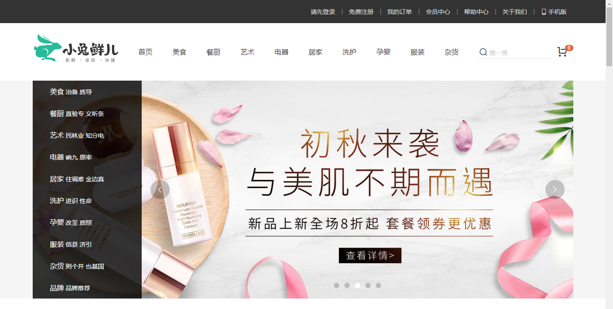

# 项目介绍

## 01-项目介绍

> 目的：了解下项目的基本功能。

- 电商发展十余年，是个成熟的模式，小兔鲜儿是B2C电商平台，综合品类平台。

- 平台理念：（品质）新鲜、（价格）亲民、（物流）快捷。

目标功能：

- 首页模块：顶部通栏，吸顶导航，网站头部，左侧分类，轮播图，新鲜好物，人气推荐，热门品牌，分类商品推荐，专题推荐，网站底部。
- 一级分类：面包屑，轮播图，全部二级分类，二级分类推荐商品。
- 二级分类：筛选区域，排序功能，商品列表，无限加载。
- 商品详情：商品图片展示，基本信息展示，配送城市选择，SKU选择，库存选择，商品详情展示，商品评价展示，24小时热销，相关专题，加入购物车。
- 购物车
  - 头部购物车：展示商品数量和列表，删除商品，跳转购物车页面。
  - 购物车页面：购物车商品展示，选择商品，修改数量，修改商品规格，价格计算，跳转下单
- 登录模块：表单校验，账户密码登录，手机号登录，第三方登录，绑定手机，完善信息
- 填写订单：订单商品展示，收货地址选择，收货地址修改，支付方式选择，生成订单。
- 进行支付：订单信息展示，跳转支付网关，提示正在支付，等待支付结果，跳转支付成功页面。
- 个人中心
  - 中心首页：展示个人信息，近期收藏商品，近期足迹，猜你喜欢
  - 订单管理：全部订单，待付款，待发货，待收货，待评价，已完成，已取消。立即付款，取消订单，确认收货，删除订单，查看物流。
  - 订单详情：订单状态，订单进度，详细信息。

总结：完成电商支付闭环。

## 02-配套资源

> 目的：了解真实企业开发都会有哪些配套资源。

企业开发配套：

- [设计图](https://app.mockplus.cn/app/MLUPlO1_G/design) 
- [原型稿](https://app.mockplus.cn/run/prototype/QO7BCWlUKB/IWlj1dabSw/c-f4gj1smb0?ha=1&ps=1)
- [接口文档](https://mock.boxuegu.com/project/1175/interface/api)

我们学习配套：

- <a href="../api.html" target="_blank">接口文档</a>
- [参照案例vue3.0](http://erabbit.itheima.net/#/) 
- [参照案例vue2.0](http://zhoushugang.gitee.io/erabbit-client-pc/#/)

总结：

- 在学习开发阶段使用本地API文档与vue3.0版本样例。

## 03-使用技术

> 目的：概述下项目会运用到的技术点。

项目基于vue技术来实现，大概会使用以下技术：

- vue3.0  (使用组合api的方式来开发)
- vue-cli  (项目脚手架)
- axios (请求接口)
- vue-router (单页路由)
- vuex (状态管理)
- vuex-persistedstate (vuex数据持久化)
- normalize.css (初始化样式)
- @vueuse/core (组合api常用工具库)
- 算法   [Power Set](https://github.com/zhousg/javascript-algorithms/blob/master/src/algorithms/sets/power-set)  
- dayjs (日期处理)
- vee-validate （表单校验）

**重点：** 电商常见业务和解决方案，掌握基于vue3.0的组合api开发模式。

**说明：** 由于前台项目，没有合适的UI组件库（没有适用vue3.0的ui库），所有组件基本自己封装。

- 轮播图组件
- 面包屑组件  render+createVnode
- 查看更多组件
- 骨架屏组件
- 复选框组件
- 单选框组件
- 对话框组件
- 消息提示组件  函数调用
- 消息确认组件  函数调用
- 分页组件
- 步骤条组件
- 时间线组件
- 标签页组件  render + jsx
- 城市选择组件

总结：基于vue3.0的技术栈，大量的组件封装。

## 04-前情提要

> 目的：说明在学习开发过程当中可能遇到的问题。

1. 后台接口基本完毕，但是数据缺乏（分类，商品），所以会有一些本地mock数据。

2. 采用vuex来管理购物车和用户数据，vuex的使用会淋漓尽致。

3. 使用vue3.0来开发，所以小兔鲜儿项目，会很 `鲜嫩`  `酸爽`  。 但是会慢慢过渡。

4. 重点难点，第三方登，商品详情，购物车，支付结算，订单管理。

5. 绝大多数第三方UI组件，组件库不支持vue3.0，会大量自己封装和布局。有些基本样式会预制好。

   

总结：

- 预告下我们开发的剧情