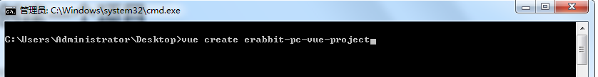
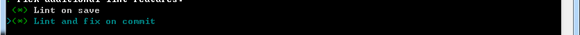

# 项目起步


## 01-创建项目

> 目的：使用vue-cli创建一个vue3.0项目。


第一步：打开命令行窗口。


- 注意，所在目录将会是你创建项目的目录。

第二步：执行创建项目命令行



第三步：选择自定义创建


第四步：选中vue-router,vuex,css Pre-processors选项


第五步：选择vue3.0版本


第六步：选择hash模式的路由


第七步：选择less作为预处理器


第八步：选择 standard 标准代码风格


第九步：保存代码校验代码风格，代码提交时候校验代码风格



第十步：依赖插件或者工具的配置文件分文件保存


第十一步：是否记录以上操作，选择否


第十二步：等待安装...


最后：安装完毕


## 02-目录调整

> 目的：对项目功能模块进行拆分。

大致步骤：

- 删除无用代码和文件
- 完善项目的基础结构
- 读懂默认生成的代码


落的代码：


注意：以上结构目录及供参考


**需要注意的一些文件有：**


- `router/index.js` 

```js
import { createRouter, createWebHashHistory } from 'vue-router'

const routes = [

]

// 创建路由实例
const router = createRouter({
  // 使用hash方式实现路由
  history: createWebHashHistory(),
  // 配置路由规则，写法和之前一样
  routes
})

export default router

```

vue3.0中createRouter来创建路由实例，createWebHashHistory代表使用hash模式的路由。


- `store/index.js`

```js
import { createStore } from 'vuex'

// 创建vuex仓库并导出
export default createStore({
  state: {
    // 数据
  },
  mutations: {
    // 改数据函数
  },
  actions: {
    // 请求数据函数
  },
  modules: {
    // 分模块
  },
  getters: {
    // vuex的计算属性
  }
})
```

vue3.0中createStore来创建vuex实例。


- `main.js`

```js
import { createApp } from 'vue'
import App from './App.vue'
import router from './router'
import store from './store'

// 创建一个vue应用实例
createApp(App).use(store).use(router).mount('#app')
```

vue3.0中createApp来创建应用app。


**额外增加两个配置文件：**


- `jsconfig.json`

```json
{
  "compilerOptions": {
    "baseUrl": ".",
    "paths": {
      "@/*": ["./src/*"],
    }
  },
  "exclude": ["node_modules", "dist"]
}
```

当我们使用路径别名@的时候可以提示路径。


- `.eslintignore`

```js
/dist
/src/vender
```

eslint在做风格检查的时候忽略 dist 和 vender 不去检查。


总结：

- 调整目录，解释生成代码
- 添加配置文件，路径提示，忽略风格校验的。


## 03-vuex-基础

> 目的：知道每个配置作用，根模块vue3.0的用法，带命名空间模块再vue3.0的用法


1. 根模块的用法

定义

```js
vue2.0 创建仓库 new Vuex.Store({})
vue3.0 创建仓库 createStore({})
export default createStore({
  state: {
    username: 'zs'
  },
  getters: {
    newName (state) {
      return state.username + '!!!'
    }
  },
  mutations: {
    updateName (state) {
      state.username = 'ls'
    }
  },
  actions: {
    updateName (ctx) {
      // 发请求
      setTimeout(() => {
        ctx.commit('updateName')
      }, 1000)
    }
  },
  modules: {

  }
})

```

使用

```vue
<template>
  <!-- vue2.0需要根元素，vue3.0可以是代码片段 Fragment -->
  <div>
    App
    <!-- 1. 使用根模块state的数据   -->
    <p>{{$store.state.username}}</p>
    <!-- 2. 使用根模块getters的数据   -->
    <p>{{$store.getters['newName']}}</p>
    <button @click="mutationsFn">mutationsFn</button>
  </div>
</template>
<script>
import { useStore } from 'vuex'
export default {
  name: 'App',
  setup () {
    // 使用vuex仓库
    const store = useStore()
    // 1. 使用根模块state的数据
    console.log(store.state.username)
    // 2. 使用根模块getters的数据
    console.log(store.getters.newName)
    const mutationsFn = () => {
      // 3. 提交根模块mutations函数
      // store.commit('updateName')
      // 4. 调用根模块actions函数
      store.dispatch('updateName')
    }
    return { mutationsFn }
  }
}
</script>
```

2. modules  (分模块)

- 存在两种情况
  - 默认的模块，`state` 区分模块，其他 `getters` `mutations` `actions`  都在全局。
  - 带命名空间  `namespaced: true`  的模块，所有功能区分模块，更高封装度和复用。

```js
import { createStore } from 'vuex'

const moduleA = {
  // 子模块state建议写成函数
  state: () => {
    return {
      username: '模块A'
    }
  },
  getters: {
    changeName (state) {
      return state.username + 'AAAAAA'
    }
  }
}

const moduleB = {
  // 带命名空间的模块
  namespaced: true,
  // 子模块state建议写成函数
  state: () => {
    return {
      username: '模块B'
    }
  },
  getters: {
    changeName (state) {
      return state.username + 'BBBBBB'
    }
  },
  mutations: {
    // 修改名字的mutation
    update (state) {
      state.username = 'BBBB' + state.username
    }
  },
  actions: {
    update ({ commit }) {
      // 假设请求
      setTimeout(() => {
        commit('update')
      }, 2000)
    }
  }
}

// 创建vuex仓库并导出
export default createStore({
  state: {
    // 数据
    person: [
      { id: 1, name: 'tom', gender: '男' },
      { id: 2, name: 'lucy', gender: '女' },
      { id: 3, name: 'jack', gender: '男' }
    ]
  },
  mutations: {
    // 改数据函数
  },
  actions: {
    // 请求数据函数
  },
  modules: {
    // 分模块
    a: moduleA,
    b: moduleB
  },
  getters: {
    // vuex的计算属性
    boys: (state) => {
      return state.person.filter(p => p.gender === '男')
    }
  }
})

```

使用：

```vue
<template>
 <div>APP组件</div>
 <ul>
   <li v-for="item in $store.getters.boys" :key="item.id">{{item.name}}</li>
 </ul>
 <!-- 使用模块A的username -->
 <p>A的username --- {{$store.state.a.username}}</p>
 <p>A的changeName --- {{$store.getters.changeName}}</p>
 <hr>
 <p>B的username --- {{$store.state.b.username}}</p>
 <p>B的changeName --- {{$store.getters['b/changeName']}}</p>
 <button @click="$store.commit('b/update')">修改username</button>
 <button @click="$store.dispatch('b/update')">异步修改username</button>
</template>
```


## 04-vuex-持久化

> 目的：让在vuex中管理的状态数据同时存储在本地。可免去自己存储的环节。


- 在开发的过程中，像用户信息（名字，头像，token）需要vuex中存储且需要本地存储。
- 再例如，购物车如果需要未登录状态下也支持，如果管理在vuex中页需要存储在本地。
- 我们需要category模块存储分类信息，但是分类信息不需要持久化。


1）首先：我们需要安装一个vuex的插件`vuex-persistedstate`来支持vuex的状态持久化。

```bash
npm i vuex-persistedstate
```

2）然后：在`src/store` 文件夹下新建 `modules` 文件，在 `modules` 下新建 `user.js`  和 `cart.js` 

`src/store/modules/user.js`     

```js
// 用户模块
export default {
  namespaced: true,
  state () {
    return {
      // 用户信息
      profile: {
        id: '',
        avatar: '',
        nickname: '',
        account: '',
        mobile: '',
        token: ''
      }
    }
  },
  mutations: {
    // 修改用户信息，payload就是用户信息对象
    setUser (state, payload) {
      state.profile = payload
    }
  }
}

```

`src/store/modules/cart.js  `    

```js
// 购物车状态
export default {
  namespaced: true,
  state: () => {
    return {
      list: []
    }
  }
}
```

`src/store/modules/category.js`

```js
// 分类模块
export default {
  namespaced: true,
  state () {
    return {
      // 分类信息集合
      list: []
    }
  }
}

```


3）继续：在 `src/store/index.js` 中导入 user cart 模块。

```js
import { createStore } from 'vuex'

import user from './modules/user'
import cart from './modules/cart'
import cart from './modules/category'

export default createStore({
  modules: {
    user,
    cart,
    category
  }
})

```

4）最后：使用vuex-persistedstate插件来进行持久化

```diff
import { createStore } from 'vuex'
+import createPersistedstate from 'vuex-persistedstate'

import user from './modules/user'
import cart from './modules/cart'
import cart from './modules/category'

export default createStore({
  modules: {
    user,
    cart,
    category
  },
+  plugins: [
+    createPersistedstate({
+      key: 'erabbit-client-pc-store',
+      paths: ['user', 'cart']
+    })
+  ]
})
```


**注意：**

===> 默认是存储在localStorage中

===> key是存储数据的键名

===> paths是存储state中的那些数据，如果是模块下具体的数据需要加上模块名称，如`user.token`

===> 修改state后触发才可以看到本地存储数据的的变化。


**测试：** user模块定义一个mutation在main.js去调用下，观察浏览器application的localStorage下数据。

`src/App.js`

```js
<template>
  <div class="container">
    <!-- 修改数据，测试是否持久化 -->
    App {{$store.state.user.profile.account}}
    <button @click="$store.commit('user/setUser',{account:'zhousg'})">设置用户信息</button>
  </div>
</template>
<script>
export default {
  name: 'App'
}
</script>

```


## 05-请求工具

> 目的：基于axios封装一个请求工具，调用接口时使用。


- 安装 axios

```bash
npm i axios
```

- 新建 `src/utils/request.js` 模块，代码如下

```js
// 1. 创建一个新的axios实例
// 2. 请求拦截器，如果有token进行头部携带
// 3. 响应拦截器：1. 剥离无效数据  2. 处理token失效
// 4. 导出一个函数，调用当前的axsio实例发请求，返回值promise

import axios from 'axios'
import store from '@/store'
import router from '@/router'

// 导出基准地址，原因：其他地方不是通过axios发请求的地方用上基准地址
export const baseURL = 'http://pcapi-xiaotuxian-front-devtest.itheima.net/'
const instance = axios.create({
  // axios 的一些配置，baseURL  timeout
  baseURL,
  timeout: 5000
})

instance.interceptors.request.use(config => {
  // 拦截业务逻辑
  // 进行请求配置的修改
  // 如果本地又token就在头部携带
  // 1. 获取用户信息对象
  const { profile } = store.state.user
  // 2. 判断是否有token
  if (profile.token) {
    // 3. 设置token
    config.headers.Authorization = `Bearer ${profile.token}`
  }
  return config
}, err => {
  return Promise.reject(err)
})

// res => res.data  取出data数据，将来调用接口的时候直接拿到的就是后台的数据
instance.interceptors.response.use(res => res.data, err => {
  // 401 状态码，进入该函数
  if (err.response && err.response.status === 401) {
    // 1. 清空无效用户信息
    // 2. 跳转到登录页
    // 3. 跳转需要传参（当前路由地址）给登录页码
    store.commit('user/setUser', {})
    // 当前路由地址
    // 组件里头：`/user?a=10` $route.path === /user  $route.fullPath === /user?a=10
    // js模块中：router.currentRoute.value.fullPath 就是当前路由地址，router.currentRoute 是ref响应式数据
    const fullPath = encodeURIComponent(router.currentRoute.value.fullPath)
    // encodeURIComponent 转换uri编码，防止解析地址出问题
    router.push('/login?redirectUrl=' + fullPath)
  }
  return Promise.reject(err)
})

// 请求工具函数
export default (url, method, submitData) => {
  // 负责发请求：请求地址，请求方式，提交的数据
  return instance({
    url,
    method,
    // 1. 如果是get请求  需要使用params来传递submitData   ?a=10&c=10
    // 2. 如果不是get请求  需要使用data来传递submitData   请求体传参
    // [] 设置一个动态的key, 写js表达式，js表达式的执行结果当作KEY
    // method参数：get,Get,GET  转换成小写再来判断
    // 在对象，['params']:submitData ===== params:submitData 这样理解
    [method.toLowerCase() === 'get' ? 'params' : 'data']: submitData
  })
}

```


## 06-路由设计

> 目的：知道项目路由层级的设计


| 路径               | 组件（功能）     | 嵌套级别 |
| ------------------ | ---------------- | -------- |
| /                  | 首页布局容器     | 1级      |
| /                  | 首页             | 2级      |
| /category/:id      | 一级分类         | 2级      |
| /category/sub/:id  | 二级分类         | 2级      |
| /product/:id       | 商品详情         | 2级      |
| /login             | 登录             | 1级      |
| /login/callback    | 第三方登录回调   | 1级      |
| /cart              | 购物车           | 2级      |
| /member/checkout   | 填写订单         | 2级      |
| /member/pay        | 进行支付         | 2级      |
| /member/pay/result | 支付结果         | 2级      |
| /member            | 个人中心布局容器 | 2级      |
| /member            | 个人中心         | 3级      |
| /member/order      | 订单管理         | 3级      |
| /member/order/:id  | 订单详情         | 3级      |


