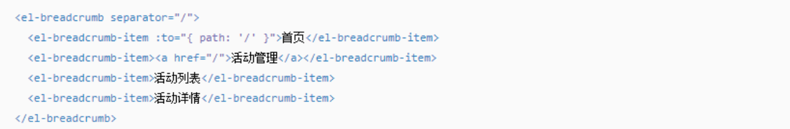

# 商品分类

## 01-顶级类目-面包屑组件-初级

> **目的：**  封装一个简易的面包屑组件，适用于两级场景。

**大致步骤：**

- 准备静态的 `xtx-bread.vue` 组件
- 定义 `props` 暴露 `parentPath`  `parentName`  属性，默认插槽，动态渲染组件
- 在 `library/index.js` 注册组件，使用验证效果。

**落的代码：**

- 基础结构 `src/components/library/xtx-bread.vue`

```vue
<template>
  <div class='xtx-bread'>
    <div class="xtx-bread-item">
      <RouterLink to="/">首页</RouterLink>
    </div>
    <i class="iconfont icon-angle-right"></i>
    <div class="xtx-bread-item">
      <RouterLink to="/category/10000">电器</RouterLink>
    </div>
    <i class="iconfont icon-angle-right"></i>
    <div class="xtx-bread-item">
      <span>空调</span>
    </div>
  </div>
</template>

<script>
export default {
  name: 'XtxBread'
}
</script>

<style scoped lang='less'>
.xtx-bread{
  display: flex;
  padding: 25px 10px;
  &-item {
    a {
      color: #666;
      transition: all .4s;
      &:hover {
        color: @xtxColor;
      }
    }
  }
  i {
    font-size: 12px;
    margin-left: 5px;
    margin-right: 5px;
    line-height: 22px;
  }
}
</style>
```

- 定义props进行渲染  `src/components/library/xtx-bread.vue`

```diff
<template>
  <div class='xtx-bread'>
    <div class="xtx-bread-item">
      <RouterLink to="/">首页</RouterLink>
    </div>
    <i class="iconfont icon-angle-right"></i>
+    <div class="xtx-bread-item" v-if="parentName">
+      <RouterLink v-if="parentPath" :to="parentPath">{{parentName}}</RouterLink>
+      <span v-else>{{parentName}}</span>
+    </div>
+    <i v-if="parentName" class="iconfont icon-angle-right"></i>
    <div class="xtx-bread-item">
+      <span><slot /></span>
    </div>
  </div>
</template>

<script>
export default {
  name: 'XtxBread',
+  props: {
+    parentName: {
+      type: String,
+      default: ''
+    },
+    parentPath: {
+      type: String,
+      default: ''
+    }
+  }
}
</script>
```

- 注册使用  `src/components/library/index.js`

```diff
+import 'XtxBread' from './xtx-bread.vue'

export default {
  install (app) {
+      app.component(XtxBread.name, XtxBread)
```

使用： `<XtxBread parentPath="/category/1005000" parentName="电器">空调</XtxBread>`


**总结：** 采用基本的封装手法，灵活度不是很高。  


## 02-顶级类目-面包屑组件-高级

> **目的：**  封装一个高复用的面包屑组件，适用于多级场景。认识 render 选项和 h 函数。

参考element-ui的面包屑组件：




**大致步骤：**

- 使用插槽和封装选项组件完成面包屑组件基本功能，但是最后一项多一个图标。
- 学习 render 选项，h 函数 的基本使用。
- 通过 render 渲染，h 函数封装面包屑功能。


**落的代码：**

- 我们需要两个组件，`xtx-bread` 和  `xtx-bread-item` 才能完成动态展示。

 定义单项面包屑组件 `src/components/library/xtx-bread-item.vue` 

```vue
<template>
  <div class="xtx-bread-item">
    <RouterLink v-if="to" :to="to"><slot /></RouterLink>
    <span v-else><slot /></span>
    <i class="iconfont icon-angle-right"></i>
  </div>
</template>
<script>
export default {
  name: 'XtxBreadItem',
  props: {
    to: {
      type: [String, Object]
    }
  }
}
</script>

```

 在 `library/index.js`注册

```diff
+import 'XtxBreadItem' from './xtx-bread-item.vue'
export default {
  install (app) {
+      app.component(XtxBreadItem.name, XtxBread)
```

- 过渡版，你发现结构缺少风格图标，如果在item中加上话都会有图标，但是最后一个是不需要的。

```vue
<template>
  <div class='xtx-bread'>
    <slot />
  </div>
</template>

<script>
export default {
  name: 'XtxBread'
}
</script>
<!-- 去掉scoped全局作用 -->
<style lang='less'>
```

```vue
      <!-- 面包屑 -->
      <XtxBread>
        <XtxBreadItem to="/">首页</XtxBreadItem>
        <XtxBreadItem to="/category/1005000">电器</XtxBreadItem>
        <XtxBreadItem >空调</XtxBreadItem>
      </XtxBread>
```


- 终极版，使用render函数自己进行拼接创建。

 [createElement](https://cn.vuejs.org/v2/guide/render-function.html#createElement-%E5%8F%82%E6%95%B0)  [render](https://cn.vuejs.org/v2/api/#render) `render选项与h函数 ` 

- 指定组件显示的内容：`new Vue({选项})`
  - el 选项，通过一个选择器找到容器，容器内容就是组件内容
  - template 选项，`<div>组件内容</div>` 作为组件内容
  - render选项，它是一个函数，函数回默认传人createElement的函数（h），这个函数用来创建结构，再render函数返回渲染为组件内容。它的优先级更高。

```js
//import App from './App.vue'
//new Vue({
//    render:h=>h(App)
//}).mount('#app')
// h() =====>  createElement()
// h(App) =====>  根据APP组件创建html结构
// render的返回值就是html结构，渲染到#app容器
// h() 函数参数，1.节点名称  2. 属性|数据 是对象  3. 子节点
```

`xtx-bread-item.vue`

```diff
<template>
  <div class="xtx-bread-item">
    <RouterLink v-if="to" :to="to"><slot /></RouterLink>
    <span v-else><slot /></span>
-    <i class="iconfont icon-angle-right"></i>
  </div>
</template>
```

`xtx-bread.vue`

```vue
<script>
import { h } from 'vue'
export default {
  name: 'XtxBread',
  render () {
    // 用法
    // 1. template 标签去除，单文件组件
    // 2. 返回值就是组件内容
    // 3. vue2.0 的h函数传参进来的，vue3.0 的h函数导入进来
    // 4. h 第一个参数 标签名字  第二个参数 标签属性对象  第三个参数 子节点
    // 需求
    // 1. 创建xtx-bread父容器
    // 2. 获取默认插槽内容
    // 3. 去除xtx-bread-item组件的i标签，因该由render函数来组织
    // 4. 遍历插槽中的item，得到一个动态创建的节点，最后一个item不加i标签
    // 5. 把动态创建的节点渲染再xtx-bread标签中
    const items = this.$slots.default()
    const dymanicItems = []
    items.forEach((item, i) => {
      dymanicItems.push(item)
      if (i < (items.length - 1)) {
        dymanicItems.push(h('i', { class: 'iconfont icon-angle-right' }))
      }
    })
    return h('div', { class: 'xtx-bread' }, dymanicItems)
  }
}
</script>

<style lang='less'>
// 去除 scoped 属性，目的：然样式作用到xtx-bread-item组件
.xtx-bread{
  display: flex;
  padding: 25px 10px;
  // ul li:last-child {}
  // 先找到父元素，找到所有的子元素，找到最后一个，判断是不是LI，是就是选中，不是就是无效选择器
  // ul li:last-of-type {}
  // 先找到父元素，找到所有的类型为li的元素，选中最后一个
  &-item {
    a {
      color: #666;
      transition: all .4s;
      &:hover {
        color: @xtxColor;
      }
    }
  }
  i {
    font-size: 12px;
    margin-left: 5px;
    margin-right: 5px;
    line-height: 22px;
    // 样式的方式，不合理
    // &:last-child {
    //   display: none;
    // }
  }
}
</style>
```

- 使用代码

```vue
      <!-- 面包屑 -->
      <XtxBread>
        <XtxBreadItem to="/">首页</XtxBreadItem>
        <XtxBreadItem to="/category/1005000">电器</XtxBreadItem>
        <XtxBreadItem >空调</XtxBreadItem>
      </XtxBread>
```


- 总结，一下知识点
  - render 是vue提供的一个渲染函数，优先级大于el,template等选项，用来提供组件结构。
  - 注意：
    - vue2.0  render函数提供h（createElement）函数用来创建节点
    - vue3.0  h（createElement）函数有 vue 直接提供，需要按需导入
  - this.$slots.default() 获取默认插槽的node结构，按照要求拼接结构。
  - h函数的传参 tag 标签名|组件名称, props 标签属性|组件属性, node 子节点|多个节点
  - 具体参考 [render]( [https://vue-docs-next-zh-cn.netlify.app/guide/render-function.html#dom-%E6%A0%91](https://vue-docs-next-zh-cn.netlify.app/guide/render-function.html#dom-树) )
- 注意：不要在 xtx-bread 组件插槽写注释，也会被解析。


## 03-顶级类目-批量注册组件

> **目的：**  自动的批量注册组件。

大致步骤：

- 使用 `require` 提供的函数 `context`  加载某一个目录下的所有 `.vue` 后缀的文件。
- 然后 `context` 函数会返回一个导入函数 `importFn`  
  - 它又一个属性 `keys() `  获取所有的文件路径
- 通过文件路径数组，通过遍历数组，再使用 `importFn`  根据路径导入组件对象
- 遍历的同时进行全局注册即可


落的代码：

`src/components/library/index.js`

```js
// 其实就是vue插件，扩展vue功能，全局组件、指令、函数 （vue.30取消过滤器）
// 当你在mian.js导入，使用Vue.use()  (vue3.0 app)的时候就会执行install函数
// import XtxSkeleton from './xtx-skeleton.vue'
// import XtxCarousel from './xtx-carousel.vue'
// import XtxMore from './xtx-more.vue'
// import XtxBread from './xtx-bread.vue'
// import XtxBreadItem from './xtx-bread-item.vue'

// 导入library文件夹下的所有组件
// 批量导入需要使用一个函数 require.context(dir,deep,matching)
// 参数：1. 目录  2. 是否加载子目录  3. 加载的正则匹配
const importFn = require.context('./', false, /\.vue$/)
// console.dir(importFn.keys()) 文件名称数组

export default {
  install (app) {
    // app.component(XtxSkeleton.name, XtxSkeleton)
    // app.component(XtxCarousel.name, XtxCarousel)
    // app.component(XtxMore.name, XtxMore)
    // app.component(XtxBread.name, XtxBread)
    // app.component(XtxBreadItem.name, XtxBreadItem)

    // 批量注册全局组件
    importFn.keys().forEach(key => {
      // 导入组件
      const component = importFn(key).default
      // 注册组件
      app.component(component.name, component)
    })

    // 定义指令
    defineDirective(app)
  }
}

const defineDirective = (app) => {
  // 图片懒加载指令 v-lazyload
  app.directive('lazyload', {
    // vue2.0 inserted函数，元素渲染后
    // vue3.0 mounted函数，元素渲染后
    mounted (el, binding) {
      // 元素插入后才能获取到dom元素，才能使用 intersectionobserve进行监听进入可视区
      // el 是图片元素  binding.value 图片地址
      const observe = new IntersectionObserver(([{ isIntersecting }]) => {
        if (isIntersecting) {
          el.src = binding.value
          // 取消观察
          observe.unobserve(el)
        }
      }, {
        threshold: 0.01
      })
      // 进行观察
      observe.observe(el)
    }
  })
}

```


总结，知识点：

- require.context() 是webpack提供的一个自动导入的API
  - 参数1：加载的文件目录
  - 参数2：是否加载子目录
  - 参数3：正则，匹配文件
  - 返回值：导入函数 fn
    - keys() 获取读取到的所有文件列表


## 04-顶级类目-基础布局搭建

> **目的：** 完成顶级分类的，面包屑+轮播图+所属全部子级分类展示。

大致步骤：

- 准备基础结构，获取轮播图数据给组件使用
- 获取面包屑和所有分类数据给子级分类展示使用


落的代码：

- 基本结构和轮播图渲染  `src/views/category/index.vue`

```vue
<template>
  <div class="top-category">
    <div class="container">
      <!-- 面包屑 -->
      <XtxBread>
        <XtxBreadItem to="/">首页</XtxBreadItem>
        <XtxBreadItem>空调</XtxBreadItem>
      </XtxBread>
      <!-- 轮播图 -->
      <XtxCarousel :sliders="sliders" style="height:500px" />
      <!-- 所有二级分类 -->
      <div class="sub-list">
        <h3>全部分类</h3>
        <ul>
          <li v-for="i in 8" :key="i">
            <a href="javascript:;">
              
              <p>空调</p>
            </a>
          </li>
        </ul>
      </div>
      <!-- 不同分类商品 -->
    </div>
  </div>
</template>
<script>
import { findBanner } from '@/api/home'
export default {
  name: 'TopCategory',
  setup () {
    // 轮播图
    const sliders = ref([])
    findBanner().then(data => {
      sliders.value = data.result
    })
    return { sliders }  
  }
}
</script>
<style scoped lang="less">
.top-category {
  h3 {
    font-size: 28px;
    color: #666;
    font-weight: normal;
    text-align: center;
    line-height: 100px;
  }
  .sub-list {
    margin-top: 20px;
    background-color: #fff;
    ul {
      display: flex;
      padding: 0 32px;
      flex-wrap: wrap;
      li {
        width: 168px;
        height: 160px;
        a {
          text-align: center;
          display: block;
          font-size: 16px;
          img {
            width: 100px;
            height: 100px;
          }
          p {
            line-height: 40px;
          }
          &:hover {
            color: @xtxColor;
          }
        }
      }
    }
  }
}
</style>
```

- 从vuex获取分类数据，进行渲染。

```js
import { useStore } from 'vuex'
import { useRoute } from 'vue-router'
import { computed, ref } from 'vue'
```

```js
    // 面包屑+所有分类
    const store = useStore()
    const route = useRoute()
    const topCategory = computed(() => {
      let cate = {}
      const item = store.state.category.list.find(item => {
        return item.id === route.params.id
      })
      if (item) cate = item
      return cate
    })
    
    return {
      sliders,
      topCategory,
    }
```

```vue
<template>
  <div class="top-category">
    <div class="container">
      <!-- 面包屑 -->
      <XtxBread>
        <XtxBreadItem to="/">首页</XtxBreadItem>
        <XtxBreadItem>{{topCategory.name}}</XtxBreadItem>
      </XtxBread>
      <!-- 轮播图 -->
      <XtxCarousel :sliders="sliders" style="height:500px" />
      <!-- 所有二级分类 -->
      <div class="sub-list">
        <h3>全部分类</h3>
        <ul>
          <li v-for="item in topCategory.children" :key="item.id">
            <a href="javascript:;">
              
              <p>{{item.name}}</p>
            </a>
          </li>
        </ul>
      </div>
      <!-- 不同分类商品 -->
    </div>
  </div>
</template>
```


## 05-顶级类目-分类商品-布局

> **目的：** 展示各个子级分类下推荐的商品基础布局


大致步骤：

- 准备单个商品组件
- 完成推荐商品区块布局


落的代码：

- 商品信息组件  `src/views/category/components/goods-item.vue` 

```vue
<template>
  <RouterLink to="/" class='goods-item'>
    
    <p class="name ellipsis">红功夫 麻辣小龙虾 19.99/500g 实惠到家</p>
    <p class="desc ellipsis">火锅食材</p>
    <p class="price">&yen;19.99</p>
  </RouterLink>
</template>

<script>
export default {
  name: 'GoodsItem'
}
</script>

<style scoped lang='less'>
.goods-item {
  display: block;
  width: 220px;
  padding: 20px 30px;
  text-align: center;
  .hoverShadow();
  img {
    width: 160px;
    height: 160px;
  }
  p {
    padding-top: 10px;
  }
  .name {
    font-size: 16px;
  }
  .desc {
    color: #999;
    height: 29px;
  }
  .price {
    color: @priceColor;
    font-size: 20px;
  }
}
</style>
```

- 顶级分类组件，进行布局 `src/views/category/index.vue`

```diff
+import GoodsItem from './components/goods-item'
export default {
  name: 'TopCategory',
  components: {
+    GoodsItem
  },
```

```vue
      <!-- 分类关联商品 -->
      <div class="ref-goods">
        <div class="head">
          <h3>- 海鲜 -</h3>
          <p class="tag">温暖柔软，品质之选</p>
          <XtxMore />
        </div>
        <div class="body">
          <GoodsItem v-for="i in 5" :key="i" />
        </div>
      </div>
```

```less
  .ref-goods {
    background-color: #fff;
    margin-top: 20px;
    position: relative;
    .head {
      .xtx-more {
        position: absolute;
        top: 20px;
        right: 20px;
      }
      .tag {
        text-align: center;
        color: #999;
        font-size: 20px;
        position: relative;
        top: -20px;
      }
    }
    .body {
      display: flex;
      justify-content: flex-start;
      flex-wrap: wrap;
      padding: 0 65px 30px;
    }
  }
```


## 06-顶级类目-分类商品-展示

> 根据切换路由的时候，根据分类ID获取数据，渲染分类商品。


大致步骤：

- 定义API，组件初始化要去加载数据，但是动态路由不会重新初始化组件。
- 如果监听地址栏id的变化，然后变化了就去加载数据，但是初始化有不会加载了。
- 不过watch提供了   immediate: true  可让watch初始化的时候主动触发一次。


落的代码：

1. 定义API  `src/api/category.js`

```js
/**
 * 获取单个顶级分类信息
 * @param {String} id - 顶级分类ID
 */
export const findTopCategory = (id) => {
  return request('/category', 'get', { id })
}
```

2. 使用watch加载数据  `src/views/category/index.vue`

```js
    // 推荐商品
    const subList = ref([])
    const getSubList = () => {
      findTopCategory(route.params.id).then(data => {
        subList.value = data.result.children
      })
    }
    watch(() => route.params.id, (newVal) => {
      newVal && getSubList()
    }, { immediate: true })

    return {
      sliders,
      topCategory,
      subList
    }
```

3. 开始渲染 `src/views/category/index.vue`

```vue
      <!-- 分类关联商品 -->
      <div class="ref-goods" v-for="item in subList" :key="item.id">
        <div class="head">
          <h3>- {{item.name}} -</h3>
          <p class="tag">{{item.desc}}</p>
          <XtxMore />
        </div>
        <div class="body">
          <GoodsItem v-for="g in item.goods" :key="g.id" :goods="g" />
        </div>
      </div>
```

4. 开始渲染 `src/views/category/components/goods-item.vue`

```vue
<template>
  <RouterLink to="/" class='category-goods'>
    
    <p class="name ellipsis">{{goods.name}}</p>
    <p class="desc ellipsis">{{goods.tag}}</p>
    <p class="price">&yen;{{goods.price}}</p>
  </RouterLink>
</template>

<script>
export default {
  name: 'CategoryGoods',
  props: {
    goods: {
      type: Object,
      default: () => {}
    }
  }
}
</script>    
```


## 07-顶级类目-面包屑切换动画

> **目的：**   由于切换顶级类目，面包屑文字瞬间完成，体验差，给切换的文字加上动画。


大致步骤：

- 给面包屑ITEM组件加上Transition组件并且创建 动画条件
- 定义动画css样式


落地代码：

- 加transition和name属性，以及加上key属性关联ID才会创建和移除。

```vue
        <transition name="fade-right" mode="out-in">
          <XtxBreadItem :key="currCategory.id">{{currCategory.name}}</XtxBreadItem>
        </transition>
```

- 写动画样式 `common.less`  做为公用

```less
.fade-right-enter-to,
.fade-right-leave-from{
  opacity: 1;
  transform: none;
}
.fade-right-enter-active,
.fade-right-leave-active{
  transition: all .5s;
}
.fade-right-enter-from,
.fade-right-leave-to{
  opacity: 0;
  transform: translate3d(20px,0,0);
}
```


**总结： **   不同的key可以创建移除元素，创造触发动画条件。


## 08-二级类目-处理跳转细节

> **目的：**  在路由跳转的时候，优化跳转的细节。

大致需求：

- 现在的路由跳转默认在当前浏览的位置（卷曲的高度），我们需要会到顶部。
- 在点击二级类目的时候，页面滚动到顶部，造成进入一级类名事件触发，显示其对应二级弹窗，需要处理。
- 切换到二级类目路由的时候也有ID，但是也触发了watch导致发送了请求，需要处理。


落的代码：

- 每次切换路由的时候滚动到顶部 `src/router/index.js`

```diff
const router = createRouter({
  history: createWebHashHistory(),
  routes,
+  scrollBehavior () {
+    return { left: 0, top: 0 }
+  }
})
```

- 滚动到顶部，鼠标有时候会进入一级类目上，触发弹出二级类目。改成在一级类目上移动弹出二级类目。`src/components/app-header-nav.vue`

```diff
    <li class="home"><RouterLink to="/">首页</RouterLink></li>
+    <li @mousemove="show(item)"
```

- 切换到二级类目路由的时候也有ID，但是也触发了watch导致发送了请求，需要处理。 `src/views/category/index.vue`

```diff
    watch(() => route.params.id, (newVal) => {
-      newVal && getSubList()
+      if (newVal && `/category/${newVal}` === route.path) getSubList()
    }, { immediate: true })
```

**总结：**   跳转的时候需要注意些细节


## 09-二级类目-展示面包屑

> 目的：根据二级类目ID展示多级面包屑


大致思路：

- 封装一个独立的组件来完成，因为需要加动画。

- 使用组合API的方式通过计算属性得到所需数据


逻辑代码：

- 从vuex中通过计算属性得到面包屑所需数据 `src/views/category/sub-bread.vue`

```vue
<template>
  <XtxBread>
    <XtxBreadItem to="/">首页</XtxBreadItem>
    <XtxBreadItem v-if="category.top" :to="`/category/${category.top.id}`">{{category.top.name}}</XtxBreadItem>
    <Transition name="fade-right" mode="out-in">
      <XtxBreadItem v-if="category.sub" :key="category.sub.id">{{category.sub.name}}</XtxBreadItem>
    </Transition>
  </XtxBread>
</template>
<script>
import { useStore } from 'vuex'
import { useRoute } from 'vue-router'
import { computed } from 'vue'
export default {
  name: 'SubBread',
  setup () {
    // 注意：setup中this不是当前vue实例

    // 1. 获取二级分类的ID，在地址在路由中
    // route ===> this.$route
    const route = useRoute()
    console.log(route.params.id)
    // 2. 获取vuex中的类目数据
    // store ===> this.$store
    const store = useStore()
    console.log(store)
    // 3. 通过计算属性得到，二级类目的名称和ID，一级类目的名称和ID
    const category = computed(() => {
      const obj = {}
      store.state.category.list.forEach(top => {
        top.children && top.children.forEach(sub => {
          if (sub.id === route.params.id) {
            // 设置二级类目
            obj.sub = { id: sub.id, name: sub.name }
            // 设置一级类目
            obj.top = { id: top.id, name: top.name }
          }
        })
      })
      return obj
    })
    // 模版需要使用的东西需要setup返回
    return { category }
  }
}
</script>
<style scoped lang="less"></style>
```

- 将该组件在 `src/views/category/sub-bread.vue`  中使用

```vue
<template>
  <div class='sub-category'>
    <div class="container">
      <!-- 面包屑 -->
      <SubBread />
      
    </div>
  </div>
</template>

<script>
import SubBread from './components/sub-bread'
export default {
  name: 'SubCategory',
  components: { SubBread}
}
</script>
```


## 10-二级类目-筛选区展示

> 目的：根据后台返回的筛选条件展示筛选区域。


大致步骤：

- 定义一个组件来展示筛选区域
- 获取数据进行品牌和属性的渲染


落地代码：

- 基础布局：`src/views/category/sub-filter.vue`

```vue
<template>
	<!-- 筛选区 -->
   <div class="sub-filter">
     <div class="item" v-for="i in 4" :key="i">
       <div class="head">品牌：</div>
       <div class="body">
         <a href="javascript:;">全部</a>
         <a href="javascript:;" v-for="i in 4" :key="i">小米</a>
       </div>
     </div>
   </div>
</template>
<script>
export default {
  name: 'SubFilter'
}
</script>
<style scoped lang='less'>
  // 筛选区
  .sub-filter {
    background: #fff;
    padding: 25px;
    .item {
      display: flex;
      line-height: 40px;
      .head {
        width: 80px;
        color: #999;
      }
      .body {
        flex: 1;
        a {
          margin-right: 36px;
          transition: all .3s;
          display: inline-block;  
          &.active,
          &:hover {
            color: @xtxColor;
          }
        }
      }
    }
  }
</style>
```

在 `sub` 组件使用

```diff
<template>
  <div class='sub-category'>
    <div class="container">
      <!-- 面包屑 -->
      <SubBread />
      <!-- 筛选区 -->
+      <SubFilter />
      </div>
    </div>
  </div>
</template>

<script>
import SubBread from './components/sub-bread'
+import SubFilter from './components/sub-filter'
export default {
  name: 'SubCategory',
+  components: { SubBread, SubFilter}
}
</script>
```


- 获取数据：在地址栏二级类目ID改变的时候去加载筛选条件数据

`src/api/category.js`  定义API

```js
/**
 * 获取二级分类筛选条件数据
 * @param {String} id - 二级分类ID
 */
export const findSubCategoryFilter = (id) => {
  return request('/category/sub/filter', 'get', { id })
}
```

`src/views/category/sub-filter.vue`  获取数据，组装数据。

```js
import { findSubCategoryFilter } from '@/api/category'
import { useRoute } from 'vue-router'
import { ref, watch } from 'vue'
export default {
  name: 'SubFilter',
  setup () {
    // 1. 获取数据
    // 2. 数据中需要全部选中，需要预览将来点击激活功能。默认选中全部
    // 3. 完成渲染
    const route = useRoute()
    const filterData = ref(null)
    const filterLoading = ref(false)
    // 4. 分类发生变化的时候需要重新获取筛选数据，需要使用侦听器
    watch(() => route.params.id, (newVal, oldVal) => {
      // 当你从二级分类去顶级分类也会拿到ID，不能去加载数据因为它不是二级分类的ID
      if (newVal && route.path === ('/category/sub/' + newVal)) {
        filterLoading.value = true
        newVal && findSubCategoryFilter(route.params.id).then(({ result }) => {
        // 品牌全部
          result.selectedBrand = null
          result.brands.unshift({ id: null, name: '全部' })
          // 销售属性全部
          result.saleProperties.forEach(p => {
            p.selectedProp = undefined
            p.properties.unshift({ id: null, name: '全部' })
          })
          filterData.value = result
          filterLoading.value = false
        })
      }
    }, { immediate: true })
    return { filterData, filterLoading }
  }
}
```


渲染模板：`src/views/category/sub.vue`  且加上骨架效果

```vue
<template>
  <div class="sub-filter" v-if="filterData && !filterLoading">
    <div class="item">
      <div class="head">品牌：</div>
      <div class="body">
        <a :class="{active:filterData.selectedBrand===brand.id}" href="javasript:;" v-for="brand in filterData.brands" :key="brand.id">{{brand.name}}</a>
      </div>
    </div>
    <div class="item" v-for="p in filterData.saleProperties" :key="p.id">
      <div class="head">{{p.name}}：</div>
      <div class="body">
        <a :class="{active:p.selectedProp===attr.id}" href="javasript:;" v-for="attr in p.properties" :key="attr.id">{{attr.name}}</a>
      </div>
    </div>
  </div>
  <div v-else class="sub-filter">
    <XtxSkeleton class="item" width="800px" height="40px"  />
    <XtxSkeleton class="item" width="800px" height="40px"  />
    <XtxSkeleton class="item" width="600px" height="40px"  />
    <XtxSkeleton class="item" width="600px" height="40px"  />
    <XtxSkeleton class="item" width="600px" height="40px"  />
  </div>
</template>
```

```less
    .xtx-skeleton {
      padding: 10px 0;
    }
```


## 11-二级类目-复选框组件封装

> 目的：实现一个自定义复选框组件。

大致步骤：

- 实现组件本身的选中与不选中效果
- 实现组件的v-model指令
- 改造成 `@vueuse/core` 的函数写法


落地代码：

- 1）实现组件功能

```vue
<template>
  <div class="xtx-checkbox" @click="changeChecked()">
    <i v-if="checked" class="iconfont icon-checked"></i>
    <i v-else class="iconfont icon-unchecked"></i>
    <span v-if="$slots.default"><slot /></span>
  </div>
</template>
<script>
import { ref } from 'vue'
export default {
  name: 'XtxCheckbox',
  setup () {
    const checked = ref(false)
    const changeChecked = () => {
      checked.value = !checked.value
    }
    return { checked, changeChecked }
  }
}
</script>
<style scoped lang="less">
.xtx-checkbox {
  display: inline-block;
  margin-right: 2px;
  .icon-checked {
    color: @xtxColor;
    ~ span {
      color: @xtxColor;
    }
  }
  i {
    position: relative;
    top: 1px;
  }
  span {
    margin-left: 2px;
  }
}
</style>
```

- 2）实现双向绑定
  - vue3.0中v-model会拆解成  属性 `modelValue`   和  事件 `update:modelValue`  

```js

import { ref, watch } from 'vue'
// v-model  ====>  :modelValue  +   @update:modelValue
export default {
  name: 'XtxCheckbox',
  props: {
    modelValue: {
      type: Boolean,
      default: false
    }
  },
  setup (props, { emit }) {
    const checked = ref(false)
    const changeChecked = () => {
      checked.value = !checked.value
      // 使用emit通知父组件数据的改变
      emit('update:modelValue', checked.value)
    }
    // 使用侦听器，得到父组件传递数据，给checked数据
    watch(() => props.modelValue, () => {
      checked.value = props.modelValue
    }, { immediate: true })
    return { checked, changeChecked }
  }
}
```

- 3）补充 ` @vueuse/core` 的实现

```js
import { useVModel } from '@vueuse/core'
// v-model  ====>  :modelValue  +   @update:modelValue
export default {
  name: 'XtxCheckbox',
  props: {
    modelValue: {
      type: Boolean,
      default: false
    }
  },
  setup (props, { emit }) {
    // 使用useVModel实现双向数据绑定v-model指令
    // 1. 使用props接收modelValue
    // 2. 使用useVModel来包装props中的modelValue属性数据
    // 3. 在使用checked.value就是使用父组件数据
    // 4. 在使用checked.value = '数据' 赋值，触发emit('update:modelvalue', '数据')
    const checked = useVModel(props, 'modelValue', emit)
    const changeChecked = () => {
      const newVal = !checked.value
      // 通知父组件
      checked.value = newVal
      // 让组件支持change事件
      emit('change', newVal)
    }
    return { checked, changeChecked }
  }
}
```


总结： `useVModel` 工具函数可实现双向绑定。


## 12-二级类目-结果区-排序组件

> 目的：封装排序组件，完成排序切换效果

大致步骤：

- 定义一个组件 `sub-sort`，完成基础布局
- 在 `sub.vue` 组件使用
- 完成切换排序时候的交换效果


落地代码：

- 1）基础布局： `src/views/category/components/sub-sort.vue`

```vue
<template>
  <div class='sub-sort'>
    <div class="sort">
      <a href="javascript:;">默认排序</a>  
      <a href="javascript:;">最新商品</a>
      <a href="javascript:;">最高人气</a>
      <a href="javascript:;">评论最多</a>
      <a href="javascript:;">
        价格排序
        <i class="arrow up" />
        <i class="arrow down" />
      </a>
    </div>
    <div class="check">
      <XtxCheckbox>仅显示有货商品</XtxCheckbox>
      <XtxCheckbox>仅显示特惠商品</XtxCheckbox>
    </div>
  </div>
</template>
<script>
export default {
  name: 'SubSort'
}
</script>
<style scoped lang='less'>
.sub-sort {
  height: 80px;
  display: flex;
  align-items: center;
  justify-content: space-between;
  .sort {
    display: flex;
    a {
      height: 30px;
      line-height: 28px;
      border: 1px solid #e4e4e4;
      padding: 0 20px;
      margin-right: 20px;
      color: #999;
      border-radius: 2px;
      position: relative;
      transition: all .3s;
      &.active {
        background: @xtxColor;
        border-color: @xtxColor;
        color: #fff;
      }
      .arrow {
        position: absolute;
        border: 5px solid transparent;
        right: 8px;
        &.up {
          top: 3px;
          border-bottom-color: #bbb;
            &.active {
            border-bottom-color: @xtxColor;
          }
        }
        &.down {
          top: 15px;
          border-top-color: #bbb;
          &.active {
            border-top-color: @xtxColor;
          }
        }
      }
    }
  }
  .check {
    .xtx-checkbox {
      margin-left: 20px;
      color: #999;
    }
  }
}
</style>
```

使用组件：`src/views/category/sub.vue`

```diff
<template>
  <div class='sub-category'>
    <div class="container">
      <!-- 面包屑 -->
      <SubBread />
      <!-- 筛选区 -->
      <SubFilter />
      <!-- 结果区域 -->
+      <div class="goods-list">
+        <!-- 排序 -->
+        <SubSort />
+        <!-- 列表 -->
+      </div>
    </div>
  </div>
</template>

<script>
import SubBread from './components/sub-bread'
import SubFilter from './components/sub-filter'
+import SubSort from './components/sub-sort'
export default {
  name: 'SubCategory',
+  components: { SubBread, SubFilter, SubSort}
}
</script>

<style scoped lang='less'>
+.goods-list {
+  background: #fff;
+  padding: 0 25px;
+  margin-top: 25px;
+}
</style>

```

- 2）交互效果：

```vue
<template>
  <div class='sub-sort'>
    <div class="sort">
      <a :class="{active:sortParams.sortField===null}" @click="changeSort(null)" href="javascript:;">默认排序</a>
      <a :class="{active:sortParams.sortField==='publishTime'}" @click="changeSort('publishTime')" href="javascript:;">最新商品</a>
      <a :class="{active:sortParams.sortField==='orderNum'}" @click="changeSort('orderNum')" href="javascript:;">最高人气</a>
      <a :class="{active:sortParams.sortField==='evaluateNum'}" @click="changeSort('evaluateNum')" href="javascript:;">评论最多</a>
      <a @click="changeSort('price')" href="javascript:;">
        价格排序
        <i class="arrow up" :class="{active:sortParams.sortField==='price'&&sortParams.sortMethod=='asc'}" />
        <i class="arrow down" :class="{active:sortParams.sortField==='price'&&sortParams.sortMethod=='desc'}" />
      </a>
    </div>
    <div class="check">
      <XtxCheckbox v-model="sortParams.inventory">仅显示有货商品</XtxCheckbox>
      <XtxCheckbox v-model="sortParams.onlyDiscount">仅显示特惠商品</XtxCheckbox>
    </div>
  </div>
</template>
<script>
import { reactive } from 'vue'
export default {
  name: 'SubSort',
  setup () {
    // 1. 根据后台需要的参数定义数据对象
    // 2. 根据数据对象，绑定组件（复选框，排序按钮）
    // 3. 在操作排序组件的时候，需要反馈给数据对象
    // sortField====>publishTime,orderNum,price,evaluateNum
    // sortMethod====>asc为正序 desc为倒序
    const sortParams = reactive({
      inventory: false,
      onlyDiscount: false,
      sortField: null,
      sortMethod: null
    })

    // 改变排序
    const changeSort = (sortField) => {
      if (sortField === 'price') {
        sortParams.sortField = sortField
        if (sortParams.sortMethod === null) {
          // 第一次点击，默认是降序
          sortParams.sortMethod = 'desc'
        } else {
          // 其他情况根据当前排序取反
          sortParams.sortMethod = sortParams.sortMethod === 'desc' ? 'asc' : 'desc'
        }
      } else {
        // 如果排序未改变停止逻辑  
        if (sortParams.sortField === sortField)  return
        sortParams.sortField = sortField
        sortParams.sortMethod = null
      }
    }

    return { sortParams, changeSort }
  }
}
</script>
```


## 13-二级类目-结果区-数据加载

> 目的：实现结果区域商品展示。


大致步骤：

- 完成结果区域商品布局
- 完成 `xtx-infinite-loading` 组件封装
- 使用 `xtx-infinite-loading` 完成数据加载和渲染


落地代码：`src/views/category/sub.vue`

1. 基础布局

```vue
<template>
  <div class='sub-category'>
    <div class="container">
      <!-- 面包屑 -->
      <SubBread />
      <!-- 筛选区 -->
      <SubFilter />
      <!-- 结果区域 -->
      <div class="goods-list">
        <!-- 排序 -->
        <SubSort />
        <!-- 列表 -->
        <ul>
          <li v-for="i in 20" :key="i" >
            <GoodsItem :goods="{}" />
          </li>
        </ul>
      </div>
    </div>
  </div>
</template>

<script>
import SubBread from './components/sub-bread'
import SubFilter from './components/sub-filter'
import SubSort from './components/sub-sort'
import GoodsItem from './components/goods-item'
export default {
  name: 'SubCategory',
  components: { SubBread, SubFilter, SubSort, GoodsItem }
}
</script>

<style scoped lang='less'>
.goods-list {
  background: #fff;
  padding: 0 25px;
  margin-top: 25px;
  ul {
    display: flex;
    flex-wrap: wrap;
    padding: 0 5px;
    li {
      margin-right: 20px;
      margin-bottom: 20px;
      &:nth-child(5n) {
        margin-right: 0;
      }
    }
  }
}
</style>
```

2. 无限列表加载组件 `src/components/xtx-infinite-loading.vue`


```vue
<template>
  <div class="xtx-infinite-loading" ref="container">
    <div class="loading" v-if="loading">
      <span class="img"></span>
      <span class="text">正在加载...</span>
    </div>
    <div class="none" v-if="finished">
      <span class="img"></span>
      <span class="text">亲，没有更多了</span>
    </div>
  </div>
</template>

<script>
import { ref } from 'vue'
import { useIntersectionObserver } from '@vueuse/core'
export default {
  name: 'XtxInfiniteLoading',
  props: {
    loading: {
      type: Boolean,
      default: false
    },
    finished: {
      type: Boolean,
      default: false
    }
  },
  setup (props, { emit }) {
    const container = ref(null)
    useIntersectionObserver(
      container,
      ([{ isIntersecting }], dom) => {
        if (isIntersecting) {
          if (props.loading === false && props.finished === false) {
            emit('infinite')
          }
        }
      },
      {
        threshold: 0
      }
    )
    return { container }
  }
}
</script>

<style scoped lang='less'>
.xtx-infinite-loading {
  .loading {
    display: flex;
    align-items: center;
    justify-content: center;
    height: 200px;
    .img {
      width: 50px;
      height: 50px;
      background: url(../../assets/images/load.gif) no-repeat center / contain;
    }
    .text {
      color: #999;
      font-size: 16px;
    }
  }
  .none {
    display: flex;
    align-items: center;
    justify-content: center;
    height: 200px;
    .img {
      width: 200px;
      height: 134px;
      background: url(../../assets/images/none.png) no-repeat center / contain;
    }
    .text {
      color: #999;
      font-size: 16px;
    }
  }
}
</style>

```

3. 定义获取数据的API `src/api/category.js`

```js

/**
 * 获取分类下的商品（带筛选条件）
 * @param {Object} params - 可参考接口文档
 */
export const findSubCategoryGoods = (params) => {
  return request('/category/goods/temporary', 'post', params)
}


```

4. 在`src/views/category/sub.vue` 使用组件

```diff
      <!-- 结果区域 -->
      <div class="goods-list">
        <!-- 排序 -->
        <GoodsSort />
        <!-- 列表 -->
        <ul>
          <li v-for="item in list" :key="item.id" >
            <GoodsItem :goods="item" />
          </li>
        </ul>
        <!-- 加载 -->
+        <XtxInfiniteLoading :loading="loading" :finished="finished" @infinite="getData" />
      </div>
```

```vue
<script>
import SubBread from './components/sub-bread'
import SubFilter from './components/sub-filter'
import SubSort from './components/sub-sort'
import GoodsItem from './components/goods-item'
import { ref, watch } from 'vue'
import { findSubCategoryGoods } from '@/api/category'
import { useRoute } from 'vue-router'
export default {
  name: 'SubCategory',
  components: { SubBread, SubFilter, SubSort, GoodsItem },
  setup () {
    // 1. 基础布局
    // 2. 无限加载组件
    // 3. 动态加载数据且渲染
    // 4. 任何筛选条件变化需要更新列表
    const route = useRoute()

    const loading = ref(false)
    const finished = ref(false)
    const goodsList = ref([])
    // 查询参数
    let reqParams = {
      page: 1,
      pageSize: 20
    }
    // 获取数据函数
    const getData = () => {
      loading.value = true
      reqParams.categoryId = route.params.id
      findSubCategoryGoods(reqParams).then(({ result }) => {
        if (result.items.length) {
          goodsList.value.push(...result.items)
          reqParams.page++
        } else {
          // 加载完毕
          finished.value = true
        }
        // 请求结束
        loading.value = false
      })
    }

    // 切换二级分类重新加载
    watch(() => route.params.id, (newVal) => {
      if (newVal && route.path === ('/category/sub/' + newVal)) {
        goodsList.value = []
        reqParams = {
          page: 1,
          pageSize: 20
        }
        finished.value = false
      }
    })

    return { loading, finished, goodsList, getData }
  }
}
</script>
```


## 14-二级类目-结果区-进行筛选

> 目的：在做了筛选和排序的时候从新渲染商品列表。

大致步骤：

- 排序组件，当你点击了排序后 或者 复选框改变后  触发自定义事件 `sort-change`  传出排序参数
- 筛选组件，当你改了品牌，或者其他筛选添加，触发自定义事件 `filter-change`  传出筛选参数
- 在sub组件，分别绑定 `sort-change`  `filter-change`  得到参数和当前参数合并，回到第一页，清空数据，设置未加载完成，触发加载。


落地代码：

- 组件：`src/views/category/components/sub-sort.vue`

```diff
    // 改变排序
    const changeSort = (sortField) => {
      // 省略代码....
+      emit('sort-change', sortParams)
    }    
```

```vue
    <div class="check">
      <XtxCheckbox @change="changeCheck" v-model="sortParams.inventory">仅显示有货商品</XtxCheckbox>
      <XtxCheckbox @change="changeCheck" v-model="sortParams.onlyDiscount">仅显示特惠商品</XtxCheckbox>
    </div>
```

```js
    const changeCheck = (sortField) => {
      emit('sort-change', sortParams)
    }
```

- 组件 `src/views/category/components/sub-filter.vue`

```js
    // 获取筛选参数
    const getFilterParams = () => {
      const filterParams = {}
      const attrs = []
      filterParams.brandId = filterData.value.selectedBrand
      filterData.value.saleProperties.forEach(p => {
        const attr = p.properties.find(attr => attr.id === p.selectedProp)
        if (attr && attr.id !== undefined) {
          attrs.push({ groupName: p.name, propertyName: attr.name })
        }
      })
      if (attrs.length) filterParams.attrs = attrs
      return filterParams
    }

    // 选择品牌
    const changeBrand = (brandId) => {
      if (filterData.value.selectedBrand === brandId) return 
      filterData.value.selectedBrand = brandId
      emit('filter-change', getFilterParams())
    }
    // 选中属性
    const changeAttr = (p, attrId) => {
      if (p.selectedProp === attrId) return
      p.selectedProp = attrId
      emit('filter-change', getFilterParams())
    }

    return { filterData, filterLoading, changeBrand, changeAttr }
  }
```

- 组件  `src/views/category/sub.vue`

```vue
<SubFilter @sort-change="changeFilter" />
```

```vue
<GoodsSort @filter-change="changeSort"/>
```

```js

    // 监听筛选区改变
    const changeFilter = (filterParams) => {
      reqParams = { ...reqParams, ...filterParams }
      reqParams.page = 1
      goodsList.value = []
      finished.value = false
    }
    // 监听排序改变
    const changeSort = (sortParams) => {
      reqParams = { ...reqParams, ...sortParams }
      reqParams.page = 1
      goodsList.value = []
      finished.value = false
    }

    return { loading, finished, goodsList, getData, changeFilter, changeSort }
```


