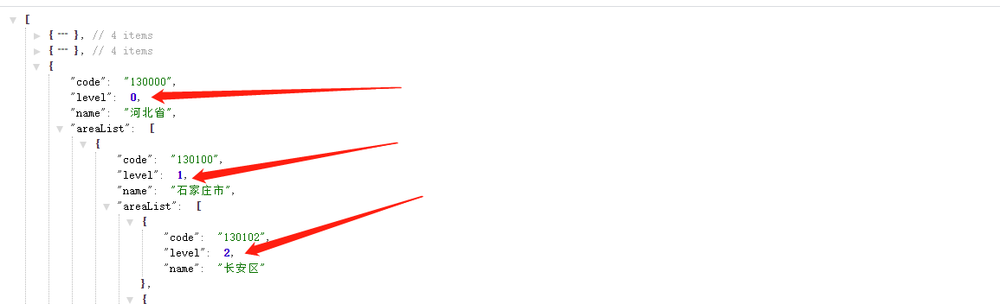

# 商品详情


## 01-商品详情-基础布局

> 目的：完成商品详情基础布局，路由配置，搭好页面架子。


大致步骤：

- 准备组件结构容器
- 提取商品推荐组件且使用
- 配置路由和组件


落地代码：

- 页面组件：`src/views/goods/index.vue`

```vue
<template>
  <div class='xtx-goods-page'>
    <div class="container">
      <!-- 面包屑 -->
      <XtxBread>
        <XtxBreadItem to="/">首页</XtxBreadItem>
        <XtxBreadItem to="/">手机</XtxBreadItem>
        <XtxBreadItem to="/">华为</XtxBreadItem>
        <XtxBreadItem to="/">p30</XtxBreadItem>
      </XtxBread>
      <!-- 商品信息 -->
      <div class="goods-info"></div>
      <!-- 商品推荐 -->
      <GoodsRelevant />
      <!-- 商品详情 -->
      <div class="goods-footer">
        <div class="goods-article">
          <!-- 商品+评价 -->
          <div class="goods-tabs"></div>
          <!-- 注意事项 -->
          <div class="goods-warn"></div>
        </div>
        <!-- 24热榜+专题推荐 -->
        <div class="goods-aside"></div>
      </div>
    </div>
  </div>
</template>

<script>
import GoodsRelevant from './components/goods-relevant'
export default {
  name: 'XtxGoodsPage',
  components: { , GoodsRelevant }
}
</script>

<style scoped lang='less'>
.goods-info {
  min-height: 600px;
  background: #fff;
}
.goods-footer {
  display: flex;
  margin-top: 20px;
  .goods-article {
    width: 940px;
    margin-right: 20px;
  }
  .goods-aside {
    width: 280px;
    min-height: 1000px;
  }
}
.goods-tabs {
  min-height: 600px;
  background: #fff;
}
.goods-warn {
  min-height: 600px;
  background: #fff;
  margin-top: 20px;
}
</style>
```

- 商品推荐组件：`src/views/goods/components/goods-relevant.vue`

```vue
<template>
  <div class='goods-relevant'></div>
</template>

<script>
export default {
  name: 'GoodsRelevant'
}
</script>

<style scoped lang='less'>
.goods-relevant {
  background: #fff;
  min-height: 460px;
  margin-top: 20px;
}
</style>

```

- 路由配置：`src/router/index.js`

```js
const Goods = () => import('@/views/goods/index')
```

```diff
    children: [
      { path: '/', component: Home },
      { path: '/category/:id', component: TopCategory },
      { path: '/category/sub/:id', component: SubCategory },
+      { path: '/product/:id', component: Goods }
    ]
```


## 02-商品详情-渲染面包屑

> 目的：获取数据，渲染面包屑。


大致步骤：

- 定义获取商品详情API函数
- 在组件setup中获取商品详情数据
- 定义一个useXxx函数处理数据


落地代码：

- API函数 `src/api/product.js`

```js
import request from '@/utils/request'

/**
 * 获取商品详情
 * @param {String} id - 商品ID
 */
export const findGoods = (id) => {
  return request('/goods', 'get', { id })
}

```

- useGoods函数 `src/views/goods/index.vue`  在setup中使用

```js
import GoodsRelevant from './components/goods-relevant'
import { nextTick, ref, watch } from 'vue'
import { findGoods } from '@/api/product'
import { useRoute } from 'vue-router'
export default {
  name: 'XtxGoodsPage',
  components: { GoodsRelevant },
  setup () {
    const goods = useGoods()
    return { goods }
  }
}
// 获取商品详情
const useGoods = () => {
  // 出现路由地址商品ID发生变化，但是不会重新初始化组件
  const goods = ref(null)
  const route = useRoute()
  watch(() => route.params.id, (newVal) => {
    if (newVal && `/product/${newVal}` === route.path) {
      findGoods(route.params.id).then(data => {
        // 让商品数据为null让后使用v-if的组件可以重新销毁和创建
        goods.value = null
        nextTick(() => {
          goods.value = data.result
        })
      })
    }
  }, { immediate: true })
  return goods
}
```

- 防止报错，加载完成goods再显示所有内容

```vue
<div class='xtx-goods-page' v-if="goods">
```

- 渲染面包屑

```vue
      <!-- 面包屑 -->
      <XtxBread>
        <XtxBreadItem to="/">首页</XtxBreadItem>
        <XtxBreadItem :to="'/category/'+goods.categories[0].id">{{goods.categories[0].name}}</XtxBreadItem>
        <XtxBreadItem :to="'/category/sub/'+goods.categories[1].id">{{goods.categories[1].name}}</XtxBreadItem>
        <XtxBreadItem>{{goods.name}}</XtxBreadItem>
      </XtxBread>
```


## 03-商品详情-图片预览组件

> 目的：完成商品图片预览功能和切换


大致步骤：

- 首先准备商品信息区块左右两侧的布局盒子
- 在定义一个商品图片组件，用来实现图片预览
  - 首先组件布局，渲染
  - 实现切换图片


落地代码：

- 商品信息区块，布局盒子 `src/views/goods/index.vue`

```vue
      <!-- 商品信息 -->
      <div class="goods-info">
        <div class="media"></div>
        <div class="spec"></div>
      </div>
```

```less
.goods-info {
  min-height: 600px;
  background: #fff;
  display: flex;
  .media {
    width: 580px;
    height: 600px;
    padding: 30px 50px;
  }
  .spec {
    flex: 1;
    padding: 30px 30px 30px 0;
  }
}
```

- 商品图片组件，渲染和切换

```vue
<template>
  <div class="goods-image">
    <div class="middle">
      
    </div>
    <ul class="small">
      <li v-for="(img,i) in images" :key="img" :class="{active:i===currIndex}">
        
      </li>
    </ul>
  </div>
</template>
<script>
import { ref } from 'vue'
export default {
  name: 'GoodsImage',
  props: {
    images: {
      type: Array,
      default: () => []
    }
  },
  setup (props) {
    const currIndex = ref(0)
    return { currIndex }
  }
}
</script>
<style scoped lang="less">
.goods-image {
  width: 480px;
  height: 400px;
  position: relative;
  display: flex;
  .middle {
    width: 400px;
    height: 400px;
    background: #f5f5f5;
  }
  .small {
    width: 80px;
    li {
      width: 68px;
      height: 68px;
      margin-left: 12px;
      margin-bottom: 15px;
      cursor: pointer;
      &:hover,&.active {
        border: 2px solid @xtxColor;
      }
    }
  }
}
</style>
```


## 04-商品详情-图片放大镜

> 目的：实现图片放大镜功能


大致步骤：

- 首先准备大图容器和遮罩容器
- 然后使用`@vueuse/core`的`useMouseInElement`方法获取基于元素的偏移量
- 计算出 遮罩容器定位与大容器北京定位  暴露出数据给模板使用


落地代码：`src/views/goods/components/goods-image.vue`

- 准备大图容器 

```diff
  <div class='goods-image'>
+    <div class="large" :style="[{backgroundImage:`url(${images[currIndex]})`}]"></div>
    <div class="middle">
```

```diff
.goods-image {
  width: 480px;
  height: 400px;
  position: relative;
  display: flex;
+  z-index: 500;
+  .large {
+    position: absolute;
+    top: 0;
+    left: 412px;
+    width: 400px;
+    height: 400px;
+    box-shadow: 0 0 10px rgba(0,0,0,0.1);
+    background-repeat: no-repeat;
+    background-size: 800px 800px;
+    background-color: #f8f8f8;
+  }
```

- 准备待移动的遮罩容器 

```diff
    <div class="middle" ref="target">
      
+      <div class="layer"></div>
    </div>
```

```diff
  .middle {
    width: 400px;
    height: 400px;
+    position: relative;
+    cursor: move;
+    .layer {
+      width: 200px;
+      height: 200px;
+      background: rgba(0,0,0,.2);
+      left: 0;
+      top: 0;
+      position: absolute;
+    }
  }
```

- 使用vueuse提供的API获取鼠标偏移量

```js
import { reactive, ref, watch } from 'vue'
import { useMouseInElement } from '@vueuse/core'
```

```js
const usePreviewImg = () => {
  const target = ref(null)
  const show = ref(false)
  // elementX 鼠标基于容器左上角X轴偏移
  // elementY 鼠标基于容器左上角Y轴偏移
  // isOutside 鼠标是否在模板容器外
  const { elementX, elementY, isOutside } = useMouseInElement(target)
  const position = reactive({ left: 0, top: 0 })
  const bgPosition = reactive({ backgroundPositionX: 0, backgroundPositionY: 0 })
  watch([elementX, elementY, isOutside], () => {
    // 控制X轴方向的定位 0-200 之间
    if (elementX.value < 100) position.left = 0
    else if (elementX.value > 300) position.left = 200
    else position.left = elementX.value - 100
    // 控制Y轴方向的定位 0-200 之间
    if (elementY.value < 100) position.top = 0
    else if (elementY.value > 300) position.top = 200
    else position.top = elementY.value - 100
    // 设置大背景的定位
    bgPosition.backgroundPositionX = -position.left * 2 + 'px'
    bgPosition.backgroundPositionY = -position.top * 2 + 'px'
    // 设置遮罩容器的定位
    position.left = position.left + 'px'
    position.top = position.top + 'px'
    // 设置是否显示预览大图
    show.value = !isOutside.value
  })
  return { position, bgPosition, show, target }
}
```

- 在setup中返回模板需要数据，并使用它

```diff
  setup () {
    const { currIndex, toggleImg } = useToggleImg()
+    const { position, bgPosition, show, target } = usePreviewImg()
+    return { currIndex, toggleImg, position, bgPosition, show, target }
  }
```

```vue
    <div class="large" v-show="show" :style="[{backgroundImage:`url(${images[currIndex]})`},bgPosition]"></div>
    <div class="middle" ref="target">
      
      <div class="layer" v-show="show" :style="position"></div>
    </div>
```


## 05-商品详情-基本信息展示

> 目的：展示商品基本信息


大致步骤：

- 商品销售属性组件
- 商品名称信息组件


落地代码：

- ⑴基础布局：

红色区域1 `src/views/goods/components/goods-sales.vue`

```vue
<template>
  <ul class="goods-sales">
    <li>
      <p>销量人气</p>
      <p>200+</p>
      <p><i class="iconfont icon-task-filling"></i>销量人气</p>
    </li>
    <li>
      <p>商品评价</p>
      <p>400+</p>
      <p><i class="iconfont icon-comment-filling"></i>查看评价</p>
    </li>
    <li>
      <p>收藏人气</p>
      <p>600+</p>
      <p><i class="iconfont icon-favorite-filling"></i>收藏商品</p>
    </li>
    <li>
      <p>品牌信息</p>
      <p>苏宁电器</p>
      <p><i class="iconfont icon-dynamic-filling"></i>品牌主页</p>
    </li>
  </ul>
</template>

<script>
export default {
  name: 'GoodsSales'
}
</script>

<style scoped lang='less'>
.goods-sales {
  display: flex;
  width: 400px;
  align-items: center;
  text-align: center;
  height: 140px;
  li {
    flex: 1;
    position: relative;
    ~ li::after {
      position: absolute;
      top: 10px;
      left: 0;
      height: 60px;
      border-left: 1px solid #e4e4e4;
      content: "";
    }
    p {
      &:first-child {
        color: #999;
      }
      &:nth-child(2) {
        color: @priceColor;
        margin-top: 10px;
      }
      &:last-child {
        color: #666;
        margin-top: 10px;
        i {
          color: @xtxColor;
          font-size: 14px;
          margin-right: 2px;
        }
        &:hover {
          color: @xtxColor;
          cursor: pointer;
        }
      }
    }
  }
}
</style>

```

红色区域2  `src/views/goods/components/goods-name.vue`

```vue
<template>
  <p class="g-name">2件装 粉釉花瓣心意点缀 点心盘*2 碟子盘子</p>
  <p class="g-desc">花瓣造型干净简约 多功能使用堆叠方便</p>
  <p class="g-price">
    <span>108.00</span>
    <span>199.00</span>
  </p>
  <div class="g-service">
    <dl>
      <dt>促销</dt>
      <dd>12月好物放送，App领券购买直降120元</dd>
    </dl>
    <dl>
      <dt>配送</dt>
      <dd>至 </dd>
    </dl>
    <dl>
      <dt>服务</dt>
      <dd>
        <span>无忧退货</span>
        <span>快速退款</span>
        <span>免费包邮</span>
        <a href="javascript:;">了解详情</a>
      </dd>
    </dl>
  </div>
</template>

<script>
export default {
  name: 'GoodName'
}
</script>

<style lang="less" scoped>
.g-name {
  font-size: 22px
}
.g-desc {
  color: #999;
  margin-top: 10px;
}
.g-price {
  margin-top: 10px;
  span {
    &::before {
      content: "¥";
      font-size: 14px;
    }
    &:first-child {
      color: @priceColor;
      margin-right: 10px;
      font-size: 22px;
    }
    &:last-child {
      color: #999;
      text-decoration: line-through;
      font-size: 16px;
    }
  }
}
.g-service {
  background: #f5f5f5;
  width: 500px;
  padding: 20px 10px 0 10px;
  margin-top: 10px;
  dl {
    padding-bottom: 20px;
    display: flex;
    align-items: center;
    dt {
      width: 50px;
      color: #999;
    }
    dd {
      color: #666;
      &:last-child {
        span {
          margin-right: 10px;
          &::before {
            content: "•";
            color: @xtxColor;
            margin-right: 2px;
          }
        }
        a {
          color: @xtxColor;
        }
      }
    }
  }
}
</style>
```


- ⑵使用组件 `src/views/goods/index.vue`

```js
import GoodsSales from './components/goods-sales'
import GoodsName from './components/goods-name'
```

```js
components: { GoodsRelevant, GoodsImage, GoodsSales, GoodsName },
```

```diff
      <!-- 商品信息 -->
      <div class="goods-info">
        <div class="media">
          <GoodsImage :images="goods.mainPictures" />
+          <GoodsSales />
        </div>
        <div class="spec">
+          <GoodsName :goods="goods"/>
        </div>
      </div>
```

- ⑶渲染数据  `src/views/goods/components/goods-name.vue`

```vue
  <p class="g-name">{{goods.name}}</p>
  <p class="g-desc">{{goods.desc}}</p>
  <p class="g-price">
    <span>{{goods.price}}</span>
    <span>{{goods.oldPrice}}</span>
  </p>
```


## 06-商品详情-城市组件-基础布局

> 目的：完成城市组件的基础布局和基本显示隐藏切换效果。


大致步骤：

- 准备基本组件结构
- 完成切换显示隐藏
- 完成点击外部隐藏


落地代码：

`src/components/library/xtx-city.vue`

- 结构

```vue
<template>
  <div class="xtx-city" ref="target">
    <div class="select" @click="toggleDialog" :class="{active}">
      <span class="placeholder">请选择配送地址</span>
      <span class="value"></span>
      <i class="iconfont icon-angle-down"></i>
    </div>
    <div class="option" v-if="active">
      <span class="ellipsis" v-for="i in 24" :key="i">北京市</span>
    </div>
  </div>
</template>
```

- 逻辑

```vue
<script>
import { ref } from 'vue'
import { onClickOutside } from '@vueuse/core'
export default {
  name: 'XtxCity',
  setup () {
    // 控制展开收起,默认收起
    const active = ref(false)
    const openDialog = () => {
      active.value = true
    }
    const closeDialog = () => {
      active.value = false
    }
    // 切换展开收起
    const toggleDialog = () => {
      if (active.value) closeDialog()
      else openDialog()
    }
    // 点击其他位置隐藏
    const target = ref(null)
    onClickOutside(target, () => {
      closeDialog()
    })
    return { active, toggleDialog, target }
  }
}
</script>
```

- 样式

```vue
<style scoped lang="less">
.xtx-city {
  display: inline-block;
  position: relative;
  z-index: 400;  
  .select {
    border: 1px solid #e4e4e4;
    height: 30px;
    padding: 0 5px;
    line-height: 28px;
    cursor: pointer;
    &.active {
      background: #fff;
    }
    .placeholder {
      color: #999;
    }
    .value {
      color: #666;
      font-size: 12px;
    }
    i {
      font-size: 12px;
      margin-left: 5px;
    }
  }
  .option {
    width: 542px;
    border: 1px solid #e4e4e4;
    position: absolute;
    left: 0;
    top: 29px;
    background: #fff;
    min-height: 30px;
    line-height: 30px;
    display: flex;
    flex-wrap: wrap;
    padding: 10px;
    > span {
      width: 130px;
      text-align: center;
      cursor: pointer;
      border-radius: 4px;
      padding: 0 3px;
      &:hover {
        background: #f5f5f5;
      }
    }
  }
}
</style>
```


## 06-商品详情-城市组件-获取数据

> 2目的：组件初始化的时候获取城市数据，进行默认展示。



大致步骤：

- 获取数据函数封装且支持缓存。
- 获取数据渲染且加上加载中效果。
- 加上一个`vue-cli`配置，处理图片为base64


落地代码：`src/components/library/xtx-city.vue`

- 获取数据的函数

```js
// 获取城市数据
// 1. 数据在哪里？https://yjy-oss-files.oss-cn-zhangjiakou.aliyuncs.com/tuxian/area.json
// 2. 何时获取？打开城市列表的时候，做个内存中缓存
// 3. 怎么使用数据？定义计算属性，根据点击的省份城市展示
const getCityData = () => {
  // 这个位置可能有异常操作，封装成promise
  return new Promise((resolve, reject) => {
    if (window.cityData) {
      // 有缓存
      resolve(window.cityData)
    } else {
      // 无缓存
      const url = 'https://yjy-oss-files.oss-cn-zhangjiakou.aliyuncs.com/tuxian/area.json'
      axios.get(url).then(res => {
        window.cityData = res.data
        resolve(window.cityData)
      })
    }
  })
}
```

- open使用函数

```js
    // 获取城市数据,显示当前地方列表
    // 2. 显示和隐藏函数（为什么是函数，做更多事情）
    const loading = ref(false)
    const cityData = ref([])
    const open = () => {
      visible.value = true
      loading.value = true
      // 获取数据
      getCityData().then(data => {
        cityData.value = data
        loading.value = false
      })
    }
    
    // 定义计算属性
    const currList = computed(() => {
      const currList = cityData.value
      // TODO 根据点击的省份城市获取对应的列表
      return currList
    })

    return { active, toggleDialog, target, currList, loading }
```

- 加载中样式

```less
.option {
    // 省略...
    .loading {
      height: 290px;
      width: 100%;
      background: url(../../assets/images/loading.gif) no-repeat center;
    }
}
```

- 模板中使用

```diff
    <div class="option" v-if="visible">
+      <div v-if="loading" class="loading"></div>
+      <template v-else>
+        <span class="ellipsis" v-for="item in currList" :key="item.code">{{item.name}}</span>
+      </template>
    </div>
```

**注意事项：** 需要配置10kb下的图片打包成base64的格式 `vue.config.js`

```js
  chainWebpack: config => {
    config.module
      .rule('images')
      .use('url-loader')
      .loader('url-loader')
      .tap(options => Object.assign(options, { limit: 10000 }))
  }
```


## 07-商品详情-城市组件-交互逻辑

> 3目的：显示省市区文字，让组件能够选择省市区并且反馈给父组件。

大致步骤：

- 明确和后台交互的时候需要产生哪些数据，省code，市code，地区code，它们组合再一起的文字。
- 商品详情的默认地址，如果登录了又地址列表，需要获取默认的地址，设置商品详情的地址。
- 然后默认的地址需要传递给`xtx-city`组件做默认值显示
- 然后 `xtx-city` 组件产生数据的时候，需要给出：省code，市code，地区code，它们组合再一起的文字。


落的代码：

- 第一步：父组件设置  省市区的code数据，对应的文字数据。

`src/views/goods/components/goods-name.vue`

```js
  setup (props) {
    // 默认情况
    const provinceCode = ref('110000')
    const cityCode = ref('119900')
    const countyCode = ref('110101')
    const fullLocation = ref('北京市 市辖区 东城区')
    // 有默认地址
    if (props.goods.userAddresses) {
      const defaultAddr = props.goods.userAddresses.find(addr => addr.isDefault === 1)
      if (defaultAddr) {
        provinceCode.value = defaultAddr.provinceCode
        cityCode.value = defaultAddr.cityCode
        countyCode.value = defaultAddr.countyCode
        fullLocation.value = defaultAddr.fullLocation
      }
    }
    return {  fullLocation }
  }
```

```vue
<XtxCity :fullLocation="fullLocation" />
```

- 第二步：监听用户点击 省，市 展示 市列表和地区列表。

`src/components/xtx-city.vue`

```diff
    <div class="option" v-show="visible">
+      <span @click="changeItem(item)" class="ellipsis"
```

```js
    const changeResult = reactive({
      provinceCode: '',
      provinceName: '',
      cityCode: '',
      cityName: '',
      countyCode: '',
      countyName: '',
      fullLocation: ''  
    })
	
    const changeItem = (item) => {
      // 省份
      if (item.level === 0) {
        changeResult.provinceCode = item.code
        changeResult.provinceName = item.name
      }
      // 市
      if (item.level === 1) {
        changeResult.cityCode = item.code
        changeResult.cityName = item.name
      }
    }
```

计算出需要展示列表

```js
    // 定义计算属性
    const currList = computed(() => {
      // 省份
      let currList = cityData.value
      // 城市
      if (changeResult.provinceCode) {
        currList = currList.find(p => p.code === changeResult.provinceCode).areaList
      }
      // 地区
      if (changeResult.cityCode) {
        currList = currList.find(c => c.code === changeResult.cityCode).areaList
      }
      return currList
    })
```

打开弹层清空之前的选择

```diff
    const open = () => {
      visible.value = true
      loading.value = true
      // 获取数据
      getCityData().then(data => {
        cityData.value = data
        loading.value = false
      })
      // 清空选择结果
+      for (const key in changeResult) {
+        changeResult[key] = ''
+      }
    }
```

- 第三步：点击地区的时候，将数据通知给父组件使用，关闭对话框

`src/components/xtx-city.vue`

```diff
    const changeItem = (item) => {
      // 省份
      if (item.level === 0) {
        changeResult.provinceCode = item.code
        changeResult.provinceName = item.name
      }
      // 市
      if (item.level === 1) {
        changeResult.cityCode = item.code
        changeResult.cityName = item.name
      }
+      // 地区
+      if (item.level === 2) {
+        changeResult.countyCode = item.code
+        changeResult.countyName = item.name
+		changeResult.fullLocation = `${changeResult.provinceName} ${changeResult.cityName} ${changeResult.countyName}`
+        close()
+        emit('change', changeResult)
+      }
    }
```

`src/views/goods/components/goods-name.vue`

```js
    // 选择城市
    const changeCity = (result) => {
      provinceCode.value = result.provinceCode
      cityCode.value = result.cityCode
      countyCode.value = result.countyCode
      fullLocation.value = result.fullLocation
    }
    return {  fullLocation, changeCity }
```

```vue
<XtxCity @change="changeCity" :fullLocation="fullLocation" />
```


## 07-★规格组件-SKU&SPU概念

官方话术：

- SPU（Standard Product Unit）：标准化产品单元。是商品信息聚合的最小单位，是一组可复用、易检索的标准化信息的集合，该集合描述了一个产品的特性。通俗点讲，属性值、特性相同的商品就可以称为一个SPU。
-  SKU（Stock Keeping Unit）库存量单位，即库存进出计量的单位， 可以是以件、盒、托盘等为单位。SKU是物理上不可分割的最小存货单元。在使用时要根据不同业态，不同管理模式来处理。 

画图理解：


总结一下：

- spu代表一个商品，拥有很多相同的属性。
- sku代表该商品可选规格的任意组合，他是库存单位的唯一标识。


## 08-★规格组件-基础结构和样式

> 目标，完成规格组件的基础布局。


大致步骤：

- 准备组件 
- 使用组件


落地代码：

-  组件结构 `src/views/goods/components/goods-sku.vue`

```vue
<template>
  <div class="goods-sku">
    <dl>
      <dt>颜色</dt>
      <dd>
        
        
      </dd>
    </dl>
    <dl>
      <dt>尺寸</dt>
      <dd>
        <span class="disabled">10英寸</span>
        <span class="selected">20英寸</span>
        <span>30英寸</span>
      </dd>
    </dl>
    <dl>
      <dt>版本</dt>
      <dd>
        <span>美版</span>
        <span>港版</span>
      </dd>
    </dl>
  </div>
</template>
<script>
export default {
  name: 'GoodsSku'
}
</script>
<style scoped lang="less">
.sku-state-mixin () {
  border: 1px solid #e4e4e4;
  margin-right: 10px;
  cursor: pointer;
  &.selected {
    border-color: @xtxColor;
  }
  &.disabled {
    opacity: 0.6;
    border-style: dashed;
    cursor: not-allowed;
  }
}
.goods-sku {
  padding-left: 10px;
  padding-top: 20px;
  dl {
    display: flex;
    padding-bottom: 20px;
    align-items: center;
    dt {
      width: 50px;
      color: #999;
    }
    dd {
      flex: 1;
      color: #666;
      > img {
        width: 50px;
        height: 50px;
        .sku-state-mixin ();
      }
      > span {
        display: inline-block;
        height: 30px;
        line-height: 28px;
        padding: 0 20px;
        .sku-state-mixin ();
      }
    }
  }
}
</style>
```

- 使用组件 `src/views/goods/index.vue`

```diff
+import GoodsSku from './components/goods-sku'

  name: 'XtxGoodsPage',
+  components: { GoodsRelevant, GoodsImage, GoodsSales, GoodsName, GoodsSku },
  setup () {
```

```diff
        <div class="spec">
          <!-- 名字区组件 -->
          <GoodsName :goods="goods" />
          <!-- 规格组件 -->
+          <GoodsSku />
        </div>
```

总结： 每一个按钮拥有`selected` `disabled`  类名，做 选中 和 禁用要用。


## 09-★规格组件-渲染与选中效果

> 目的：根据商品信息渲染规格，完成选中，取消选中效果。

大致步骤：

- 依赖 `goods.specs` 渲染规格
- 绑定按钮点击事件，完成选中和取消选中
  - 当前点的是选中，取消即可
  - 当前点的未选中，先当前规格按钮全部取消，当前按钮选中。


落的代码：`src/views/goods/components/goods-sku.vue`

```vue
<template>
  <div class="goods-sku">
    <dl v-for="item in goods.specs" :key="item.id">
      <dt>{{item.name}}</dt>
      <dd>
        <template v-for="val in item.values" :key="val.name">
          
          <span :class="{selected:val.selected}" @click="clickSpecs(item,val)" v-else>{{val.name}}</span>
        </template>
      </dd>
    </dl>
  </div>
</template>
<script>
export default {
  name: 'GoodsSku',
  props: {
    goods: {
      type: Object,
      default: () => ({ specs: [], skus: [] })
    }
  },
  setup (props) {
    const clickSpecs = (item, val) => {
      // 1. 选中与取消选中逻辑
      if (val.selected) {
        val.selected = false
      } else {
        item.values.forEach(bv => { bv.selected = false })
        val.selected = true
      }
    }
    return { clickSpecs }
  }
}
</script>
```


注意：`处理后台数据不规范，规格属性顺序和sku属性顺序不一致问题`  `src/views/goods/index.vue`  现在无需处理。

```js
    findGoods('1369155859933827074').then(({ result }) => {
      // const sortSpecs = []
      // result.skus[0].specs.forEach(spec => {
      //   sortSpecs.push(result.specs.find(item => item.name === spec.name))
      // })
      // result.specs = sortSpecs
      result.skus.forEach(sku => {
        const sortSpecs = []
        result.specs.forEach(spec => {
          sortSpecs.push(sku.specs.find(item => item.name === spec.name))
        })
        sku.specs = sortSpecs
      })
      goods.value = result
    })
```


## 10-★规格组件-禁用效果-思路分析

> 目标：大致了解禁用效果的整体思路，注意只是了解。


大致步骤：

1. 根据后台返回的skus数据得到有效sku组合
2. 根据有效的sku组合得到所有的子集集合
3. 根据子集集合组合成一个路径字典，也就是对象。
4. 在组件初始化的时候去判断每个规格是否点击
5. 在点击规格的时候去判断其他规格是否可点击
6. 判断的依据是，拿着说有规格和现在已经选中的规则取搭配，得到可走路径。
   1. 如果可走路径在字典中，可点击
   2. 如果可走路径不在字典中，禁用


## 11-★规格组件-禁用效果-路径字典

> 目的：根据后台skus数据得到可走路径字典对象

- js算法库 https://github.com/trekhleb/javascript-algorithms
- 幂集算法 https://raw.githubusercontent.com/trekhleb/javascript-algorithms/master/src/algorithms/sets/power-set/bwPowerSet.js

`src/vender/power-set.js`

```js
/**
 * Find power-set of a set using BITWISE approach.
 *
 * @param {*[]} originalSet
 * @return {*[][]}
 */
export default function bwPowerSet(originalSet) {
  const subSets = [];

  // We will have 2^n possible combinations (where n is a length of original set).
  // It is because for every element of original set we will decide whether to include
  // it or not (2 options for each set element).
  const numberOfCombinations = 2 ** originalSet.length;

  // Each number in binary representation in a range from 0 to 2^n does exactly what we need:
  // it shows by its bits (0 or 1) whether to include related element from the set or not.
  // For example, for the set {1, 2, 3} the binary number of 0b010 would mean that we need to
  // include only "2" to the current set.
  for (let combinationIndex = 0; combinationIndex < numberOfCombinations; combinationIndex += 1) {
    const subSet = [];

    for (let setElementIndex = 0; setElementIndex < originalSet.length; setElementIndex += 1) {
      // Decide whether we need to include current element into the subset or not.
      if (combinationIndex & (1 << setElementIndex)) {
        subSet.push(originalSet[setElementIndex]);
      }
    }

    // Add current subset to the list of all subsets.
    subSets.push(subSet);
  }

  return subSets;
}
```

`src/views/goods/components/goods-sku.vue`

```js
import getPowerSet from '@/vender/power-set'
const spliter = '★'
// 根据skus数据得到路径字典对象
const getPathMap = (skus) => {
  const pathMap = {}
  skus.forEach(sku => {
    // 1. 过滤出有库存有效的sku
    if (sku.inventory) {
      // 2. 得到sku属性值数组
      const specs = sku.specs.map(spec => spec.valueName)
      // 3. 得到sku属性值数组的子集
      const powerSet = getPowerSet(specs)
      // 4. 设置给路径字典对象
      powerSet.forEach(set => {
        const key = set.join(spliter)
        if (pathMap[key]) {
          // 已经有key往数组追加
          pathMap[key].push(sku.id)
        } else {
          // 没有key设置一个数组
          pathMap[key] = [sku.id]
        }
      })
    }
  })
  return pathMap
}
```

```diff
+  setup (props) {
+    const pathMap = getPathMap(props.goods.skus)
+    console.log(pathMap)
```

- 参照示例


## 12-★规格组件-禁用效果-设置状态


> 目的：在组件初始化的时候，点击规格的时候，去更新其他按钮的禁用状态。

大致的步骤：

- 再需要更新状态的时候获取当前选中的规格数组
- 遍历所有的规格按钮，拿出按钮的值设置给规格数组，让后得到key
- 拿着key去路径字典中查找，有就可点击，没有禁用即可。


`src/views/goods/components/goods-sku.vue`

```js
// 得到当前选中规格集合
const getSelectedArr = (specs) => {
  const selectedArr = []
  specs.forEach(spec => {
    const selectedVal = spec.values.find(val => val.selected)
    selectedArr.push(selectedVal ? selectedVal.name : undefined)
  })
  return selectedArr
}
```

```js
// 更新按钮的禁用状态
const updateDisabledStatus = (specs, pathMap) => {
  specs.forEach((spec, i) => {
    const selectedArr = getSelectedArr(specs)
    spec.values.forEach(val => {
      // 已经选中的按钮不用判断
      if (val.name === selectedArr[i]) return false
      // 未选中的替换对应的值
      selectedArr[i] = val.name
      // 过滤无效值得到key
      const key = selectedArr.filter(v => v).join(spliter)
      // 设置禁用状态
      val.disabled = !pathMap[key]
    })
  })
}
```

```diff
  setup (props) {
    const pathMap = getPathMap(props.goods.skus)
    // 组件初始化的时候更新禁用状态
+    updateDisabledStatus(props.goods.specs, pathMap)
    const clickSpecs = (item, val) => {
      // 如果是禁用状态不作为
+      if (val.disabled) return false
      // 1. 选中与取消选中逻辑
      if (val.selected) {
        val.selected = false
      } else {
        item.values.find(bv => { bv.selected = false })
        val.selected = true
      }
      // 点击的时候更新禁用状态
+      updateDisabledStatus(props.goods.specs, pathMap)
    }
    return { clickSpecs }
  }
```


## 13-★规格组件-数据通讯

> 目的：根据传入的skuId进行默认选中，选择规格后触发change事件传出选择的sku数据。

大致步骤：

- 根据传入的SKUID选中对应规格按钮
- 选择规格后传递sku信息给父组件
  - 完整规格，传 skuId 价格  原价  库存   规格文字
  - 不完整的，传 空对象


落的代码：

- 根据传人的sku设置默认选中的规格 `src/views/goods/components/goods-sku.vue`

```js
    skuId: {
      type: String,
      default: ''
    }
```

```js
// 初始化选中状态
const initSelectedStatus = (goods, skuId) => {
  const sku = goods.skus.find(sku => sku.id === skuId)
  if (sku) {
    goods.specs.forEach((spec, i) => {
      const value = sku.specs[i].valueName
      spec.values.forEach(val => {
        val.selected = val.name === value
      })
    })
  }
}
```

```diff
  setup (props, { emit }) {
    const pathMap = getPathMap(props.goods.skus)
    // 根据传入的skuId默认选中规格按钮
+    initSelectedStatus(props.goods, props.skuId)
    // 组件初始化的时候更新禁用状态
    updateDisabledStatus(props.goods.specs, pathMap)
```


- 根据选择的完整sku规格传出sku信息
  - 其中传出的specsText是提供给购物车存储使用的。

 `src/views/goods/components/goods-sku.vue`

```diff
+  setup (props, { emit }) {
```

```diff
const clickSpecs = (item, val) => {
      // 如果是禁用状态不作为
      if (val.disabled) return false
      // 1. 选中与取消选中逻辑
      if (val.selected) {
        val.selected = false
      } else {
        item.values.find(bv => { bv.selected = false })
        val.selected = true
      }
      // 点击的时候更新禁用状态
      updateDisabledStatus(props.goods.specs, pathMap)
+      // 触发change事件将sku数据传递出去
+      const selectedArr = getSelectedArr(props.goods.specs).filter(v => v)
+      if (selectedArr.length === props.goods.specs.length) {
+        const skuIds = pathMap[selectedArr.join(spliter)]
+        const sku = props.goods.skus.find(sku => sku.id === skuIds[0])
+        // 传递
+        emit('change', {
+          skuId: sku.id,
+          price: sku.price,
+          oldPrice: sku.oldPrice,
+          inventory: sku.inventory,
+          specsText: sku.specs.reduce((p, n) => `${p} ${n.name}：${n.valueName}`, '').replace(' ', '')
+        })
+      } else {
+        emit('change', {})
+      }
+    }
```

`src/views/goods/index.vue`

```vue
          <GoodsSku :goods="goods" @change="changeSku"/>
```

```diff
  setup () {
    const goods = useGoods()
    // sku改变时候触发
+    const changeSku = (sku) => {
+      if (sku.skuId) {
+        goods.value.price = sku.price
+        goods.value.oldPrice = sku.oldPrice
+        goods.value.inventory = sku.inventory
+      }
+    }
+    return { goods, changeSku }
  }
```


## 14-商品详情-数量选择组件

> 目的：封装一个通用的数量选中组件。


大致功能分析：

- 默认值为1
- 可限制最大最小值
- 点击-就是减1  点击+就是加1
- 需要完成v-model得实现
- 存在无label情况


基础布局代码：`src/components/library/xtx-numbox.vue`

```vue
<template>
  <div class="xtx-numbox">
    <div class="label">数量</div>
    <div class="numbox">
      <a href="javascript:;">-</a>
      <input type="text" readonly value="1">
      <a href="javascript:;">+</a>
    </div>
  </div>
</template>
<script>
export default {
  name: 'XtxNumbox'
}
</script>
<style scoped lang="less">
.xtx-numbox {
  display: flex;
  align-items: center;
  .label {
    width: 60px;
    color: #999;
    padding-left: 10px;
  }
  .numbox {
    width: 120px;
    height: 30px;
    border: 1px solid #e4e4e4;
    display: flex;
    > a {
      width: 29px;
      line-height: 28px;
      text-align: center;
      background: #f8f8f8;
      font-size: 16px;
      color: #666;
      &:first-of-type {
        border-right:1px solid #e4e4e4;
      }
      &:last-of-type {
        border-left:1px solid #e4e4e4;
      }
    }
    > input {
      width: 60px;
      padding: 0 5px;
      text-align: center;
      color: #666;
    }
  }
}
</style>
```

逻辑功能实现：

`src/components/library/xtx-numbox.vue`

```js
<script>
import { useVModel } from '@vueuse/core'
export default {
  name: 'XtxNumbox',
  props: {
    label: {
      type: String
    },
    modelValue: {
      type: Number,
      default: 1
    },
    min: {
      type: Number,
      default: 1
    },
    max: {
      type: Number,
      default: 100
    }
  },
  setup (props, { emit }) {
    const num = useVModel(props, 'modelValue', emit)
    const changeNum = (value) => {
      const newValue = num.value + value
      if (newValue < props.min) return
      if (newValue > props.max) return
      num.value = newValue
      emit('change', newValue)
    }
    return { num, changeNum }
  }
}
```

`src/views/goods/index.vue`

```vue
<XtxNumbox label="数量" v-model="num" :max="goods.inventory"/>
```

```diff
// 选择的数量
+    const num = ref(1)
+    return { goods, changeSku, num }
```


## 15-商品详情-按钮组件

> 目的：封装一个通用按钮组件，有大、中、小、超小四种尺寸，有默认、主要、次要、灰色四种类型。

大致步骤：

- 完成组件基本结构
- 介绍各个参数的使用
- 测试按钮组件

落地代码：

- 封装组件：`src/components/library/xtx-numbox.vue`

```vue
<template>
  <button class="xtx-button ellipsis" :class="[size,type]">
    <slot />
  </button>
</template>
<script>
export default {
  name: 'XtxButton',
  props: {
    size: {
      type: String,
      default: 'middle'
    },
    type: {
      type: String,
      default: 'default'
    }
  }
}
</script>
<style scoped lang="less">
.xtx-button {
  appearance: none;
  border: none;
  outline: none;
  background: #fff;
  text-align: center;
  border: 1px solid transparent;
  border-radius: 4px;
  cursor: pointer;
}
.large {
  width: 240px;
  height: 50px;
  font-size: 16px;
}
.middle {
  width: 180px;
  height: 50px;
  font-size: 16px;
}
.small {
  width: 100px;
  height: 32px;
  font-size: 14px;  
}
.mini {
  width: 60px;
  height: 32px;
  font-size: 14px;  
}
.default {
  border-color: #e4e4e4;
  color: #666;
}
.primary {
  border-color: @xtxColor;
  background: @xtxColor;
  color: #fff;
}
.plain {
  border-color: @xtxColor;
  color: @xtxColor;
  background: lighten(@xtxColor,50%);
}
.gray {
  border-color: #ccc;
  background: #ccc;;
  color: #fff;
}
</style>
```

- 使用组件：`src/views/goods/index.vue`

```diff
        <div class="spec">
          <GoodsName :goods="goods"/>
          <GoodsSku :goods="goods" @change="changeSku"/>
          <XtxNumbox label="数量" v-model="num" :max="goods.inventory"/>
+          <XtxButton type="primary" style="margin-top:20px;">加入购物车</XtxButton>
        </div>
```


## 16-商品详情-同类推荐组件

> 目的：实现商品的同类推荐与猜你喜欢展示功能。


大致功能需求：

- 完成基础布局（头部），后期改造xtx-carousel.vue组件来展示商品效果。
- 然后可以通过是否传入商品ID来区别同类推荐和猜你喜欢。


落的代码开始：

- 基础布局 `src/views/goods/components/goods-relevant.vue`

```vue
<template>
  <div class="goods-relevant">
    <div class="header">
      <i class="icon" />
      <span class="title">同类商品推荐</span>
    </div>
    <!-- 此处使用改造后的xtx-carousel.vue -->
  </div>
</template>

<script>
export default {
  // 同类推荐，猜你喜欢
  name: 'GoodsRelevant'
}
</script>

<style scoped lang='less'>
.goods-relevant {
  background: #fff;
  min-height: 460px;
  margin-top: 20px;
  .header {
    height: 80px;
    line-height: 80px;
    padding: 0 20px;
    .title {
      font-size: 20px;
      padding-left: 10px;
    }
    .icon {
      width: 16px;
      height: 16px;
      display: inline-block;
      border-top: 4px solid @xtxColor;
      border-right: 4px solid @xtxColor;
      box-sizing: border-box;
      position: relative;
      transform: rotate(45deg);
      &::before {
        content: "";
        width: 10px;
        height: 10px;
        position: absolute;
        left: 0;
        top: 2px;
        background: lighten(@xtxColor, 40%);
      }
    }
  }
}
</style>
```

- 获取数据传入xtx-carousel.vue组件 

`src/views/goods/index.vue`  传ID

```vue
      <!-- 商品推荐 -->
      <GoodsRelevant :goodsId="goods.id"/>
```

 `src/api/goods.js` 定义获取数据的API

```js

/**
 * 获取商品同类推荐-未传入ID为猜喜欢
 * @param {String} id - 商品ID
 * @param {Number} limit - 获取条数
 */
export const findRelGoods = (id, limit = 16) => {
  return request('/goods/relevant', 'get', { id, limit })
}
```

`src/views/goods/components/goods-relevant.vue`  获取数据

```diff
    <div class="header">
      <i class="icon" />
+      <span class="title">{{goodsId?'同类商品推荐':'猜你喜欢'}}</span>
    </div>
```

```vue
<script>
import { findRelGoods } from '@/api/goods'
import { ref } from 'vue'
// 得到需要的数据
const useRelGoodsData = (id) => {
  const sliders = ref([])
  findRelGoods(id).then(data => {
    // 每页4条
    const size = 4
    const total = Math.ceil(data.result.length / size)
    for (let i = 0; i < total; i++) {
      sliders.value.push(data.result.slice(i * size, (i + 1) * size))
    }
  })
  return sliders
}
export default {
  // 同类推荐，猜你喜欢
  name: 'GoodsRelevant',
  props: {
    goodsId: {
      type: String,
      default: undefined
    }
  },
  setup (props) {
    const sliders = useRelGoodsData(props.goodsId)
    return { sliders }
  }
}
</script>
```

```vue
    <!-- 此处使用改造后的xtx-carousel.vue -->
    <XtxCarousel :sliders="sliders" style="height:380px" auto-play />
```


- 改造xtx-carousel.vue组件  `src/components/library/xtx-carousel.vue`

```diff
+        <RouterLink v-if="item.hrefUrl" :to="item.hrefUrl">
          
        </RouterLink>
+        <div v-else class="slider">
+          <RouterLink v-for="goods in item" :key="goods.id" :to="`/product/${goods.id}`">
+            
+            <p class="name ellipsis">{{goods.name}}</p>
+            <p class="price">&yen;{{goods.price}}</p>
+          </RouterLink>
```

```less
// 轮播商品
.slider {
  display: flex;
  justify-content: space-around;
  padding: 0 40px;
  > a {
    width: 240px;
    text-align: center;
    img {
      padding: 20px;
      width: 230px!important;
      height: 230px!important;
    }
    .name {
      font-size: 16px;
      color: #666;
      padding: 0 40px;
    }
    .price {
      font-size: 16px;
      color: @priceColor;
      margin-top: 15px;
    }
  }
}
```


- 覆盖xtx-carousel.vue的样式在   `src/views/goods/components/goods-relevant.vue`

```less
:deep(.xtx-carousel) {
  height: 380px;
  .carousel {
    &-indicator {
      bottom: 30px;
      span {
        &.active {
          background: @xtxColor;
        }
      }
    }
    &-btn {
      top: 110px;
      opacity: 1;
      background: rgba(0,0,0,0);
      color: #ddd;
      i {
        font-size: 30px;
      }
    }
  }
}
```

注意：vue3.0使用深度作用选择器写法 `:deep(选择器)`

## 17-商品详情-标签页组件

> 目的：实现商品详情组件和商品评价组件的切换


大致步骤：

- 完成基础的tab的导航布局
- 完成tab标签页的切换样式效果
- 使用动态组件完成可切换 详情  和  评论  组件


落的代码：

- 标签页基础布局 `src/vies/goods/components/goods-tabs.vue`

```vue
  <div class="goods-tabs">
    <nav>
      <a class="active" href="javascript:;">商品详情</a>
      <a href="javascript:;">商品评价<span>(500+)</span></a>
    </nav>
    <!-- 切换内容的地方 -->  
  </div>     
```

```less
.goods-tabs {
  min-height: 600px;
  background: #fff;
  nav {
    height: 70px;
    line-height: 70px;
    display: flex;
    border-bottom: 1px solid #f5f5f5;
    a {
      padding: 0 40px;
      font-size: 18px;
      position: relative;
      > span {
        color: @priceColor;
        font-size: 16px;
        margin-left: 10px;
      }
      &:first-child {
        border-right: 1px solid #f5f5f5;
      }
      &.active {
        &::before {
          content: "";
          position: absolute;
          left: 40px;
          bottom: -1px;
          width: 72px;
          height: 2px;
          background: @xtxColor;
        }
      }
    }
  }
}
```

- tabs组件切换 `src/vies/goods/components/goods-tabs.vue`

```vue
<template>
  <div class="goods-tabs">
    <nav>
      <a
        :class="{ active: activeName === 'detail' }"
        href="javascript:;"
        @click="clickTab('detail')"
        >商品详情</a
      >
      <a
        :class="{ active: activeName === 'comment' }"
        href="javascript:;"
        @click="clickTab('comment')"
        >商品评价<span>(500+)</span></a
      >
    </nav>
    <!-- 这个位置显示对应的组件 GoodsDetail 或者 GoodsComment -->
    <component :is="'goods-'+activeName" />
  </div>
</template>
<script>
import { ref } from 'vue'
import GoodsDetail from './goods-detail'
import GoodsComment from './goods-comment'
export default {
  name: 'GoodsTabs',
  components: { GoodsDetail, GoodsComment },
  setup () {
    // detail-->详情   comment-->评价
    const activeName = ref('detail')
    const clickTab = (name) => {
      activeName.value = name
    }
    return { activeName, clickTab }
  }
}
</script>
```

- 使用tabs组件 `src/views/goods/index.vue`

```diff
+import GoodsTabs from './components/goods-tabs'
// ... 省略
export default {
  name: 'XtxGoodsPage',
+  components: { GoodsRelevant, GoodsImage, GoodsSales, GoodsName, GoodsSku, GoodsTabs },
  setup () {
```

```diff
        <div class="goods-article">
          <!-- 商品+评价 -->
+          <GoodsTabs :goods="goods" />
          <!-- 注意事项 -->
          <div class="goods-warn"></div>
        </div>
```

```diff
-.goods-tabs {
-  min-height: 600px;
-  background: #fff;
-}
```

- 定义详情组件，评价组件。

 `src/vies/goods/components/goods-detail.vue`

```vue
<template>
  <div class="goods-detail">详情</div>
</template>
<script>
export default {
  name: 'GoodsDetail'
}
</script>
<style scoped lang="less"></style>
```

 `src/vies/goods/components/goods-comment.vue`

```vue
<template>
  <div class="goods-comment">评价</div>
</template>
<script>
export default {
  name: 'GoodsComment'
}
</script>
<style scoped lang="less"></style>

```


## 18-商品详情-热榜组件

> 目的：展示24小时热榜商品，和周热榜商品。


大致步骤：

- 定义一个组件，完成多个组件展现型态，根据传入组件的类型决定。
  - 1代表24小时热销榜 2代表周热销榜 3代表总热销榜
- 获取数据，完成商品展示和标题样式的设置。


落的代码：

- 定义组件  `src/views/goods/components/goods-hot.vue`

```vue
<template>
  <div class="goods-hot">
    <h3>{{title}}</h3>
  </div>
</template>
<script>
import { computed } from 'vue'
export default {
  name: 'GoodsHot',
  props: {
    type: {
      type: Number,
      default: 1
    }
  },
  setup (props) {
    const titleObj = { 1: '24小时热销榜', 2: '周热销榜', 3: '总热销榜' }
    const title = computed(() => {
      return titleObj[props.type]
    })
    return { title }
  }
}
</script>
<style scoped lang="less"></style>
```

- 使用组件  `src/views/goods/index.vue`

```diff
+import GoodsHot from './components/goods-hot'
// ... 省略
  name: 'XtxGoodsPage',
+  components: { GoodsRelevant, GoodsImage, GoodsSales, GoodsName, GoodsSku, GoodsTabs, GoodsHot },
  setup () {
```

```vue
        <!-- 24热榜+专题推荐 -->
        <div class="goods-aside">
          <GoodsHot :goodsId="goods.id" :type="1" />
          <GoodsHot :goodsId="goods.id" :type="2" />
        </div>
```

- 获取数据，设置组件样式

`src/api/goods.js`

```js
/**
 * 获取热榜商品
 * @param {Number} type - 1代表24小时热销榜 2代表周热销榜 3代表总热销榜
 * @param {Number} limit - 获取个数
 */
export const findHotGoods = ({id,type, limit = 3}) => {
  return request('/goods/hot', 'get', {id, type, limit })
}
```

`src/views/goods/components/goot-hot.vue`

```js
import { computed, ref } from 'vue'
import GoodsItem from '../../category/components/goods-item'
import { findHotGoods } from '@/api/goods'
export default {
  name: 'GoodsHot',
  props: {
    type: {
      type: Number,
      default: 1
    },
    goodsId: {
      type: String
    }  
  },
  components: { GoodsItem },
  setup (props) {
    // 处理标题
    const titleObj = { 1: '24小时热销榜', 2: '周热销榜', 3: '总热销榜' }
    const title = computed(() => {
      return titleObj[props.type]
    })
    // 商品列表
    const goodsList = ref([])
    findHotGoods({ id: props.goodsId, type: props.type }).then(data => {
      goodsList.value = data.result.map(item => {
        item.tag = item.desc
        return item
      })
    })
    return { title, goodsList }
  }
}
```

```vue
<template>
  <div class="goods-hot">
    <h3>{{title}}</h3>
    <div v-if="goodsList">
      <GoodsItem v-for="item in goodsList" :key="item.id" :goods="item"/>  
    </div>  
  </div>
</template>
```

```js
.goods-hot {
  h3 {
    height: 70px;
    background: @helpColor;
    color: #fff;
    font-size: 18px;
    line-height: 70px;
    padding-left: 25px;
    margin-bottom: 10px;
    font-weight: normal;
  }
  ::v-deep .goods-item {
    background: #fff;
    width: 100%;
    margin-bottom: 10px;
    img {
      width: 200px;
      height: 200px;
    }
    p {
      margin: 0 10px;
    }
    &:hover {
      transform: none;
      box-shadow: none;
    }
  }
}
```


## 19-商品详情-详情组件

> 目的：展示商品属性和商品详情。


大致步骤：

- 完成基础布局，主要是属性，详情是图片。
- `goods/index.vue` 提供goods数据，子孙组件注入goods数据，渲染展示即可。


落的代码：

- 传递goods数据

`src/views/goods/index.vue`  setup中提供数据

```js
provide('goods', goods)
```

- 使用goods数据，展示评价数量

`src/views/goods/components/goods-tabs.vue`

```js
  setup () {
      const goods = inject('goods')
      return { goods }
  },
```

```diff
+    >商品评价<span>({{goods.commentCount}})</span></a
```

- 使用goods数据，展示商品详情

`src/views/goods/components/goods-detail.vue`

```vue
<template>
  <div class="goods-detail">
    <!-- 属性 -->
    <ul class="attrs">
      <li v-for="item in goods.details.properties" :key="item.value">
        <span class="dt">{{item.name}}</span>
        <span class="dd">{{item.value}}</span>
      </li>
    </ul>
    <!-- 图片 -->
    
  </div>
</template>
<script>
export default {
  name: 'GoodsDetail',
  setup () {
      const goods = inject('goods')
      return { goods }
  }
}
</script>
<style scoped lang="less">
.goods-detail {
  padding: 40px;
  .attrs {
    display: flex;
    flex-wrap: wrap;
    margin-bottom: 30px;
    li {
      display: flex;
      margin-bottom: 10px;
      width: 50%;
      .dt {
        width: 100px;
        color: #999;
      }
      .dd {
        flex: 1;
        color: #666;
      }
    }
  }
  > img {
    width: 100%;
  }
}
</style>
```


## 20-商品详情-注意事项组件

> 目的：展示购买商品的注意事项。

`src/views/goods/index.vue`

```diff
+import GoodsWarn from './components/goods-warn'
```

```diff
  name: 'XtxGoodsPage',
+  components: { GoodsRelevant, GoodsImage, GoodsSales, GoodsName, GoodsSku, GoodsTabs, GoodsHot, GoodsWarn },
  setup () {
```

```
          <!-- 注意事项 -->
+          <GoodsWarn />
```

`src/views/goods/components/goods-warn.vue`

```vue
<template>
  <!-- 注意事项 -->
  <div class="goods-warn">
    <h3>注意事项</h3>
    <p class="tit">• 购买运费如何收取？</p>
    <p>
      单笔订单金额(不含运费)满88元免邮费；不满88元，每单收取10元运费。（港澳台地区需满500元免邮费；不满500元，每单收取30元运费)
    </p>
    <br />
    <p class="tit">• 使用什么快递发货?</p>
    <p>默认使用顺丰快递发货(个别商品使用其他快递）</p>
    <p>配送范围覆盖全国大部分地区(港澳台地区除外）</p>
    <br />
    <p class="tit">• 如何申请退货?</p>
    <p>
      1.自收到商品之日起30日内，顾客可申请无忧退货，退款将原路返还，不同的银行处理时间不同，预计1-5个工作日到账；
    </p>
    <p>2.内裤和食品等特殊商品无质量问题不支持退货；</p>
    <p>
      3.退货流程：
      确认收货-申请退货-客服审核通过-用户寄回商品-仓库签收验货-退款审核-退款完成；
    </p>
    <p>
      4.因小兔鲜儿产生的退货，如质量问题，退货邮费由小兔鲜儿承担，退款完成后会以现金券的形式报销。因客户个人原因产生的退货，购买和寄回运费由客户个人承担。
    </p>
  </div>
</template>
<style lang="less" scoped>
.goods-warn {
  margin-top: 20px;
  background: #fff;
  padding-bottom: 40px;
  h3 {
    height: 70px;
    line-height: 70px;
    border-bottom: 1px solid #f5f5f5;
    padding-left: 50px;
    font-size: 18px;
    font-weight: normal;
    margin-bottom: 10px;
  }
  p {
    line-height: 40px;
    padding: 0 25px;
    color: #666;
    &.tit {
      color: #333;
    }
  }
}
</style>
```


## 21-商品详情-评价组件-头部渲染


> 目的：根据后台返回的评价信息渲染评价头部内容。


`yapi` 平台可提供模拟接口，当后台接口未开发完毕或者没有数据的情况下，可以支持前端的开发。


大致步骤：

- 完成静态布局
- 定义API接口
- 获取数据，处理完毕，提供给模版
- 渲染模版


落的代码：

- 布局 `src/views/goods/components/goods-comment.vue`

```vue
<template>
  <div class="goods-comment">
    <div class="head">
      <div class="data">
        <p><span>100</span><span>人购买</span></p>
        <p><span>99.99%</span><span>好评率</span></p>
      </div>
      <div class="tags">
        <div class="dt">大家都在说：</div>
        <div class="dd">
          <a href="javascript:;" class="active">全部评价（1000）</a>
          <a href="javascript:;">好吃（1000）</a>
          <a href="javascript:;">便宜（1000）</a>
          <a href="javascript:;">很好（1000）</a>
          <a href="javascript:;">再来一次（1000）</a>
          <a href="javascript:;">快递棒（1000）</a>
        </div>
      </div>
    </div>
    <div class="sort">
      <span>排序：</span>
      <a href="javascript:;" class="active">默认</a>
      <a href="javascript:;">最新</a>
      <a href="javascript:;">最热</a>
    </div>
    <div class="list"></div>
  </div>
</template>
<script>
export default {
  name: 'GoodsComment'
}
</script>
<style scoped lang="less">
.goods-comment {
  .head {
    display: flex;
    padding: 30px 0;
    .data {
      width: 340px;
      display: flex;
      padding: 20px;
      p {
        flex: 1;
        text-align: center;
        span {
          display: block;
          &:first-child {
            font-size: 32px;
            color: @priceColor;
          }
          &:last-child {
            color: #999;
          }
        }
      }
    }
    .tags {
      flex: 1;
      display: flex;
      border-left: 1px solid #f5f5f5;
      .dt {
        font-weight: bold;
        width: 100px;
        text-align: right;
        line-height: 42px;
      }
      .dd {
        flex: 1;
        display: flex;
        flex-wrap: wrap;
        > a {
          width: 132px;
          height: 42px;
          margin-left: 20px;
          margin-bottom: 20px;
          border-radius: 4px;
          border: 1px solid #e4e4e4;
          background: #f5f5f5;
          color: #999;
          text-align: center;
          line-height: 40px;
          &:hover {
            border-color: @xtxColor;
            background: lighten(@xtxColor,50%);
            color: @xtxColor;
          }
          &.active {
            border-color: @xtxColor;
            background: @xtxColor;
            color: #fff;
          }
        }
      }
    }
  }
  .sort {
    height: 60px;
    line-height: 60px;
    border-top: 1px solid #f5f5f5;
    border-bottom: 1px solid #f5f5f5;
    margin: 0 20px;
    color: #666;
    > span {
      margin-left: 20px;
    }
    > a {
      margin-left: 30px;
      &.active,&:hover {
        color: @xtxColor;
      }
    }
  }
}
</style>
```

- 接口 `src/api/goods.js`

```js
/**
 * 获取商品的评价统计信息
 * @param {String} id - 商品ID
 */
export const findCommentInfoByGoods = (id) => {
  return request(`/goods/${id}/evaluate`)
}
// https://mock.boxuegu.com/mock/1175/goods/${id}/evaluate
```

- 获取数据，处理数据 `src/views/goods/components/goods-comment.vue`

```js
import { findCommentInfoByGoods } from '@/api/goods'
import { ref } from 'vue'
const getCommentInfo = (props) => {
  const commentInfo = ref(null)
  findCommentInfoByGoods(props.goods.id).then(data => {
    // type 的目的是将来点击可以区分点的是不是标签
    data.result.tags.unshift({ type: 'img', title: '有图', tagCount: data.result.hasPictureCount })
    data.result.tags.unshift({ type: 'all', title: '全部评价', tagCount: data.result.evaluateCount })
    commentInfo.value = data.result
  })
  return commentInfo
}
export default {
  name: 'GoodsComment',
  props: {
    goods: {
      type: Object,
      default: () => {}
    }
  },
  setup (props) {
    const commentInfo = getCommentInfo(props)
    return { commentInfo }
  }
}
```

- 渲染模版 + tag选中效果  `src/views/goods/components/goods-comment.vue`   

```vue
    <!-- 头部 -->
    <div class="head" v-if="commentInfo">
      <div class="data">
        <p><span>{{commentInfo.salesCount}}</span><span>人购买</span></p>
        <p><span>{{commentInfo.praisePercent}}</span><span>好评率</span></p>
      </div>
      <div class="tags">
        <div class="dt">大家都在说：</div>
        <div class="dd">
          <a
            v-for="(item,i) in commentInfo.tags"
            :key="item.title"
            href="javascript:;"
            :class="{active:currTagIndex===i}"
            @click="changeTag(i)"
          >
            {{item.title}}（{{item.tagCount}}）
          </a>
        </div>
      </div>
    </div>
    <!-- 排序 -->
    <div class="sort" v-if="commentInfo">
```

```diff
  setup (props) {
    const commentInfo = getCommentInfo(props)
    // 记录当前激活的索引
+    const currTagIndex = ref(0)
+    const changeTag = (i) => {
+      currTagIndex.value = i
+    }
+    return { commentInfo, currTagIndex, changeTag }
  }
```


## 22-商品详情-评价组件-实现列表

> 目的：完成列表渲染，筛选和排序。


大致步骤：

- 列表基础布局
- 筛选条件数据准备
- 何时去获取数据？
  - 组件初始化
  - 点标签
  - 点排序
- 渲染列表

落地代码：

- 列表基础布局

```vue
    <!-- 列表 -->
    <div class="list">
      <div class="item">
        <div class="user">
          
          <span>兔****m</span>
        </div>
        <div class="body">
          <div class="score">
            <i class="iconfont icon-wjx01"></i>
            <i class="iconfont icon-wjx01"></i>
            <i class="iconfont icon-wjx01"></i>
            <i class="iconfont icon-wjx01"></i>
            <i class="iconfont icon-wjx02"></i>
            <span class="attr">颜色：黑色 尺码：M</span>
          </div>
          <div class="text">网易云app上这款耳机非常不错 新人下载网易云购买这款耳机优惠大 而且耳机🎧确实正品 音质特别好 戴上这款耳机 听音乐看电影效果声音真是太棒了 无线方便 小盒自动充电 最主要是质量好音质棒 想要买耳机的放心拍 音效巴巴滴 老棒了</div>
          <div class="time">
            <span>2020-10-10 10:11:22</span>
            <span class="zan"><i class="iconfont icon-dianzan"></i>100</span>
          </div>
        </div>
      </div>
    </div>
```

```less
  .list {
    padding: 0 20px;
    .item {
      display: flex;
      padding: 25px 10px;
      border-bottom: 1px solid #f5f5f5;
      .user {
        width: 160px;
        img {
          width: 40px;
          height: 40px;
          border-radius: 50%;
          overflow: hidden;
        }
        span {
          padding-left: 10px;
          color: #666;
        }
      }
      .body {
        flex: 1;
        .score {
          line-height: 40px;
          .iconfont {
            color: #ff9240;
            padding-right: 3px;
          }
          .attr {
            padding-left: 10px;
            color: #666;
          }
        }
      }
      .text {
        color: #666;
        line-height: 24px;
      }
      .time {
        color: #999;
        display: flex;
        justify-content: space-between;
        margin-top: 5px;
      }
    }
  }
```

- 筛选条件数据准备

  - 定义筛选条件

  ```js
      // 筛选条件准备
      const reqParams = reactive({
        page: 1,
        pageSize: 10,
        hasPicture: null,
        tag: null,
        sortField: null
      })
  ```
  
- 收集排序条件
  
```vue
      <!-- 排序 -->
      <div class="sort">
        <span>排序：</span>
        <a
          @click="changeSort(null)"
          href="javascript:;"
          :class="{active:reqParams.sortField===null}"
        >默认</a>
        <a
          @click="changeSort('praiseCount')"
          href="javascript:;"
          :class="{active:reqParams.sortField==='praiseCount'}"
        >最热</a>
        <a
          @click="changeSort('createTime')"
          href="javascript:;"
          :class="{active:reqParams.sortField==='createTime'}"
        >最新</a>
      </div>
```

```js
      // 改变排序
      const changeSort = (type) => {
        reqParams.sortField = type
         reqParams.page = 1
      }
```

- 收集标签和是否有图条件
  
```diff
      const changeTag = (i) => {
        currTagIndex.value = i
+      // 设置有图和标签条件
+      const currTag = commentInfo.value.tags[i]
+      if (currTag.type === 'all') {
+        reqParams.hasPicture = false
+        reqParams.tag = null
+      } else if (currTag.type === 'img') {
+        reqParams.hasPicture = true
+        reqParams.tag = null
+      } else {
+        reqParams.hasPicture = false
+        reqParams.tag = currTag.title
+      }
+      reqParams.page = 1
      }
```

- 获取数据（当组件初始化的时候，筛选条件改变的时候）

```js
    // 初始化或者筛选条件改变后，获取列表数据。
    const commentList = ref([])
    watch(reqParams, async () => {
      const data = await findCommentListByGoods(props.goods.id, reqParams)
      commentList.value = data.result.items
    }, { immediate: true })
```

- 渲染模版

  - 处理数据，昵称加*号，规格拼接字符串。

  ```js
      // 定义转换数据的函数（对应vue2.0的过滤器）
      const formatSpecs = (specs) => {
        return specs.reduce((p, c) => `${p} ${c.name}：${c.nameValue}`, '').trim()
      }
      const formatNickname = (nickname) => {
        return nickname.substr(0, 1) + '****' + nickname.substr(-1)
      }
  ```
  
- 所有数据和函数
  
  ```js
  return { commentInfo, currentTagIndex, changeTag, reqParams, commentList, changeSort, formatSpecs, formatNickname }
  ```
  
  - 渲染html
  
  ```vue
    <!-- 列表 -->
      <div class="list">
        <div class="item" v-for="item in commentList" :key="item.id">
          <div class="user">
            
            <span>{{formatNickname(item.member.nickname)}}</span>
          </div>
          <div class="body">
            <div class="score">
              <i v-for="i in item.score" :key="i+'1'" class="iconfont icon-wjx01"></i>
              <i v-for="i in 5-item.score" :key="i+'2'" class="iconfont icon-wjx02"></i>
              <span class="attr">{{formatSpecs(item.orderInfo.specs)}}</span>
            </div>
            <div class="text">{{item.content}}</div>
            <div class="time">
              <span>{{item.createTime}}</span>
              <span class="zan"><i class="iconfont icon-dianzan"></i> {{item.praiseCount}}</span>
            </div>
          </div>
        </div>
      </div>
  ```
  
  

## 23-商品详情-评价组件-图片预览

> 目的：封装一个组件展示 图片列表 和 预览图片 功能。


大致步骤：

- 准备一个组件导入goods-comment.vue使用起来，传入图片数据
- 展示图片列表，和选中图片功能。
- 提供图片预览功能和关闭图片预览。


落的代码：

- 展示图片列表和选中效果实现

`src/views/goods/goods-comment-image.vue`

```vue
<template>
  <div class="goods-comment-image">
    <div class="list">
      <a
        href="javascript:;"
        :class="{active:currImage===url}"
        @click="currImage=url"
        v-for="url in pictures"
        :key="url"
      >
        
      </a>
    </div>
    <div class="preview"></div>
  </div>
</template>
<script>
import { ref } from 'vue'
export default {
  name: 'GoodsCommentImage',
  props: {
    pictures: {
      type: Array,
      default: () => []
    }
  },
  setup () {
    const currImage = ref(null)
    return { currImage }
  }
}
</script>
<style scoped lang="less">
.goods-comment-image {
  .list {
    display: flex;
    flex-wrap: wrap;
    margin-top: 10px;
    a {
      width: 120px;
      height: 120px;
      border:1px solid #e4e4e4;
      margin-right: 20px;
      margin-bottom: 10px;
      img {
        width: 100%;
        height: 100%;
        object-fit: contain;
      }
      &.active {
        border-color: @xtxColor;
      }
    }
  }
}
</style>
```

`src/views/goods/goods-comment.vue`

```diff
+import GoodsCommentImage from './goods-comment-image'
// ...
export default {
  name: 'GoodsComment',
+  components: { GoodsCommentImage },
  props: {
```

```diff
          <div class="text">{{item.content}}</div>
          <!-- 使用图片预览组件 -->
+          <GoodsCommentImage v-if="item.pictures.length" :pictures="item.pictures" />
          <div class="time">
```

- 实现预览图片和关闭预览

```vue
    <div class="preview" v-if="currImage">
      
      <i @click="currImage=null" class="iconfont icon-close-new"></i>
    </div>
```

```less
  .preview {
    width: 480px;
    height: 480px;
    border: 1px solid #e4e4e4;
    background: #f8f8f8;
    margin-bottom: 20px;
    position: relative;
    img {
        width: 100%;
        height: 100%;
        object-fit: contain;
    }
    i {
      position: absolute;
      right: 0;
      top: 0;
      width: 30px;
      height: 30px;
      background: rgba(0,0,0,0.2);
      color: #fff;
      text-align: center;
      line-height: 30px;
    }
  }
```


## 24-商品详情-评价组件-★分页组件

> 目的：封装一个统一的分页组件。


大致步骤：

- 分页基础布局，依赖数据分析。
- 分页内部逻辑，完成切换效果。
- 接收外部数据，提供分页事件。


落的代码：

- 分页基础布局，依赖数据分析 `src/components/library/xtx-pagination.vue`

```vue
<template>
  <div class="xtx-pagination">
    <a href="javascript:;" class="disabled">上一页</a>
    <span>...</span>
    <a href="javascript:;" class="active">3</a>
    <a href="javascript:;">4</a>
    <a href="javascript:;">5</a>
    <a href="javascript:;">6</a>
    <a href="javascript:;">7</a>
    <span>...</span>
    <a href="javascript:;">下一页</a>
  </div>
</template>
<script>
export default {
  name: 'XtxPagination'
}
</script>
<style scoped lang="less">
.xtx-pagination {
  display: flex;
  justify-content: center;
  padding: 30px;
  > a {
    display: inline-block;
    padding: 5px 10px;
    border: 1px solid #e4e4e4;
    border-radius: 4px;
    margin-right: 10px;
    &:hover {
      color: @xtxColor;
    }
    &.active {
      background: @xtxColor;
      color: #fff;
      border-color: @xtxColor;
    }
    &.disabled {
      cursor: not-allowed;
      opacity: 0.4;
      &:hover {
        color: #333
      }
    }
  }
  > span {
    margin-right: 10px;
  }
}
</style>
```


- 分页内部逻辑，完成切换效果  `src/components/library/xtx-pagination.vue`

1）准备渲染数据


```js
  setup () {
    // 总条数
    const myTotal = ref(100)
    // 每页条数
    const myPageSize = ref(10)
    // 当前第几页
    const myCurrentPage = ref(1)
    // 按钮个数
    const btnCount = 5

    // 重点：根据上述数据得到（总页数，起始页码，结束页码，按钮数组）
    const pager = computed(() => {
      // 计算总页数
      const pageCount = Math.ceil(myTotal.value / myPageSize.value)
      // 计算起始页码和结束页码
      // 1. 理想情况根据当前页码，和按钮个数可得到
      let start = myCurrentPage.value - Math.floor(btnCount / 2)
      let end = start + btnCount - 1
      // 2.1 如果起始页码小于1了，需要重新计算
      if (start < 1) {
        start = 1
        end = (start + btnCount - 1) > pageCount ? pageCount : (start + btnCount - 1)
      }
      // 2.2 如果结束页码大于总页数，需要重新计算
      if (end > pageCount) {
        end = pageCount
        start = (end - btnCount + 1) < 1 ? 1 : (end - btnCount + 1)
      }
      // 处理完毕start和end得到按钮数组
      const btnArr = []
      for (let i = start; i <= end; i++) {
        btnArr.push(i)
      }
      return { pageCount, start, end, btnArr }
    })

    return { pager, myCurrentPage}
  }
```

2）进行渲染

```vue
    <a v-if="myCurrentPage<=1" href="javascript:;" class="disabled">上一页</a>
    <a v-else href="javascript:;">上一页</a>
    <span v-if="pager.start>1">...</span>
    <a href="javascript:;" :class="{active:i===myCurrentPage}" v-for="i in pager.btnArr" :key="i">{{i}}</a>
    <span v-if="pager.end<pager.pageCount">...</span>
    <a v-if="myCurrentPage>=pager.pageCount" href="javascript:;" class="disabled">下一页</a>
    <a v-else href="javascript:;">下一页</a>
```

3）切换效果

```diff
  <div class="xtx-pagination">
    <a v-if="myCurrentPage<=1" href="javascript:;" class="disabled">上一页</a>
+    <a @click="changePage(myCurrentPage-1)" v-else href="javascript:;">上一页</a>
    <span v-if="pager.start>1">...</span>
+    <a @click="changePage(i)" href="javascript:;" :class="{active:i===myCurrentPage}" v-for="i in pager.btnArr" :key="i">{{i}}</a>
    <span v-if="pager.end<pager.pageCount">...</span>
    <a v-if="myCurrentPage>=pager.pageCount" href="javascript:;" class="disabled">下一页</a>
+    <a @click="changePage(myCurrentPage+1)" v-else href="javascript:;">下一页</a>
  </div>
```

```js
    // 改变页码
    const changePage = (newPage) => {
      myCurrentPage.value = newPage
    }

    return { pager, myCurrentPage, changePage }
```


- 接收外部数据，提供分页事件。

```js
  props: {
    total: {
      type: Number,
      default: 100
    },
    currentPage: {
      type: Number,
      default: 1
    },
    pageSize: {
      type: Number,
      default: 10
    }
  },
```

```js
    // 监听传人的值改变
    watch(props, () => {
      myTotal.value = props.total
      myPageSize.value = props.pageSize
      myCurrentPage.value = props.currentPage
    }, { immediate: true })
```

```js
    // 改变页码
    const changePage = (newPage) => {
      if (myCurrentPage.value !== newPage) {
        myCurrentPage.value = newPage
        // 通知父组件最新页码
        emit('current-change', newPage)
      }
    }
```


最后使用组件：

```diff
+   // 记录总条数
	const commentList = ref([])
+   const total = ref(0)
	watch(reqParams, async () => {
      const data = await findCommentListByGoods(props.goods.id, reqParams)
      commentList.value = data.result
+      total.value = data.result.counts
    }, { immediate: true })
```

```js
	// 改变分页函数
    const changePager = (np) => {
      reqParams.page = np
    }
    return { commentInfo, currTagIndex, changeTag, reqParams, changeSort, commentList, total, changePager }
```

```vue
    <!-- 分页 -->
    <XtxPagination @current-change="changePager" :total="total" :current-page="reqParams.page"  />
```

筛选和排序改变后页码回到第一页：

```diff
    // 改变排序
    const changeSort = (type) => {
      reqParams.sortField = type
+      reqParams.page = 1
    }
```

```diff
    const changeTag = (i) => {
      currTagIndex.value = i
      // 设置有图和标签条件
      const currTag = commentInfo.value.tags[i]
      if (currTag.type === 'all') {
        reqParams.hasPicture = false
        reqParams.tag = null
      } else if (currTag.type === 'img') {
        reqParams.hasPicture = true
        reqParams.tag = null
      } else {
        reqParams.hasPicture = false
        reqParams.tag = currTag.title
      }
+      reqParams.page = 1
    }
```

优化：有条数才显示分页

```html
<div class="xtx-pagination" v-if="total>0">
```


