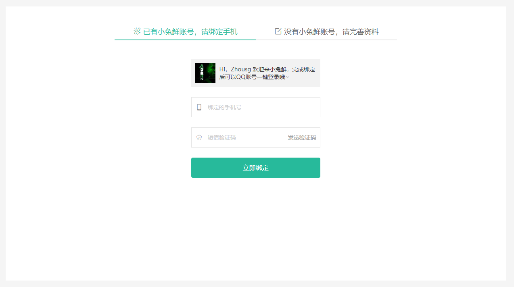

# 登录模块


## 01-登录-路由与组件

> 目的：完成登录页的路由与组件配置


组件：`src/views/login/index.vue`

```vue
<template>
  <div class="page-login">
    Login
  </div>
</template>
<script>
export default {
  name: 'PageLogin'
}
</script>
<style scoped lang="less"></style>
```

路由：`src/router/index.js`  一级路由规则

```diff
+const Login = () => import('@/views/login/index')
...
const routes = [
	...
+  { path: '/login', component: Login }
]
```

链接：`src/components/app-topnav.vue`

```diff
+<li><RouterLink to="/login">请先登录</RouterLink></li>
```


## 02-登录-基础布局

> 目的：完成登录页基础结构布局。


**结构分析：** 

- 登录头部 LoginHeader 需要留出副标题插槽
- 登录主体 Login
- 登录底部 LoginFooter


**具体代码：** 

- 头部组件 `src/views/login/components/login-header.vue`

```vue
<template>
  <header class="login-header">
    <div class="container">
      <h1 class="logo"><RouterLink to="/">小兔鲜</RouterLink></h1>
      <h3 class="sub"><slot /></h3>
      <RouterLink class="entry" to="/">
        进入网站首页
        <i class="iconfont icon-angle-right"></i>
        <i class="iconfont icon-angle-right"></i>
      </RouterLink>
    </div>
  </header>
</template>

<script>
export default {
  name: 'LoginHeader'
}
</script>

<style scoped lang='less'>
.login-header {
  background: #fff;
  border-bottom: 1px solid #e4e4e4;
  .container {
    display: flex;
    align-items: flex-end;
    justify-content: space-between;
  }
  .logo {
    width: 200px;
    a {
      display: block;
      height: 132px;
      width: 100%;
      text-indent: -9999px;
      background: url(../../../assets/images/logo.png) no-repeat center 18px / contain;
    }
  }
  .sub {
    flex: 1;
    font-size: 24px;
    font-weight: normal;
    margin-bottom: 38px;
    margin-left: 20px;
    color: #666;
  }
  .entry {
    width: 120px;
    margin-bottom: 38px;
    font-size: 16px;
    i {
      font-size: 14px;
      color: @xtxColor;
      letter-spacing: -5px;
    }
  }
}
</style>

```

- 底部组件 `src/views/login/components/login-footer.vue`

```vue
<template>
  <footer class="login-footer">
    <div class='container'>
      <p>
        <a href="javascript:;">关于我们</a>
        <a href="javascript:;">帮助中心</a>
        <a href="javascript:;">售后服务</a>
        <a href="javascript:;">配送与验收</a>
        <a href="javascript:;">商务合作</a>
        <a href="javascript:;">搜索推荐</a>
        <a href="javascript:;">友情链接</a>
      </p>
      <p>CopyRight &copy; 小兔鲜儿</p>
    </div>
  </footer>
</template>

<script>
export default {
  name: 'LoginFooter'
}
</script>

<style scoped lang='less'>
.login-footer {
  padding: 30px 0 50px;
  background: #fff;
  p {
    text-align: center;
    color: #999;
    padding-top: 20px;
    a {
      line-height: 1;
      padding:0 10px;
      color: #999;
      display: inline-block;
      ~ a {
        border-left: 1px solid #ccc;
      }
    }
  }
}
</style>
```

- 主体组件 `src/views/login/index.vue`

```vue
<template>
  <LoginHeader>欢迎登录</LoginHeader>
  <section class="login-section">
    <div class="wrapper">
      <nav>
        <a href="javascript:;">账户登录</a>
        <a href="javascript:;">扫码登录</a>
      </nav>
    </div>
  </section>
  <LoginFooter />
</template>

<script>
import LoginHeader from './components/login-header'
import LoginFooter from './components/login-footer'
export default {
  name: 'Login',
  components: {
    LoginHeader,
    LoginFooter
  }
}
</script>

<style scoped lang='less'>
.login-section {
  background: url(../../assets/images/login-bg.png) no-repeat center / cover;
  height: 488px;
  position: relative;
  .wrapper {
    width: 380px;
    background: #fff;
    min-height: 400px;
    position: absolute;
    left: 50%;
    top: 54px;
    transform: translate3d(100px,0,0);
    box-shadow: 0 0 10px rgba(0,0,0,.15);
    nav {
      height: 55px;
      border-bottom: 1px solid #f5f5f5;
      display: flex;
      padding: 0 40px;
      text-align: right;
      align-items: center;  
      a {
        flex: 1;
        line-height: 1;
        display: inline-block;
        font-size: 18px;
        position: relative;
        &:first-child {
          border-right: 1px solid #f5f5f5;
          text-align: left;
        }
        &.active{
          color: @xtxColor;
          font-weight: bold;
        }
      }
    }
  }
}
</style>
```


## 03-登录-切换效果

> 目的：完成点击nav按钮切换，帐号登录和扫码登录。


**大致步骤：** 

- 声明activeName数据提供模版使用
- 点击按钮设置activeName和绑定class属性
- 控制帐号登录盒子和扫码登录盒子显示隐藏


**落的代码：** 

`src/views/login/index.vue`

```diff
+import { ref } from 'vue'
export default {
  name: 'PageLogin',
  components: { LoginHeader, LoginFooter },
  setup () {
+    const activeName = ref('account')
+    return { activeName }
  }
}
```

```vue
    <div class="wrapper">
      <nav>
        <a @click="activeName='account'" :class="{active:activeName==='account'}" href="javascript:;">账户登录</a>
        <a @click="activeName='qrcode'" :class="{active:activeName==='qrcode'}" href="javascript:;">扫码登录</a>
      </nav>
      <!-- 表单 -->
      <div v-if="activeName==='account'" class="account-box">表单</div>
      <!-- 二维码 -->
      <div v-if="activeName==='qrcode'" class="qrcode-box">
        
        <p>打开 <a href="javascript:;">小兔鲜App</a> 扫码登录</p>
      </div>
    </div>
```

```less
// 二维码容器
.qrcode-box {
  text-align: center;
  padding-top: 40px;
  p {
    margin-top: 20px;
    a {
      color: @xtxColor;
      font-size: 16px;
    }
  }
}
```


## 04-登录-表单组件

> 目的：完成表单布局和帐号登录，短信登录切换。


**大致步骤：** 

- 提取组件
  - 通过isMsgLogin切换短信登录
  - 通过form.isAgree绑定同意协议
- 使用组件


**落的代码：** 

1. 定义组件 `src/views/login/component/login-form.vue`

基础结构：

```vue
<template>
  <div class="account-box">
    <div class="toggle">
      <a @click="isMsgLogin=false" href="javascript:;" v-if="isMsgLogin">
        <i class="iconfont icon-user"></i> 使用账号登录
      </a>
      <a @click="isMsgLogin=true" href="javascript:;" v-else>
        <i class="iconfont icon-msg"></i> 使用短信登录
      </a>
    </div>
    <div class="form">
      <template v-if="!isMsgLogin">
        <div class="form-item">
          <div class="input">
            <i class="iconfont icon-user"></i>
            <input type="text" placeholder="请输入用户名或手机号" />
          </div>
          <!-- <div class="error"><i class="iconfont icon-warning" />请输入手机号</div> -->
        </div>
        <div class="form-item">
          <div class="input">
            <i class="iconfont icon-lock"></i>
            <input type="password" placeholder="请输入密码">
          </div>
        </div>
      </template>
      <template v-else>
        <div class="form-item">
          <div class="input">
            <i class="iconfont icon-user"></i>
            <input type="text" placeholder="请输入手机号" />
          </div>
        </div>
        <div class="form-item">
          <div class="input">
            <i class="iconfont icon-code"></i>
            <input type="password" placeholder="请输入验证码">
            <span class="code">发送验证码</span>
          </div>
        </div>
      </template>
      <div class="form-item">
        <div class="agree">
          <XtxCheckbox v-model="form.isAgree" />
          <span>我已同意</span>
          <a href="javascript:;">《隐私条款》</a>
          <span>和</span>
          <a href="javascript:;">《服务条款》</a>
        </div>
      </div>
      <a href="javascript:;" class="btn">登录</a>
    </div>
    <div class="action">
      
      <div class="url">
        <a href="javascript:;">忘记密码</a>
        <a href="javascript:;">免费注册</a>
      </div>
    </div>
  </div>
</template>
```

基础样式：

```less
// 账号容器
.account-box {
  .toggle {
    padding: 15px 40px;
    text-align: right;
    a {
      color: @xtxColor;
      i {
        font-size: 14px;
      }
    }
  }
  .form {
    padding: 0 40px;
    &-item {
      margin-bottom: 28px;
      .input {
        position: relative;
        height: 36px;
        > i {
          width: 34px;
          height: 34px;
          background: #cfcdcd;
          color: #fff;
          position: absolute;
          left: 1px;
          top: 1px;
          text-align: center;
          line-height: 34px;
          font-size: 18px;
        }
        input {
          padding-left: 44px;
          border: 1px solid #cfcdcd;
          height: 36px;
          line-height: 36px;
          width: 100%;
          &.error {
            border-color: @priceColor;
          }
          &.active,&:focus {
            border-color: @xtxColor;
          }
        }
        .code {
          position: absolute;
          right: 1px;
          top: 1px;
          text-align: center;
          line-height: 34px;
          font-size: 14px;
          background: #f5f5f5;
          color: #666;
          width: 90px;
          height: 34px;
          cursor: pointer;
        }
      }
      > .error {
        position: absolute;
        font-size: 12px;
        line-height: 28px;
        color: @priceColor;
        i {
          font-size: 14px;
          margin-right: 2px;
        }
      }
    }
    .agree {
      a {
        color: #069;
      }
    }
    .btn {
      display: block;
      width: 100%;
      height: 40px;
      color: #fff;
      text-align: center;
      line-height: 40px;
      background: @xtxColor;
      &.disabled {
        background: #cfcdcd;
      }
    }
  }
  .action {
    padding: 20px 40px;
    display: flex;
    justify-content: space-between;
    align-items: center;
    .url {
      a {
        color: #999;
        margin-left: 10px;
      }
    }
  }
}
```

依赖数据：

```js
import { reactive, ref } from 'vue'
export default {
  name: 'LoginForm',
  setup () {
    // 是否短信登录
    const isMsgLogin = ref(false)
    // 表单信息对象
    const form = reactive({
      isAgree: true
    })
    return { isMsgLogin, form }
  }
}
```


2. 使用组件 `src/views/login/index.vue`

```diff
      <!-- 表单 -->
+      <LoginForm v-if="activeName==='account'"></LoginForm>
```

```diff
+import LoginForm from './components/login-form'
import { ref } from 'vue'
export default {
  name: 'PageLogin',
  components: {
    LoginHeader,
    LoginFooter,
+    LoginForm
  },
```


## 05-登录-表单校验

> 文档：https://vee-validate.logaretm.com/v4/  支持vue3.0


第一步：安装

- 执行命令 `npm i vee-validate@4.0.3`

第二步：导入

- 修改文件 `src/views/login/index.vue`

```js
import { Form, Field } from 'vee-validate'
```

第三步：定义校验规则

- 新建文件 `src/utils/vee-validate-schema.js`

```js
// 定义校验规则提供给vee-validate组件使用
export default {
  // 校验account
  account (value) {
    // value是将来使用该规则的表单元素的值
    // 1. 必填
    // 2. 6-20个字符，需要以字母开头
    // 如何反馈校验成功还是失败，返回true才是成功，其他情况失败，返回失败原因。
    if (!value) return '请输入用户名'
    if (!/^[a-zA-Z]\w{5,19}$/.test(value)) return '字母开头且6-20个字符'
    return true
  },
  password (value) {
    if (!value) return '请输入密码'
    if (!/^\w{6,24}$/.test(value)) return '密码是6-24个字符'
    return true
  },
  mobile (value) {
    if (!value) return '请输入手机号'
    if (!/^1[3-9]\d{9}$/.test(value)) return '手机号格式错误'
    return true
  },
  code (value) {
    if (!value) return '请输入验证码'
    if (!/^\d{6}$/.test(value)) return '验证码是6个数字'
    return true
  },
  isAgree (value) {
    if (!value) return '请勾选同意用户协议'
    return true
  }
}
```

- 提取目的 `这些校验规则将来在其他表单验证时候可复用`

第三步：使用 `Form` 组件，使用 `vee-validate-schema` 校验规则

- 修改文件 `src/views/login/index.vue`

```diff
-<div class="form">...</div>
+<Form class="form" :validation-schema="schema" autocomplete="off">...</Form>
```

```diff
import veeSchema from '@/utils/vee-validate-schema'
```

```js
  setup () {
    // 控制短信登录切换的
    const isMsgLogin = ref(false)
    // 表单对象数据
    const form = reactive({
      isAgree: true,
      account: null,
      password: null,
      mobile: null,
      code: null
    })
    // 校验规则对象
    const mySchema = {
      account: schema.account,
      password: schema.password,
      mobile: schema.mobile,
      code: schema.code,
      isAgree: schema.isAgree
    }
    return { isMsgLogin, form, scheam:mySchema, submit }
 } 
```

第四步：使用 `Field` 组件，添加表单项目校验

- 修改文件 `src/views/login/index.vue`

```diff
          <div class="form-item">
            <div class="input">
              <i class="iconfont icon-user"></i>
+              <Field :class="{error:errors.mobile}" v-model="form.mobile" name="mobile" type="text" placeholder="请输入手机号" />
            </div>
+            <div class="error" v-if="errors.mobile"><i class="iconfont icon-warning" />{{errors.mobile}}</div>
          </div>
          <div class="form-item" v-if="!isMsgLogin">
            <div class="input">
              <i class="iconfont icon-lock"></i>
+              <Field :class="{error:errors.password}" v-model="form.password" name="password" type="password" placeholder="请输入密码" />
            </div>
+            <div class="error" v-if="errors.password"><i class="iconfont icon-warning" />{{errors.password}}</div>
          </div>
          <div class="form-item" v-else>
            <div class="input">
              <i class="iconfont icon-code"></i>
+              <Field :class="{error:errors.code}" v-model="form.code" name="code" type="password" placeholder="请输入验证码" />
              <span class="code">发送验证码</span>
            </div>
+            <div class="error" v-if="errors.code"><i class="iconfont icon-warning" />{{errors.code}}</div>
          </div>
```

```vue
<Form class="form" :validation-schema="schema" v-slot="{errors}" 
```

- 其实就是把input改成 `Field` 组件，默认解析成input
-  `Field` 添加name属性，作用是指定使用schema中哪个校验规则
- `Form` 添加 `v-slot="{errors}"` 使用作用域插槽暴露 `errors` 错误对象
  - 通过 `errors['校验规则名称']` 取出错误信息，有则显示，无即隐藏

第五步：如何校验 自定义组件 `XtxCheckbox`

- 修改文件 `src/views/login/index.vue`

```diff
-<XtxCheckbox v-model="form.isAgree" />
+<Field as="XtxCheckbox" name="isAgree" v-model="form.isAgree"/>
```

- `Field` 的 `as` 属性可以指定为其他标签，也可指定为组件。
  - 但是组件需要支持 v-model 否则校验不会触发。

第六步：如何在切换 短信 与 账户 登录时候清空表单和校验结果

- 修改文件 `src/views/login/index.vue`

```vue
<Form ref="formCom" class="form" :validation-schema="schema" v-slot="{errors}" 
```

```js
    // 切换表单元素，还原数据和清除校验效果
    const formCom = ref(null)
    watch(isMsgLogin, () => {
      // 还原数据
      form.isAgree = true
      form.account = null
      form.password = null
      form.mobile = null
      form.code = null
      // 补充校验效果清除，Form组件提供resetForm()
      formCom.value.resetForm()
    })
```

- 首先需要自己手动清除数据，然后使用`Form` 组件提供 resetForm 方法对表单进行清除校验结果

第七步：如何整体表单校验 

- 修改文件 `src/views/login/index.vue`

```vue
<a @click="login()" href="javascript:;" class="btn">登 录</a>
```

```js
    // 需要在点击登录的时候对整体表单进行校验
    const login = async () => {
      // Form组件提供了一个 validate 函数作为整体表单校验，当是返回的是一个promise
      const valid = await formCom.value.validate()
      console.log(valid)
    }

    return { isMsgLogin, form, schema: mySchema, formCom, login }
```

- `Form` 组件提供 validate 方法对表单进行整体校验

## 06-登录-消息提示组件封装

> 目的：在接口请求报错的时候给用户进行提示


组件功能分析：

- 固定顶部显示，有三种类型：成功，错误，警告。
- 显示消息提示时需要动画从上滑入且淡出。
- 组件使用的方式不够便利，封装成工具函数方式。


大致实现步骤：

- 先把布局，和三种情况的显示，完成。 

  - 定义组件：`src/components/library/xtx-message.vue`

  ```vue
  <template>
    <div class="xtx-message" :style="style[type]">
      <!-- 上面绑定的是样式 -->
      <!-- 不同提示图标会变 -->
      <i class="iconfont" :class="[style[type].icon]"></i>
      <span class="text">{{text}}</span>
    </div>
  </template>
  <script>
  export default {
    name: 'XtxMessage',
    props: {
      text: {
        type: String,
        default: ''
      },
      type: {
        type: String,
        // warn 警告  error 错误  success 成功
        default: 'warn'
      }
    },
    setup () {
      // 定义一个对象，包含三种情况的样式，对象key就是类型字符串
      const style = {
        warn: {
          icon: 'icon-warning',
          color: '#E6A23C',
          backgroundColor: 'rgb(253, 246, 236)',
          borderColor: 'rgb(250, 236, 216)'
        },
        error: {
          icon: 'icon-shanchu',
          color: '#F56C6C',
          backgroundColor: 'rgb(254, 240, 240)',
          borderColor: 'rgb(253, 226, 226)'
        },
        success: {
          icon: 'icon-queren2',
          color: '#67C23A',
          backgroundColor: 'rgb(240, 249, 235)',
          borderColor: 'rgb(225, 243, 216)'
        }
      }
      return { style }
    }
  }
  </script>
  <style scoped lang="less">
  .xtx-message {
    width: 300px;
    height: 50px;
    position: fixed;
    z-index: 9999;
    left: 50%;
    margin-left: -150px;
    top: 25px;
    line-height: 50px;
    padding: 0 25px;
    border: 1px solid #e4e4e4;
    background: #f5f5f5;
    color: #999;
    border-radius: 4px;
    i {
      margin-right: 4px;
      vertical-align: middle;
    }
    .text {
      vertical-align: middle;
    }
  }
  </style>
  ```

  - 使用组件

  ```vue
  <XtxMessage text="手机号或密码错误" type="error" />
  ```

- 实现显示的时候动画效果

```diff
<template>
+  <Transition name="down">
+    <div class='xtx-message' :style="style" v-show="show">
      <!-- 上面绑定的是样式 -->
      <!-- 不同提示图标会变 -->
      <i class="iconfont" :class="[style[type].icon]"></i>
      <span class="text">{{text}}</span>
    </div>
+  </Transition>
</template>

<script>
+import { onMounted, ref } from 'vue'
export default {
  name: 'XtxMessage',
  props: {
    text: {
      type: String,
      default: ''
    },
    type: {
      type: String,
      // warn 警告  error 错误  success 成功
      default: 'warn'
    }
  },
  setup () {
    // 定义一个对象，包含三种情况的样式，对象key就是类型字符串
    const style = {
      warn: {
        icon: 'icon-warning',
        color: '#E6A23C',
        backgroundColor: 'rgb(253, 246, 236)',
        borderColor: 'rgb(250, 236, 216)'
      },
      error: {
        icon: 'icon-shanchu',
        color: '#F56C6C',
        backgroundColor: 'rgb(254, 240, 240)',
        borderColor: 'rgb(253, 226, 226)'
      },
      success: {
        icon: 'icon-queren2',
        color: '#67C23A',
        backgroundColor: 'rgb(240, 249, 235)',
        borderColor: 'rgb(225, 243, 216)'
      }
    }
+    // 定义一个数据控制显示隐藏，默认是隐藏，组件挂载完毕显示
+    const visible = ref(false)
+    onMounted(() => {
+      visible.value = true
+    })
+    return { style, visible }
  }
}
</script>

<style scoped lang='less'>
+.down {
+  &-enter {
+    &-from {
+      transform: translate3d(0,-75px,0);
+      opacity: 0;
+    }
+    &-active {
+      transition: all 0.5s;
+    }
+    &-to {
+      transform: none;
+      opacity: 1;
+    }
+  }
+}
// 。。。 省略
```

- 封装成vue实例函数式调用
  - vue3.0使用app.config.globalProperties挂载原型方法
  - 也支持直接导入函数使用

`src/components/library/Message.js`

```js
// 实现使用函数调用xtx-message组件的逻辑
import { createVNode, render } from 'vue'
import XtxMessage from './xtx-message.vue'

// 准备dom容器
const div = document.createElement('div')
div.setAttribute('class', 'xtx-message-container')
document.body.appendChild(div)
// 定时器标识
let timer = null

export default ({ type, text }) => {
  // 实现：根据xtx-message.vue渲染消息提示
  // 1. 导入组件
  // 2. 根据组件创建虚拟节点
  const vnode = createVNode(XtxMessage, { type, text })
  // 3. 准备一个DOM容器
  // 4. 把虚拟节点渲染DOM容器中
  render(vnode, div)
  // 5. 开启定时，移出DOM容器内容
  clearTimeout(timer)
  timer = setTimeout(() => {
    render(null, div)
  }, 3000)
}
```

 `src/components/library/index.js`

```js
import Message from './Message'
```

```diff
    // 定义指令
    defineDirective(app)

+    // 如果你想挂载全局的属性，能够通过组件实例调用的属性   this.$message
+    app.config.globalProperties.$message = Message// 原型函数
}
```

- 在登录逻辑中使用  `src/views/login/index.vue`

```js
import Message from '@/components/library/Message'
```

```diff
          // 帐号密码登录
          userAccountLogin(form).then(data => {
            // 成功
          }).catch(e => {
            // 失败
+            Message({ type: 'error', text: '登录失败' })
          })
```


## 07-登录-账户登录

> 目的：完成以账户进行登录


定义API `src/api/user.js`

```js
import request from '@/utils/request'

/**
 * 帐号登录
 * @param {String} account - 用户名
 * @param {String} password - 密码
 * @returns Promise
 */
export const userAccountLogin = ({ account, password }) => {
  return request('/login', 'post', { account, password })
}

```

定义修改用户信息的 mutations `src/store/module/user.js`

```diff
// 用户状态
export default {
  namespaced: true,
  state: () => ({
    id: '',
+    account:'',
    nickname: '',
    avatar: '',
    token: '',
    mobile: ''
  })
}
```

进行登录 `src/views/login/index.vue`

```js
import { userAccountLogin } from '@/api/user'
import Message from '@/components/library/Message'
import { useStore } from 'vuex'
import { useRoute, useRouter } from 'vue-router'
```

```js
    // 使用store
    const store = useStore()
    // 使用router
    const router = useRouter()
    // 使用route
    const route = useRoute()
    // 登录提交
    const submit = async () => {
      // 整体校验
      const valid = await target.value.validate()
      console.log(valid)
      if (valid) {
        // 发送请求
        if (!isMsgLogin.value) {
          // 帐号密码登录
          userAccountLogin(form).then(data => {
            // 成功
            // 1. 存储信息
            const { id, account, nickname, avatar, token, mobile } = data.result
            store.commit('user/setUser', { id, account, nickname, avatar, token, mobile })
            // 2. 提示
            Message({ type: 'success', text: '登录成功' })
            // 3. 跳转
            router.push(route.query.redirectUrl || '/')
          }).catch(e => {
            // 失败
            Message({ type: 'error', text: e.response.data.message || '登录失败' })
          })
        } else {
          // 短信登录
        }
      }
    }
```


## 08-登录-手机号登录

>  `src/api/user.js`实现代码

封装好发短信和进行短信登录的接口API

```js
/**
 * 短信登录
 * @param {String} mobile - 手机号
 * @param {String} code - 验证码
 * @returns Promise
 */
export const userMobileLogin = ({ mobile, code }) => {
  return request('/login/code', 'post', { mobile, code })
}

/**
 * 获取短信登录验证码
 * @param {String} mobile - 手机号
 * @returns Promise
 */
export const userMobileLoginMsg= (mobile) => {
  return request('/login/code', 'get', { mobile })
}

```

`src/views/login/index.vue` 实现代码发送短信

根据数据渲染按钮文字，绑定点击事件发送验证码：

```vue
            <span @click="send()" class="code">
              {{time===0?'发送验证码':`${time}秒后发送`}}
            </span>
```

使用 schma 函数来校验mobile，如果成功继续执行，不成功使用`Form`组件错误 `setFieldError`

发送验证码，需要校验手机号，和判断是否60秒内，方可发送。组件销毁时候清除定时器。

```js
import { useIntervalFn } from '@vueuse/core'
```

```js
    // pause 暂停 resume 开始
    // useIntervalFn(回调函数,执行间隔,是否立即开启)
    const time = ref(0)
    const { pause, resume } = useIntervalFn(() => {
      time.value--
      if (time.value <= 0) {
        pause()
      }
    }, 1000, false)
    onUnmounted(() => {
      pause()
    })

    // 发送短信
    const send = async () => {
      const valid = mySchema.mobile(form.mobile)
      if (valid === true) {
        // 通过
        if (time.value === 0) {
        // 没有倒计时才可以发送
          await userMobileLoginMsg(form.mobile)
          Message({ type: 'success', text: '发送成功' })
          time.value = 60
          resume()
        }
      } else {
        // 失败，使用vee的错误函数显示错误信息 setFieldError(字段,错误信息)
        formCom.value.setFieldError('mobile', valid)
      }
    }
        return { isMsgLogin, form, schema: mySchema, formCom, login, send, time }
```

`src/views/login/index.vue` 实现代码手机号登录

```js
    // 使用store
    const store = useStore()
    // 使用router
    const router = useRouter()
    // 使用route
    const route = useRoute()
    // 登录提交
    const submit = async () => {
      // 整体校验
      const valid = await target.value.validate()
      if (valid) {
        // 发送请求
        let data = null
        try {
          if (!isMsgLogin.value) {
            // 帐号登录
            data = await userAccountLogin(form)
          } else {
            // 短信登录
            // 1. 定义两个API  短信登录，获取短信验证码
            // 2. 实现发送短信验证码发送功能
            // 3. 完成手机号短信验证码登录逻辑
            data = await userMobileLogin(form)
          }
        } catch (e) {
          Message({ type: 'error', text: e.response.data.message || '登录失败' })
        }
        // 成功
        // 1. 存储信息
        const { id, account, nickname, avatar, token, mobile } = data.result
        store.commit('user/setUser', { id, account, nickname, avatar, token, mobile })
        // 2. 提示
        Message({ type: 'success', text: '登录成功' })
        // 3. 跳转
        router.push(route.query.redirectUrl || '/')
      }
    }
```


## 09-退出登录

> 目的：完成退出

`src/components/app-topnav.vue`

```vue
        <template v-if="profile.token">
          <li>
            <a href="javascript:;"><i class="iconfont icon-user"></i>
              {{profile.account}}
            </a>
          </li>
          <li><a @click="logout()" href="javascript:;">退出登录</a></li>
        </template>
```

```diff
import { computed } from 'vue'
import { useStore } from 'vuex'
import { useRouter } from 'vue-router'
export default {
  name: 'AppTopnav',
  setup () {
    // 获取用户的登录信息才能控制切换导航菜单
    const store = useStore()
    // 使用vuex中的state需要设置计算属性，否则不是响应式
    const profile = computed(() => {
      return store.state.user.profile
    })
+    const router = userRouter()
+    const logout = () => {
+      store.commit('user/setUser',{})
+      router.push('/login')
+    }
+    return { profile, logout}
  }
}
```


## 10-登录-QQ登录-流程分析

> 目的：掌握第三方登录的实现流程。


描述一下我们要做的事情：

- 在登录页面，QQ登录图片处，赋予其打开QQ登录页面功能。
- 回跳的页面得到QQ给的唯一标识openId，根据openId去后台查询是否已经绑定过账户。
  - 如果绑定过，完成登录。
  - 没有绑定过
    - 有账号的，绑定手机号，即为登录。
    - 没账号的，完善账户信息，即为登录。

- 登录成功后，跳转首页，或者来源页面。


## 11-登录-QQ登录-按钮处理

> 目的：完成QQ登录按钮初始化

第一步：参考文档：

-  [准备工作](https://wiki.connect.qq.com/%E5%87%86%E5%A4%87%E5%B7%A5%E4%BD%9C_oauth2-0)
-  [QQ互联JS_SDK](https://wiki.connect.qq.com/js_sdk%E4%BD%BF%E7%94%A8%E8%AF%B4%E6%98%8E#3..E8.87.AA.E5.AE.9A.E4.B9.89.E7.99.BB.E5.BD.95.E6.8C.89.E9.92.AE)

- 总结一下：
  - 有一个网站，且已备案。网站需要有QQ登录的逻辑（登录页面，回跳页面）。
  - 然后在QQ互联上进行身份认证，审核通过。
  - 然后在QQ互联上创建应用，应用需要域名，备案号，回调地址。审核通过。
  - 得到：应用ID  应用key  回调地址。
  - 才能完成QQ登录。（以上四个步骤，工作后大概率由后台或运维完成）
  - 注意：id和uri都不能修改，否则无效。

  ```bash
  # 测试用appid 
  # 100556005
  # 测试用redirect_uri
  # http://www.corho.com:8080/#/login/callback
  ```

  


第二步：遇到问题：

- 由于域名是www.corho.com和localhost不一致无法回调页面，需要在本地修改hosts地址。

`windows`

```
1. 找到 C:\Windows\System32\drivers\etc 下hosts文件
2. 在文件中加入  127.0.0.1       www.corho.com
3. 保存即可。
# 如果提示没有权限
1. 将hosts文件移到桌面，然后进行修改，确认保存。
2. 将桌面hosts文件替换c盘文件
```

`mac OS`

```
1. 打开命令行窗口
2. 输入：sudo vim /etc/hosts
3. 按下：i 键
4. 输入：127.0.0.1       www.corho.com
5. 按下：esc
6. 按下：shift + :
7. 输入：wq 回车即可
```

- 需要开启IP或域名访问webpack服务器权限，在vue.config.js中

```json
  // 这个是给webpack-dev-server开启可IP和域名访问权限。
  chainWebpack: config => {
    config.devServer.disableHostCheck(true)
  }
```


第三步：处理QQ登录按钮：

1. 在index.html添加

```html
<script src="http://connect.qq.com/qc_jssdk.js" data-appid="100556005" data-redirecturi="http://www.corho.com:8080/#/login/callback"></script>
```

2. 在vue.config.js添加

```json
  # 这个是设置外部扩展，模块为qc变量名为QC，导入qc将不做打包。
  configureWebpack: {
    externals: {
      qc: 'QC'
    }
  },
```

3. 在 `src/views/login.vue`

```js
import QC from 'qc'
```

```html
<span id="qqLoginBtn"></span>
```

```js
    // onMounted(() => {
    //   // 组件渲染完毕，使用QC生成QQ登录按钮
    //   QC.Login({
    //     btnId: 'qqLoginBtn'
    //   })
    // })
```

4. 看页面生成QQ登录按钮，点击后新窗口打开，**登录成功也无法跳转到登录页面窗口**。


5. 通过审查元素，找到跳转连接，自己来控制

```html
          <a href="https://graph.qq.com/oauth2.0/authorize?client_id=100556005&response_type=token&scope=all&redirect_uri=http%3A%2F%2Fwww.corho.com%3A8080%2F%23%2Flogin%2Fcallback">
            
          </a>
```


## 12-登录-QQ登录-回跳页面

> 目的：完成QQ登录成功后的页面

主要有三个逻辑：

- 已注册，已绑定，登录成功，跳转首页，或者来源页面
- 已注册，未绑定，绑定手机号，登录成功，跳转首页，或者来源页面
- 未注册，补充完善账户信息，，登录成功，跳转首页，或者来源页面

需要一个回调页面：

- 路由规则 `src/router/index.js`

```js
const LoginCallback = () => import('@/views/login/callback')
```

```diff
  { path: '/login', component: Login },
+  { path: '/login/callback', component: LoginCallback }
```

- 三个组件

`src/views/login/callback.vue`   回调页面

```vue
<template>
  <LoginHeader>联合登录</LoginHeader>
  <section class="container">
    <nav class="tab">
      <a @click="hasAccount=true" :class="{active:hasAccount}" href="javascript:;">
        <i class="iconfont icon-bind" />
 <span>已有小兔鲜账号，请绑定手机</span>
      </a>
      <a @click="hasAccount=false" :class="{active:!hasAccount}" href="javascript:;">
        <i class="iconfont icon-edit" />
        <span>没有小兔鲜账号，请完善资料</span>
      </a>
    </nav>
    <div class="tab-content" v-if="hasAccount">
      <CallbackBind :nickname="nickname" :avatar="avatar" />
    </div>
    <div class="tab-content" v-else>
      <CallbackPatch />
    </div>
  </section>
  <LoginFooter />
</template>

<script>
import { ref } from 'vue'
import LoginHeader from './components/login-header'
import LoginFooter from './components/login-footer'
import CallbackBind from './components/callback-bind'
import CallbackPatch from './components/callback-patch'
export default {
  name: 'PageCallback',
  components: { LoginHeader, LoginFooter, CallbackBind, CallbackPatch },
  setup () {
    const hasAccount = ref(true)
    const nickname = ref(null)
    const avatar = ref(null)
    return { hasAccount, nickname, avatar }
  }
}
</script>

<style scoped lang='less'>
.container {
  padding: 25px 0;
}
.tab {
  background: #fff;
  height: 80px;
  padding-top: 40px;
  font-size: 18px;
  text-align: center;
  a {
    color: #666;
    display: inline-block;
    width: 350px;
    line-height: 40px;
    border-bottom: 2px solid #e4e4e4;
    i {
      font-size: 22px;
      vertical-align: middle;
    }
    span {
      vertical-align: middle;
      margin-left: 4px;
    }
    &.active {
      color: @xtxColor;
      border-color: @xtxColor;
    }
  }
}
.tab-content {
  min-height: 600px;
  background: #fff;
}
</style>
```

`src/views/login/components/callback-bind.vue `  绑定手机

```vue
<template>
  <div class="xtx-form">
    <div class="user-info">
      
      <p>Hi，Tom 欢迎来小兔鲜，完成绑定后可以QQ账号一键登录哦~</p>
    </div>
    <div class="xtx-form-item">
      <div class="field">
        <i class="icon iconfont icon-phone"></i>
        <input class="input" type="text" placeholder="绑定的手机号" />
      </div>
      <div class="error"></div>
    </div>
    <div class="xtx-form-item">
      <div class="field">
        <i class="icon iconfont icon-code"></i>
        <input class="input" type="text" placeholder="短信验证码" />
        <span class="code">发送验证码</span>
      </div>
      <div class="error"></div>
    </div>
    <a href="javascript:;" class="submit">立即绑定</a>
  </div>
</template>

<script>
export default {
  name: 'CallbackBind'
}
</script>

<style scoped lang='less'>
.user-info {
    width: 320px;
    height: 70px;
    margin: 0 auto;
    display: flex;
    background: #f2f2f2;
    align-items: center;
    padding: 0 10px;
    margin-bottom: 25px;
    img {
      background: #f2f2f2;
      width: 50px;
      height: 50px;
    }
    p {
      padding-left: 10px;
    }
  }
  .code {
    position: absolute;
    right: 0;
    top: 0;
    line-height: 50px;
    width: 80px;
    color: #999;
    &:hover {
      cursor: pointer;
    }
  }
</style>
```

`src/views/login/components/callback-patch.vue ` 完善信息

```vue
<template>
  <div class="xtx-form">
    <div class="xtx-form-item">
      <div class="field">
        <i class="icon iconfont icon-user"></i>
        <input class="input" type="text" placeholder="请输入用户名" />
      </div>
      <div class="error"></div>
    </div>
    <div class="xtx-form-item">
      <div class="field">
        <i class="icon iconfont icon-phone"></i>
        <input class="input" type="text" placeholder="请输入手机号" />
      </div>
      <div class="error"></div>
    </div>
    <div class="xtx-form-item">
      <div class="field">
        <i class="icon iconfont icon-code"></i>
        <input class="input" type="text" placeholder="请输入验证码" />
        <span class="code">发送验证码</span>
      </div>
      <div class="error"></div>
    </div>
    <div class="xtx-form-item">
      <div class="field">
        <i class="icon iconfont icon-lock"></i>
        <input class="input" type="password" placeholder="请输入密码" />
      </div>
      <div class="error"></div>
    </div>
    <div class="xtx-form-item">
      <div class="field">
        <i class="icon iconfont icon-lock"></i>
        <input class="input" type="password" placeholder="请确认密码" />
      </div>
      <div class="error"></div>
    </div>
    <a href="javascript:;" class="submit">立即提交</a>
  </div>
</template>

<script>
export default {
  name: 'CallbackPatch'
}
</script>

<style scoped lang='less'>
.code {
  position: absolute;
  right: 0;
  top: 0;
  line-height: 50px;
  width: 80px;
  color: #999;
  &:hover {
    cursor: pointer;
  }
}
</style>

```

`src/assets/styles/common.less`  公用样式

```less
// 表单
.xtx-form {
  padding: 50px 0;
  &-item {
    display: flex;
    align-items: center;
    width: 700px;
    margin: 0 auto;
    padding-bottom: 25px;
    .label {
      width: 180px;
      padding-right: 10px;
      text-align: right;
      color: #999;
      ~ .field {
        margin-left: 0;
      }
    }
    .field {
      width: 320px;
      height: 50px;
      position: relative;
      margin-left: 190px;
      .icon {
        position: absolute;
        left: 0;
        top: 0;
        width: 40px;
        height: 50px;
        text-align: center;
        line-height: 50px;
        color: #999;
        ~ .input {
          padding-left: 40px;
        }
      }
      .input{
        border: 1px solid #e4e4e4;
        width: 320px;
        height: 50px;
        line-height: 50px;
        padding: 0 10px;
        &.err {
          border-color: @priceColor;
        }
        &:focus,&:active{
          border-color: @xtxColor;
        }
      }
    }
    .error {
      width: 180px;
      padding-left: 10px;
      color: @priceColor;
    }
  }
  .submit {
    width: 320px;
    height: 50px;
    border-radius: 4px;
    background: @xtxColor;
    height: 50px;
    line-height: 50px;
    text-align: center;
    font-size: 16px;
    color: #fff;
    display: block;
    margin: 0 auto;
  }
}
```


## 13-登录-QQ登录-已注册已绑定

> 目的：已注册已绑定，完成QQ登录。


大致思路：

- 回跳组件初始化的时候获取openId
- 根据openId去后台进行登录
- 如果成功，就代表已注册已绑定，记录返回的用户信息，跳转到首页或者来源页面。
- 再做上述事件需要网络请求，所以加上一个loading状态。


落地代码：

- 准备一个loading的容器覆盖在当前页面容器上。

```less
.container {
  padding: 25px 0;
  position: relative;
  height: 730px;  
  .unbind {
    position: absolute;
    left: 0;
    top: 0;
    width: 100%;
    height: 100%;
    padding: 25px 0;
    z-index: 99;
    .loading {
      height: 100%;
      background: #fff url(../../assets/images/load.gif) no-repeat center / 100px 100px;
    }
  }
}
```

```diff
+  <section class="container"v-if="isBind">
+    <div class="unbind">
+      <div class="loading"></div>
+    </div>
+  <section class="container" v-else>
```

```js
    // 假设已经绑定，默认会去做一次登录，如果登录失败证明未绑定。
    const isBind = ref(true)
```


- 记录需要回跳的页面地址

`src/store/module/user.js`

```diff
// 用户状态
export default {
  namespaced: true,
  state: () => ({
    profile: {
      id: '',
      nickname: '',
      avatar: '',
      token: '',
      mobile: ''
    },
+    redirectUrl: '/'
  }),
  mutations: {
    setUser (state, payload) {
      state.profile = payload
    },
+    setRedirectUrl (state, url) {
+      state.redirectUrl = url
+    }
  }
}

```

·`src/views/login/index.vue`   记录跳转登录地址栏通过returnUrl传递的参数

```js
import { useStore } from 'vuex'
import { useRoute } from 'vue-router'
```

```js
    // 存储回调地址，提供将来QQ回调页使用  setup中
    const store = useStore()
    const route = useRoute()
    store.commit('user/setRedirectUrl', route.query.redirectUrl)
```


- 在组件初始化的时候获取openId去登录

`src/api/user.js` 准备登录API

```js
/**
 * 第三方登录
 * @param {String} unionId - 第三方登录唯一标识
 * @param {Integer} source - 来源 1为pc，2为webapp，3为微信小程序，4为Android，5为ios,6为qq,7为微信
 * @returns Promise
 */
export const userQQLogin = (unionId, source = 6) => {
  return request('/login/social', 'post', { unionId, source })
}

```

`src/views/login/callback.vue` 根据openId登录

```js
import QC from 'qc'
import { userQQLogin } from '@/api/user'
import Message from '@/components/library/Message'
```

```js
    // 假设已经绑定，默认会去做一次登录，如果登录失败证明未绑定。
    const isBind = ref(true)
    // 1. 获取QQ互联的openId也就是后台需要的unionId
    // 2. 根据QQ互联的openId去进行登录，准备一个接口
    const store = useStore()
    const router = useRouter()
    if (QC.Login.check()) {
      // 检查QQ是否登录
      QC.Login.getMe((openId) => {
        userQQLogin(openId).then(data => {
          // 代表：使用qq登录成功
          // 1. 存储用户信息
          const { id, account, avatar, mobile, nickname, token } = data.result
          store.commit('user/setUser', { id, account, avatar, mobile, nickname, token })
          // 2. 跳转到来源页或者首页
          router.push(store.state.user.redirectUrl)
          // 3. 成功提示
          Message({ type: 'success', text: 'QQ登录成功' })
        }).catch(e => {
          // 代表：使用qq登录失败===>1. 没绑定小兔鲜帐号  2. 没有小兔鲜帐号
          isBind.value = false
        })
      })
    }
    return { hasAccount, isBind }
  }
```


## 14-登录-QQ登录-未绑定有账号

> 目的：未注册有账号，完成QQ绑定。



大致思路：

- 获取QQ用户的头像和昵称展示
- 进行表单校验
- 进行短信验证码发送
- 进行绑定，完成后为登录状态，跳转到首页或者来源页面。


落地代码：

- QQ信息展示 `src/views/login/callback.vue`

```js
import QC from 'qc'
import { ref } from 'vue'
export default {
  name: 'CallbackBind',
  props: {
    unionId: {
      type: String,
      default: ''
    }
  },
  setup () {
    // 1. 准备下信息：unionId(openId) qq头像 昵称
    // 2. 完成表单校验
    // 3. 发送验证吗（校验，定义api，调用，完成倒计时）
    // 4. 进行绑定（绑定成功就是登录成功）
    const nickname = ref('null')
    const avatar = ref('null')
    if (QC.Login.check()) {
      QC.api('get_user_info').success(res => {
        avatar.value = res.data.figureurl_1
        nickname.value = res.data.nickname
      })
    }
    return { nickname, avatar }
  }
}
```

- `src/views/login/index.vue`传入openId给 `callback-bind.vue`组件

```js
<CallbackBind :unionId="unionId" />
```

```js
    const unionId = ref(null)
```

```diff
      QC.Login.getMe((openId) => {
+        unionId.value = openId
        userQQLogin(openId).then(data => {
```

- 表单校验，发送短信，立即绑定 `src/login/components/callback-bind.vue`

```vue
<template>
  <Form ref="formCom" :validation-schema="mySchema" v-slot="{errors}" autocomplete="off" class="xtx-form">
    <div class="user-info">
      
      <p>Hi，{{nickname}} 欢迎来小兔鲜，完成绑定后可以QQ账号一键登录哦~</p>
    </div>
    <div class="xtx-form-item">
      <div class="field">
        <i class="icon iconfont icon-phone"></i>
        <Field :class="{err:errors.mobile}" v-model="form.mobile" name="mobile" class="input" type="text" placeholder="绑定的手机号" />
      </div>
      <div v-if="errors.mobile" class="error">{{errors.mobile}}</div>
    </div>
    <div class="xtx-form-item">
      <div class="field">
        <i class="icon iconfont icon-code"></i>
        <Field :class="{err:errors.code}" v-model="form.code" name="code" class="input" type="text" placeholder="短信验证码" />
        <span @click="send()" class="code">
          {{time===0?'发送验证码':`${time}秒后发送`}}
        </span>
      </div>
      <div v-if="errors.code" class="error">{{errors.code}}</div>
    </div>
    <a @click="submit()" href="javascript:;" class="submit">立即绑定</a>
  </Form>
</template>

<script>
import QC from 'qc'
import { reactive, ref, onUnmounted } from 'vue'
import { Form, Field } from 'vee-validate'
import schema from '@/utils/vee-validate-schema'
import { userQQBindCode, userQQBindLogin } from '@/api/user'
import { useIntervalFn } from '@vueuse/core'
import Message from '@/components/library/Message'
import { useStore } from 'vuex'
import { useRouter } from 'vue-router'
export default {
  name: 'CallbackBind',
  components: { Form, Field },
  props: {
    unionId: {
      type: String,
      default: ''
    }
  },
  setup (props) {
    // 1. 准备下信息：unionId(openId) qq头像 昵称
    // 2. 完成表单校验
    // 3. 发送验证吗（校验，定义api，调用，完成倒计时）
    // 4. 进行绑定（绑定成功就是登录成功）
    const nickname = ref('null')
    const avatar = ref('null')
    if (QC.Login.check()) {
      QC.api('get_user_info').success(res => {
        avatar.value = res.data.figureurl_qq_1
        nickname.value = res.data.nickname
      })
    }

    // 表单数据对象
    const form = reactive({
      mobile: null,
      code: null
    })
    // 校验规则对象
    const mySchema = {
      mobile: schema.mobile,
      code: schema.code
    }

    // 发送短信验证码
    // pause 暂停 resume 开始
    // useIntervalFn(回调函数,执行间隔,是否立即开启)
    const formCom = ref(null)
    const time = ref(0)
    const { pause, resume } = useIntervalFn(() => {
      time.value--
      if (time.value <= 0) {
        pause()
      }
    }, 1000, false)
    onUnmounted(() => {
      pause()
    })

    // 1. 发送验证码
    // 1.1 绑定发送验证码按钮点击事件
    // 1.2 校验手机号，如果成功才去发送短信（定义API），请求成功开启60s的倒计时，不能再次点击，倒计时结束恢复
    // 1.3 如果失败，失败的校验样式显示出来
    const send = async () => {
      const valid = mySchema.mobile(form.mobile)
      if (valid === true) {
        // 通过
        if (time.value === 0) {
        // 没有倒计时才可以发送
          await userQQBindCode(form.mobile)
          Message({ type: 'success', text: '发送成功' })
          time.value = 60
          resume()
        }
      } else {
        // 失败，使用vee的错误函数显示错误信息 setFieldError(字段,错误信息)
        formCom.value.setFieldError('mobile', valid)
      }
    }

    // 立即绑定
    const store = useStore()
    const router = useRouter()
    const submit = async () => {
      const valid = formCom.value.validate()
      if (valid) {
        userQQBindLogin({
          unionId: props.unionId,
          ...form
        }).then(data => {
          // 实现和之前登录一样的逻辑
          // 1. 存储用户信息
          const { id, account, avatar, mobile, nickname, token } = data.result
          store.commit('user/setUser', { id, account, avatar, mobile, nickname, token })
          // 2. 跳转到来源页或者首页
          router.push(store.state.user.redirectUrl)
          // 3. 成功提示
          Message({ type: 'success', text: 'QQ绑定成功' })
        }).catch(e => {
          Message({ type: 'error', text: '绑定失败' })
        })
      }
    }

    return { nickname, avatar, form, mySchema, send, time, formCom, submit }
  }
}
</script>

<style scoped lang='less'>
.user-info {
    width: 320px;
    height: 70px;
    margin: 0 auto;
    display: flex;
    background: #f2f2f2;
    align-items: center;
    padding: 0 10px;
    margin-bottom: 25px;
    img {
      background: #f2f2f2;
      width: 50px;
      height: 50px;
    }
    p {
      padding-left: 10px;
    }
  }
  .code {
    position: absolute;
    right: 0;
    top: 0;
    line-height: 50px;
    width: 80px;
    color: #999;
    &:hover {
      cursor: pointer;
    }
  }
</style>
```

`api/user.js`  定义发短信API和立即绑定API

```js
/**
 * 获取QQ绑定的时候短信验证码
 * @param {String} mobile - 手机号
 * @returns promise
 */
export const userQQBindCode = (mobile) => {
  return request('/login/social/code', 'get', { mobile })
}

/**
 * QQ登录-绑定帐号
 * @param {String} unionId - QQ唯一标识，openId
 * @param {String} mobile - 手机号
 * @param {String} code - 验证码
 * @returns
 */
export const userQQBindLogin = ({ unionId, mobile, code }) => {
  return request('/login/social/bind', 'post', { unionId, mobile, code })
}

```


## 15-登录-QQ登录-未绑定没账号

> 目的：未绑定没账号，完成完整信息的补充。


大致思路：

- 完成表单校验，需要加两个校验规则，用户名和确认密码。
- 需要短信验证码功能，使用注册时候的接口
- 进行完善，完成后为登录状态，跳转到首页或者来源页面。


落地代码：

- 判断用户名是否存在的API  `src/api/user.js`

```js
/**
 * 校验帐号是否存在
 * @param {String} account - 帐号
 * @returns Promise
 */
export const userCheckAccount = (account) => {
  return request('/register/check', 'get', { account })
}

```

- 完成校验规则定义

`src/utils/vee-validate-schema.js`

```js
  async accountApi (value) {
    if (!value) return '请输入用户名'
    if (!/^[a-zA-Z]\w{5,19}$/.test(value)) return '字母开头且6-20个字符'
    // 服务端校验
    const { result } = await userCheckAccount(value)
    if (result.valid) return '用户名已存在'
    return true
  },
  rePassword (value, { form }) {
    if (!value) return '请输入密码'
    if (!/^\w{6,24}$/.test(value)) return '密码是6-24个字符'
    // 校验密码是否一致  form表单数据对象
    if (value !== form.password) return '两次输入的密码不一致'
    return true
  },
```

- 完成表单校验，短信验证码，提交操作

```vue
<template>
  <Form ref="formCom" :validation-schema="mySchema" v-slot="{errors}" class="xtx-form" autocomplete="off">
    <div class="xtx-form-item">
      <div class="field">
        <i class="icon iconfont icon-user"></i>
        <Field :class="{err:errors.account}" v-model="form.account" name="account" class="input" type="text" placeholder="请输入用户名" />
      </div>
      <div v-if="errors.account" class="error">{{errors.account}}</div>
    </div>
    <div class="xtx-form-item">
      <div class="field">
        <i class="icon iconfont icon-phone"></i>
        <Field :class="{err:errors.mobile}" v-model="form.mobile" name="mobile" class="input" type="text" placeholder="请输入手机号" />
      </div>
      <div v-if="errors.mobile" class="error">{{errors.mobile}}</div>
    </div>
    <div class="xtx-form-item">
      <div class="field">
        <i class="icon iconfont icon-code"></i>
        <Field :class="{err:errors.code}" v-model="form.code" name="code" class="input" type="text" placeholder="请输入验证码" />
        <span @click="send()" class="code">
          {{time===0?'发送验证码':`${time}秒后发送`}}
        </span>
      </div>
      <div v-if="errors.code" class="error">{{errors.code}}</div>
    </div>
    <div class="xtx-form-item">
      <div class="field">
        <i class="icon iconfont icon-lock"></i>
        <Field :class="{err:errors.password}" v-model="form.password" name="password" class="input" type="password" placeholder="请输入密码" />
      </div>
      <div v-if="errors.password" class="error">{{errors.password}}</div>
    </div>
    <div class="xtx-form-item">
      <div class="field">
        <i class="icon iconfont icon-lock"></i>
        <Field :class="{err:errors.rePassword}" v-model="form.rePassword" name="rePassword" class="input" type="password" placeholder="请确认密码" />
      </div>
      <div v-if="errors.rePassword" class="error">{{errors.rePassword}}</div>
    </div>
    <a @click="submit()" href="javascript:;" class="submit">立即提交</a>
  </Form>
</template>

<script>
import { Form, Field } from 'vee-validate'
import { reactive, ref, onUnmounted } from 'vue'
import schema from '@/utils/vee-validate-schema'
import { userQQPatchCode, userQQPatchLogin } from '@/api/user'
import { useIntervalFn } from '@vueuse/core'
import Message from '@/components/library/Message'
import { useStore } from 'vuex'
import { useRouter } from 'vue-router'
export default {
  name: 'CallbackPatch',
  components: { Form, Field },
  props: {
    unionId: {
      type: String,
      default: ''
    }
  },
  setup (props) {
    // 1. 表单校验 多两个校验：用户名是否存在，再次输入密码是否一致
    // 2. 发送短信验证码：接口API定义
    // 3. 完善信息

    // 表单数据对象
    const form = reactive({
      account: null,
      mobile: null,
      code: null,
      password: null,
      rePassword: null
    })
    // 表单校验规则
    const mySchema = {
      account: schema.accountApi,
      mobile: schema.mobile,
      code: schema.code,
      password: schema.password,
      rePassword: schema.rePassword
    }

    // -------------------------------------------------------
    const formCom = ref(null)
    const time = ref(0)
    const { pause, resume } = useIntervalFn(() => {
      time.value--
      if (time.value <= 0) {
        pause()
      }
    }, 1000, false)
    onUnmounted(() => {
      pause()
    })

    // 1. 发送验证码
    // 1.1 绑定发送验证码按钮点击事件
    // 1.2 校验手机号，如果成功才去发送短信（定义API），请求成功开启60s的倒计时，不能再次点击，倒计时结束恢复
    // 1.3 如果失败，失败的校验样式显示出来
    const send = async () => {
      const valid = mySchema.mobile(form.mobile)
      if (valid === true) {
        // 通过
        if (time.value === 0) {
        // 没有倒计时才可以发送
          await userQQPatchCode(form.mobile)
          Message({ type: 'success', text: '发送成功' })
          time.value = 60
          resume()
        }
      } else {
        // 失败，使用vee的错误函数显示错误信息 setFieldError(字段,错误信息)
        formCom.value.setFieldError('mobile', valid)
      }
    }

    // ----------------------------------------------------------
    // 完善信息
    const store = useStore()
    const router = useRouter()
    const submit = async () => {
      const valid = formCom.value.validate()
      if (valid) {
        userQQPatchLogin({
          unionId: props.unionId,
          ...form
        }).then(data => {
          // 实现和之前登录一样的逻辑
          // 1. 存储用户信息
          const { id, account, avatar, mobile, nickname, token } = data.result
          store.commit('user/setUser', { id, account, avatar, mobile, nickname, token })
          // 2. 跳转到来源页或者首页
          router.push(store.state.user.redirectUrl)
          // 3. 成功提示
          Message({ type: 'success', text: 'QQ完善信息成功' })
        }).catch(e => {
          Message({ type: 'error', text: '完善信息失败' })
        })
      }
    }

    return { form, mySchema, formCom, time, send, submit }
  }
}
</script>

<style scoped lang='less'>
.code {
  position: absolute;
  right: 0;
  top: 0;
  line-height: 50px;
  width: 80px;
  color: #999;
  &:hover {
    cursor: pointer;
  }
}
</style>
```


## 16-登录-扫码登录

> 敬请期待


