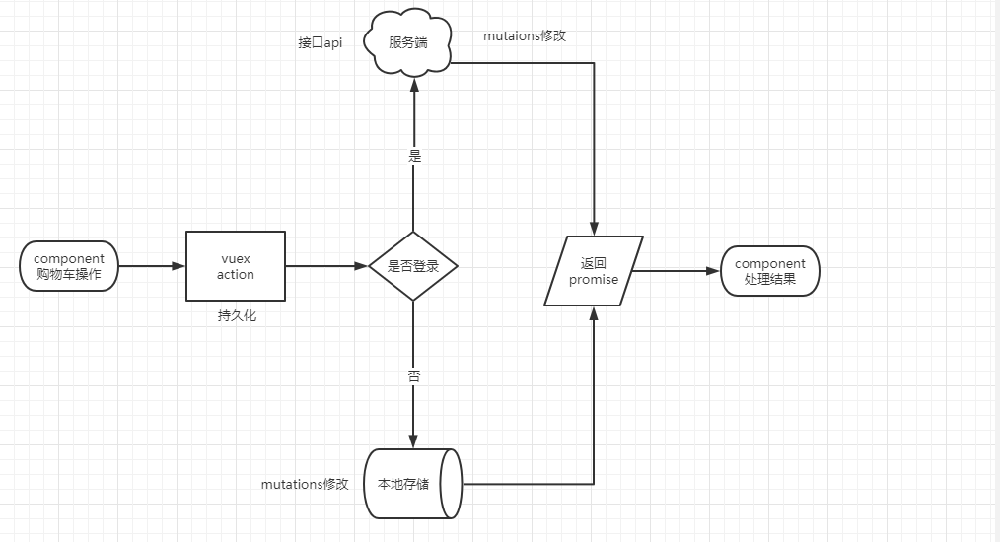
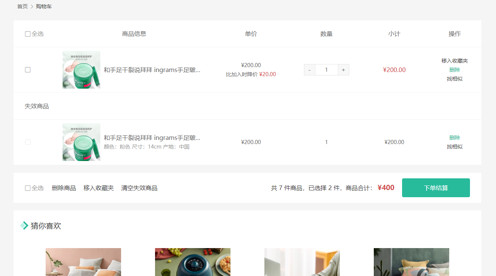
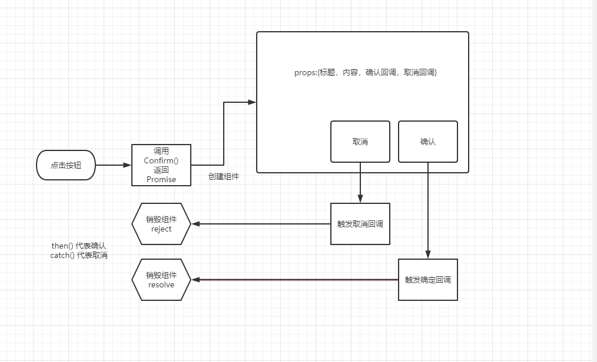
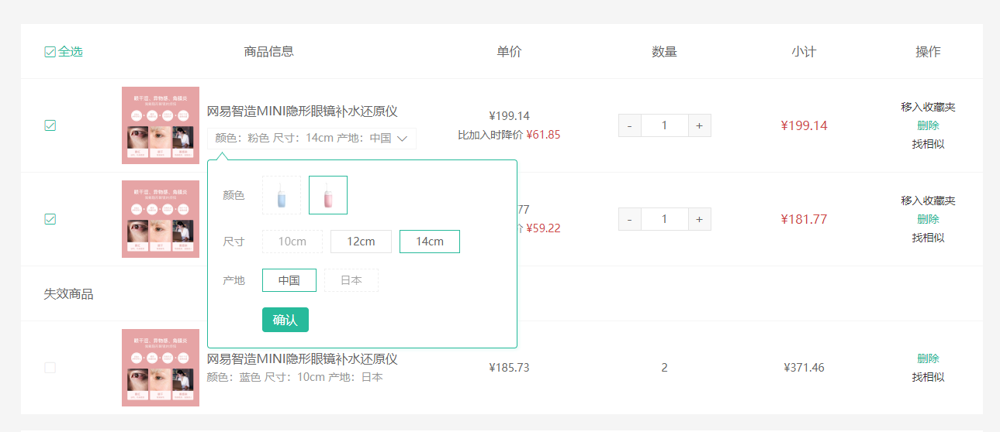
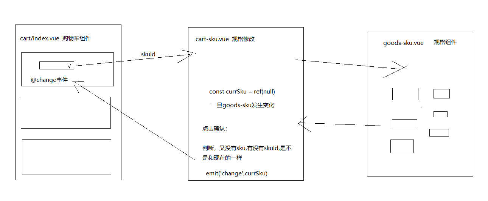
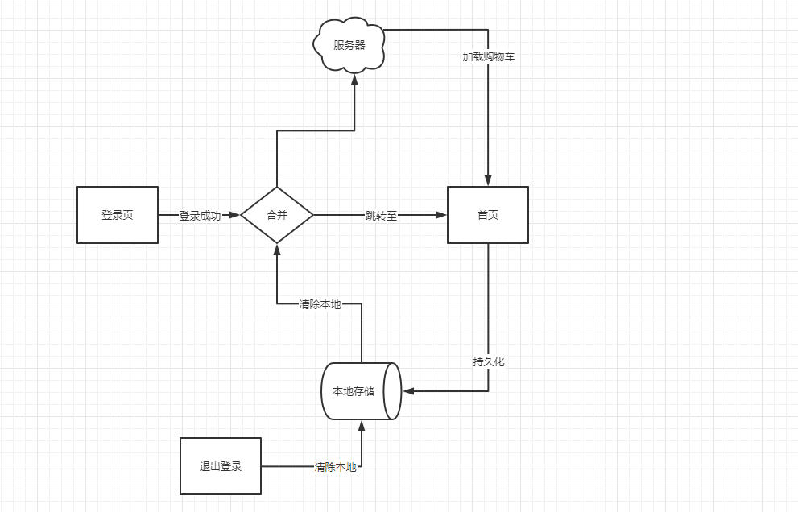

# 购物车


## 01-购物车功能分析

> 目的：了解购物车两种状态下的操作逻辑，方便后续的开发理解。



总结：

- 购物车的各种操作都会有两种状态的区分，但是不会在组件中去区分。
- 而是在封装在vuex中的actions中去区分，在组件上只需调用actions即可。
- 在actions中通过user信息去区分登录状态
  - 未登录，通过mutations修改vuex中的数据即可，vuex已经实现持久化，会同步保持在本地。
  - 已登录，通过api接口去服务端操作，响应成功后通过mutations修改vuex中的数据即可，它也会同步在本地。
- 不管何种操作何种状态返回一个promise，然后组件能够判断操作是否完毕是否成功，再而去做其他事情。

注意：

- 登录后，需要合并本地购物车到服务端。
- 退出后，清空vuex数据也会同步清空本地数据。


## 02-加入购物车-本地

> 目的：完成商品详情的添加购物车操作，支持未登录状态。


大致步骤：

- 约定本地存储的信息内容
- 编写mutaions添加购物车逻辑
- 编写actions进行添加操作
- 在商品详情页实现添加逻辑


落地代码：

- vuex中的修改数据，获取数据 `src/store/module/cart.js`

```js
  // 本地：id skuId name picture price nowPrice count attrsText selected stock isEffective
  // 线上：比上面多 isCollect 有用 discount 无用 两项项信息
  mutations: {
    insertCart (state, goods) {
      const sameIndex = state.list.findIndex(item => item.skuId === goods.skuId)
      // 逻辑：有相同的给goods累加数量，删除相同skuId的商品
      if (sameIndex >= 0) {
        goods.count = state.list[sameIndex].count + goods.count
        state.list.splice(sameIndex, 1)
      }
      state.list.unshift(goods)
    }
  },
  actions: {
    insertCart (ctx, goods) {
      return new Promise((resolve, reject) => {
        if (ctx.rootState.user.token) {
          // 已登录 TODO

        } else {
          // 未登录
          ctx.commit('insertCart', goods)
          resolve()
        }
      })
    }
  }
```

- 商品详情点击加入购物车 `src/views/goods/index.vue`

```diff
  setup () {
    const goods = useGoods()
    // sku改变时候触发
    const changeSku = (sku) => {
      if (sku.skuId) {
        goods.value.price = sku.price
        goods.value.oldPrice = sku.oldPrice
        goods.value.inventory = sku.inventory
+        currSku.value = sku
      } else {
+        currSku.value = null
      }
    }
    // 选择的数量
    const num = ref(1)
    // 加入购物车逻辑
+   const currSku = ref(null)
+   const instance = getCurrentInstance()
+   const store = useStore()
+   const insertCart = () => {
+     if (!currSku.value) {
+       return instance.proxy.$message('请选择商品规格')
+     }
+     if (num.value > goods.inventory) {
+       return instance.proxy.$message('库存不足')
+     }
+     store.dispatch('cart/insertCart', {
+       id: goods.value.id,
+       skuId: currSku.value.skuId,
+       name: goods.value.name,
+       picture: goods.value.mainPictures[0],
+       price: currSku.value.price,
+       nowPrice: currSku.value.price,
+       count: num.value,
+       attrsText: currSku.value.specsText,
+       selected: true,
+       isEffective: true,
+       stock: currSku.value.inventory
+     }).then(() => {
+       instance.proxy.$message('加入购物车成功', 'success')
+     })
+   }
+   return { goods, changeSku, num, insertCart }
+ }
```


## 03-头部购物车-基础布局

> 目的：在网站头部购物车图片处，鼠标经过展示购物车列表。


大致步骤：

- 提取头部购物车组件，完成基础布局。
- 通过getters返回，有效商品总数，和有效商品列表。
- 渲染组件。


落的代码：

- 新建组件 `src/components/app-header-cart.vue`

```vue
<template>
  <div class="cart">
    <a class="curr" href="#"> <i class="iconfont icon-cart"></i><em>2</em> </a>
  </div>
</template>
<script>
export default {
  name: 'AppHeaderCart'
}
</script>
<style scoped lang="less">
.cart {
  width: 50px;
  .curr {
    height: 32px;
    line-height: 32px;
    text-align: center;
    position: relative;
    display: block;
    .icon-cart {
      font-size: 22px;
    }
    em {
      font-style: normal;
      position: absolute;
      right: 0;
      top: 0;
      padding: 1px 6px;
      line-height: 1;
      background: @helpColor;
      color: #fff;
      font-size: 12px;
      border-radius: 10px;
      font-family: Arial;
    }
  }
}
</style>
```

- 使用组件，和**删除迁移过的代码** `src/components/app-header.vue`

```diff
      <div class="search">
        <i class="iconfont icon-search"></i>
        <input type="text" placeholder="搜一搜">
      </div>
+      <AppHeaderCart />
    </div>
  </header>
</template>

<script>
import AppHeaderNav from './app-header-nav'
+import AppHeaderCart from './app-header-cart'
export default {
  name: 'AppHeader',
+  components: { AppHeaderNav, AppHeaderCart }
}
</script>
```

- 基础布局和弹出效果  `src/components/app-header-cart.vue`

```vue
<template>
  <div class="cart">
    <a class="curr" href="javascript:;">
      <i class="iconfont icon-cart"></i><em>2</em>
    </a>
    <div class="layer">
      <div class="list">
        <div class="item" v-for="i in 4" :key="i">
          <RouterLink to="">
            
            <div class="center">
              <p class="name ellipsis-2">和手足干裂说拜拜 ingrams手足皲裂修复霜</p>
              <p class="attr ellipsis">颜色：修复绿瓶 容量：150ml</p>
            </div>
            <div class="right">
              <p class="price">&yen;45.00</p>
              <p class="count">x2</p>
            </div>
          </RouterLink>
          <i class="iconfont icon-close-new"></i>
        </div>
      </div>
      <div class="foot">
        <div class="total">
          <p>共 3 件商品</p>
          <p>&yen;135.00</p>
        </div>
        <XtxButton type="plain">去购物车结算</XtxButton>
      </div>
    </div>
  </div>
</template>
<script>
export default {
  name: 'AppHeaderCart'
}
</script>
<style scoped lang="less">
.cart {
  width: 50px;
  position: relative;
  z-index: 600;
  .curr {
    height: 32px;
    line-height: 32px;
    text-align: center;
    position: relative;
    display: block;
    .icon-cart {
      font-size: 22px;
    }
    em {
      font-style: normal;
      position: absolute;
      right: 0;
      top: 0;
      padding: 1px 6px;
      line-height: 1;
      background: @helpColor;
      color: #fff;
      font-size: 12px;
      border-radius: 10px;
      font-family: Arial;
    }
  }
  &:hover {
    .layer {
      opacity: 1;
      transform: none
    }
  }
  .layer {
    opacity: 0;
    transition: all .4s .2s;
    transform: translateY(-200px) scale(1, 0);
    width: 400px;
    height: 400px;
    position: absolute;
    top: 50px;
    right: 0;
    box-shadow: 0 0 10px rgba(0,0,0,0.2);
    background: #fff;
    border-radius: 4px;
    padding-top: 10px;
    &::before {
      content: "";
      position: absolute;
      right: 14px;
      top: -10px;
      width: 20px;
      height: 20px;
      background: #fff;
      transform: scale(0.6,1) rotate(45deg);
      box-shadow: -3px -3px 5px rgba(0,0,0,0.1);
    }
    .foot {
      position: absolute;
      left: 0;
      bottom: 0;
      height: 70px;
      width: 100%;
      padding: 10px;
      display: flex;
      justify-content: space-between;
      background: #f8f8f8;
      align-items: center;
      .total {
        padding-left: 10px;
        color: #999;
        p {
          &:last-child {
            font-size: 18px;
            color: @priceColor;
          }
        }
      }
    }
  }
  .list {
    height: 310px;
    overflow: auto;
    padding: 0 10px;
    &::-webkit-scrollbar{
      width:10px;
      height:10px;
    }
    &::-webkit-scrollbar-track{
      background: #f8f8f8;
      border-radius: 2px;
    }
    &::-webkit-scrollbar-thumb{
      background: #eee;
      border-radius:10px;
    }
    &::-webkit-scrollbar-thumb:hover{
      background: #ccc;
    }
    .item {
      border-bottom: 1px solid #f5f5f5;
      padding: 10px 0;
      position: relative;
      i {
          position: absolute;
          bottom: 38px;
          right: 0;
          opacity: 0;
          color: #666;
          transition: all .5s;
      }
      &:hover {
        i {
          opacity: 1;
          cursor: pointer;
        }
      }
      a {
        display: flex;
        align-items: center;
        img {
          height: 80px;
          width: 80px;
        }
        .center {
          padding: 0 10px;
          width: 200px;
          .name {
            font-size: 16px;
          }
          .attr {
            color: #999;
            padding-top: 5px;
          }
        }
        .right {
          width: 100px;
          padding-right: 20px;
          text-align: center;
          .price {
            font-size: 16px;
            color: @priceColor;
          }
          .count {
            color: #999;
            margin-top: 5px;
            font-size: 16px;
          }
        }
      }
    }
  }
}
</style>
```

- 使用getters得到有效商品列表和期种件数

```js
  getters: {
    // 有效商品列表
    validList (state) {
      return state.list.filter(item => item.stock > 0 && item.isEffective)
    },
    // 有效商品件数
    validTotal (state, getters) {
      return getters.validList.reduce((p, c) => p + c.count, 0)
    },
    // 有效商品总金额
    validAmount (state, getters) {
      return getters.validList.reduce((p, c) => p + c.nowPrice * 100 * c.count, 0) / 100
    },
  },
```

- 渲染头部购物车信息

```vue
<template>
  <div class="cart">
    <a class="curr" href="javascript:;">
      <i class="iconfont icon-cart"></i><em>{{$store.getters['cart/validTotal']}}</em>
    </a>
    <div class="layer">
      <div class="list">
        <div class="item" v-for="item in $store.getters['cart/validList']" :key="item.skuId">
          <RouterLink to="">
            
            <div class="center">
              <p class="name ellipsis-2">{{item.name}}</p>
              <p class="attr ellipsis">{{item.attrsText}}</p>
            </div>
            <div class="right">
              <p class="price">&yen;{{item.nowPrice}}</p>
              <p class="count">x{{item.count}}</p>
            </div>
          </RouterLink>
          <i class="iconfont icon-close-new"></i>
        </div>
      </div>
      <div class="foot">
        <div class="total">
          <p>共 {{$store.getters['cart/validTotal']}} 件商品</p>
          <p>&yen;{{$store.getters['cart/validAmount']}}</p>
        </div>
        <XtxButton type="plain">去购物车结算</XtxButton>
      </div>
    </div>
  </div>
</template>
```


## 04-头部购物车-商品列表-本地

> 目的：根据本地存储的商品获取最新的库存价格和有效状态。


大致步骤：

- 定义获取最新信息的API
- 定义修改购物车商品信息的mutations
- 定义获取购物车列表信息的actions
- 在头部购物车组件初始化的时候更新列表信息


落的代码：

- 定义获取最新信息的API `src/api/cart.js`

```js
import request from '@/utils/request'

/**
 * 获取新的商品信息
 * @param {String} skuId - 商品SKUID
 * @returns Promise
 */
export const getNewCartGoods = (skuId) => {
  return request(`/goods/stock/${skuId}`, 'get')
}
```

- 定义修改购物车商品信息的mutations   `src/store/module/cart.js`

```js
     // 修改购物车商品
    updateCart (state, goods) {
      // goods中字段有可能不完整，goods有的信息才去修改。
      // 1. goods中必需又skuId，才能找到对应的商品信息
      const updateGoods = state.list.find(item => item.skuId === goods.skuId)
      for (const key in goods) {
        if (goods[key] !== null && goods[key] !== undefined && goods[key] !== '') {
          updateGoods[key] = goods[key]
        }
      }
    }
```

- 定义获取购物车列表信息的actions `src/store/module/cart.js`

```js
    // 获取购物车列表
    findCartList (ctx) {
      return new Promise((resolve, reject) => {
        if (ctx.rootState.user.profile.token) {
          // 登录 TODO
        } else {
          // 本地
          // Promise.all() 可以并列发送多个请求，等所有请求成功，调用then
          // Promise.race() 可以并列发送多个请求，等最快的请求成功，调用then
          // 传参事promise数组
          const promiseArr = ctx.state.list.map(item => {
            // 返回接口函数的调用
            return getNewCartGoods(item.skuId)
          })
          Promise.all(promiseArr).then(dataArr => {
            dataArr.forEach((data, i) => {
              ctx.commit('updateCart', { skuId: ctx.state.list[i].skuId, ...data.result })
            })
            resolve()
          }).catch(e => {
            reject(e)
          })
        }
      })
    },
```

- 再头部购物车组件初始化的时候更新列表信息 `src/components/app-header-cart.vue`

```js
  setup () {
    const store = useStore()
    store.dispatch('cart/findCartList')
  }
```


## 05-头部购物车-删除操作-本地

> 目的：完成头部购物车删除操作，支持未登录状态。


大致步骤：

- 编写mutaions删除购物车商品逻辑
- 编写actions进行删除操作
- 在头部购物车进行删除逻辑


落的代码：

- vuex的mutations和actions代码 `src/store/module/cart.js`

```js
  mutations: {
    // ... 省略
    // 删除购物车商品
    deleteCart (state, skuId) {
      const index = state.list.findIndex(item => item.skuId === skuId)
      state.list.splice(index, 1)
    }
  },
```

```js
  actions: {
    // ... 省略
    // 删除购物车商品
    deleteCart (ctx, skuId) {
      return new Promise((resolve, reject) => {
        if (ctx.rootState.user.profile.token) {
          // 登录 TODO
        } else {
          // 本地
          ctx.commit('deleteCart', skuId)
          resolve()
        }
      })
    },
```

- 头部组件实现删除逻辑 `src/components/app-header-cart.vue`

```diff
+ 购物车无商品不显示弹出层,并且不是在购物车页面
+<div class="layer" v-if="$store.getters['cart/validTotal']&&$route.path!=='/cart'">
```

```diff
+ 绑定点击事件传入skuId
+<i @click="deleteCart(item.skuId)" class="iconfont icon-close-new"></i>
```

```js
  setup () {
    // 删除
    const deleteCart = (skuId) => {
      store.dispatch('cart/deleteCart', skuId).then(() => {
        Message({ type: 'success', text: '删除成功' })
      }).catch(e => {
        Message({ type: 'error', text: '删除失败' })
      })
    }
    return { deleteCart }
  }
```


## 06-购物车页面-基础布局

> 目的：完成购物车组件基础布局和路由配置与跳转链接。



大致步骤：

- 完成头部组件，购物车图标，购物车结算按钮，点击跳转购物车路由。商品点击跳转详情的操作。
- 配置购物车路由和组件，完成基础布局。


落的代码：

- 跳转功能  `src/components/app-header-cart.vue`

```diff
    <RouterLink to="/cart" class="curr">
+      <i class="iconfont icon-cart"></i><em>{{$store.getters['cart/validTotal']}}</em>
    </RouterLink>
```

```diff
        <div class="item" v-for="item in $store.getters['cart/validList']" :key="item.skuId">
+          <RouterLink :to="`/product/${item.id}`">
            
```

```vue
  <XtxButton type="plain" @click="$router.push('/cart')">去购物车结算</XtxButton>
```

- 组件与路由 `src/views/cart/index.vue`

```vue
<template>
  <div class="xtx-cart-page">
    <div class="container">
      <XtxBread>
        <XtxBreadItem to="/">首页</XtxBreadItem>
        <XtxBreadItem>购物车</XtxBreadItem>
      </XtxBread>
      <div class="cart">
        <table>
          <thead>
            <tr>
              <th width="120"><XtxCheckbox>全选</XtxCheckbox></th>
              <th width="400">商品信息</th>
              <th width="220">单价</th>
              <th width="180">数量</th>
              <th width="180">小计</th>
              <th width="140">操作</th>
            </tr>
          </thead>
          <!-- 有效商品 -->
          <tbody>
            <tr v-for="i in 3" :key="i">
              <td><XtxCheckbox /></td>
              <td>
                <div class="goods">
                  <RouterLink to="/"></RouterLink>
                  <div>
                    <p class="name ellipsis">和手足干裂说拜拜 ingrams手足皲裂修复霜</p>
                    <!-- 选择规格组件 -->
                  </div>
                </div>
              </td>
              <td class="tc">
                <p>&yen;200.00</p>
                <p>比加入时降价 <span class="red">&yen;20.00</span></p>
              </td>
              <td class="tc">
                <XtxNumbox />
              </td>
              <td class="tc"><p class="f16 red">&yen;200.00</p></td>
              <td class="tc">
                <p><a href="javascript:;">移入收藏夹</a></p>
                <p><a class="green" href="javascript:;">删除</a></p>
                <p><a href="javascript:;">找相似</a></p>
              </td>
            </tr>
          </tbody>
          <!-- 无效商品 -->
          <tbody>
            <tr><td colspan="6"><h3 class="tit">失效商品</h3></td></tr>
            <tr v-for="i in 3" :key="i">
              <td><XtxCheckbox style="color:#eee;" /></td>
              <td>
                <div class="goods">
                  <RouterLink to="/"></RouterLink>
                  <div>
                    <p class="name ellipsis">和手足干裂说拜拜 ingrams手足皲裂修复霜</p>
                    <p class="attr">颜色：粉色 尺寸：14cm 产地：中国</p>
                  </div>
                </div>
              </td>
              <td class="tc"><p>&yen;200.00</p></td>
              <td class="tc">1</td>
              <td class="tc"><p>&yen;200.00</p></td>
              <td class="tc">
                <p><a class="green" href="javascript:;">删除</a></p>
                <p><a href="javascript:;">找相似</a></p>
              </td>
            </tr>
          </tbody>
        </table>
      </div>
      <!-- 操作栏 -->
      <div class="action">
        <div class="batch">
          <XtxCheckbox>全选</XtxCheckbox>
          <a href="javascript:;">删除商品</a>
          <a href="javascript:;">移入收藏夹</a>
          <a href="javascript:;">清空失效商品</a>
        </div>
        <div class="total">
          共 7 件商品，已选择 2 件，商品合计：
          <span class="red">¥400</span>
          <XtxButton type="primary">下单结算</XtxButton>
        </div>
      </div>
      <!-- 猜你喜欢 -->
      <GoodRelevant />
    </div>
  </div>
</template>
<script>
import GoodRelevant from '@/views/goods/components/goods-relevant'
export default {
  name: 'XtxCartPage',
  components: { GoodRelevant }
}
</script>
<style scoped lang="less">
.tc {
  text-align: center;
  .xtx-numbox {
    margin: 0 auto;
    width: 120px;
  }
}
.red {
  color: @priceColor;
}
.green {
  color: @xtxColor
}
.f16 {
  font-size: 16px;
}
.goods {
  display: flex;
  align-items: center;
  img {
    width: 100px;
    height: 100px;
  }
  > div {
    width: 280px;
    font-size: 16px;
    padding-left: 10px;
    .attr {
      font-size: 14px;
      color: #999;
    }
  }
}
.action {
  display: flex;
  background: #fff;
  margin-top: 20px;
  height: 80px;
  align-items: center;
  font-size: 16px;
  justify-content: space-between;
  padding: 0 30px;
  .xtx-checkbox {
    color: #999;
  }
  .batch {
    a {
      margin-left: 20px;
    }
  }
  .red {
    font-size: 18px;
    margin-right: 20px;
    font-weight: bold;
  }
}
.tit {
  color: #666;
  font-size: 16px;
  font-weight: normal;
  line-height: 50px;
}
.xtx-cart-page {
  .cart {
    background: #fff;
    color: #666;
    table {
      border-spacing: 0;
      border-collapse: collapse;
      line-height: 24px;
      th,td{
        padding: 10px;
        border-bottom: 1px solid #f5f5f5;
        &:first-child {
          text-align: left;
          padding-left: 30px;
          color: #999;
        }
      }
      th {
        font-size: 16px;
        font-weight: normal;
        line-height: 50px;
      }
    }
  }
}
</style>
```


## 07-购物车页面-列表展示-本地

> 目的：实现本地状态下的，购物车商品列表展示功能。


大致步骤：

- 准备失效商品列表数据。已选择商品列表数据。已选择商品件数数据。需要支付的金额数据。
- 渲染模版


落的代码：

- 准备数据 `src/store/module/cart.js`

```js
    // ... getters 代码
    // 无效商品列表
    invalidList (state) {
      return state.list.filter(item => !(item.stock > 0 && item.isEffective))
    },
    // 选中商品列表
    selectedList (state, getters) {
      return getters.validList.filter(item => item.selected)
    },
    // 选中商品件数
    selectedTotal (state, getters) {
      return getters.selectedList.reduce((p, c) => p + c.count, 0)
    },
    // 选中商品总金额
    selectedAmount (state, getters) {
      return getters.selectedList.reduce((p, c) => p + (c.nowPrice * 100 * c.count), 0) / 100
    },
    // 是否全选
    isCheckAll (state, getters) {
      return getters.validList.length === getters.selectedList.length && getters.selectedList.length !== 0
    }
```

- 渲染列表

```diff
      <div class="cart">
        <table>
          <thead>
            <tr>
+              <th width="120"><XtxCheckbox :modelValue="$store.getters['cart/isCheckAll']">全选</XtxCheckbox></th>
              <th width="400">商品信息</th>
              <th width="220">单价</th>
              <th width="180">数量</th>
              <th width="180">小计</th>
              <th width="140">操作</th>
            </tr>
          </thead>
          <!-- 有效商品 -->
          <tbody>
+            <tr v-for="item in $store.getters['cart/validList']" :key="item.skuId">
+              <td><XtxCheckbox :modelValue="item.selected" /></td>
              <td>
                <div class="goods">
+                  <RouterLink :to="`/product/${item.id}`">
+                    
                  </RouterLink>
                  <div>
+                    <p class="name ellipsis">{{item.name}}</p>
                    <!-- 选择规格组件 -->
+                    <p class="attr">{{item.attrsText}}</p>
                  </div>
                </div>
              </td>
              <td class="tc">
+                <p>&yen;{{item.nowPrice}}</p>
+                <p v-if="item.price-item.nowPrice>0">
                  比加入时降价
+                  <span class="red">&yen;{{item.price-item.nowPrice}}</span>
                </p>
              </td>
              <td class="tc">
+                <XtxNumbox :modelValue="item.count" />
              </td>
+              <td class="tc"><p class="f16 red">&yen;{{item.nowPrice*100*item.count/100}}</p></td>
              <td class="tc">
                <p><a href="javascript:;">移入收藏夹</a></p>
                <p><a class="green" href="javascript:;">删除</a></p>
                <p><a href="javascript:;">找相似</a></p>
              </td>
            </tr>
          </tbody>
          <!-- 无效商品 -->
          <tbody v-if="$store.getters['cart/invalidList'].length>0">
            <tr><td colspan="6"><h3 class="tit">失效商品</h3></td></tr>
            <tr v-for="item in $store.getters['cart/validList']" :key="item.skuId">
              <td><XtxCheckbox style="color:#eee;" /></td>
              <td>
                <div class="goods">
                  <RouterLink :to="`/product/${item.id}`">
                    
                  </RouterLink>
                  <div>
                    <p class="name ellipsis">{{item.name}}</p>
                    <p class="attr">{{item.attrsText}}</p>
                  </div>
                </div>
              </td>
              <td class="tc"><p>&yen;{{item.nowPrice}}</p></td>
              <td class="tc">{{item.count}}</td>
              <td class="tc"><p>&yen;{{item.nowPrice*100*item.count/100}}</p></td>
              <td class="tc">
                <p><a class="green" href="javascript:;">删除</a></p>
                <p><a href="javascript:;">找相似</a></p>
              </td>
            </tr>
          </tbody>
        </table>
      </div>
      <!-- 操作栏 -->
      <div class="action">
        <div class="batch">
+          <XtxCheckbox :modelValue="$store.getters['cart/isCheckAll']">全选</XtxCheckbox>
          <a href="javascript:;">删除商品</a>
          <a href="javascript:;">移入收藏夹</a>
          <a href="javascript:;">清空失效商品</a>
        </div>
        <div class="total">
+          共 {{$store.getters['cart/validTotal']}} 件商品，已选择 {{$store.getters['cart/selectedTotal']}} 件，商品合计：
+          <span class="red">¥{{$store.getters['cart/selectedAmount']}}</span>
          <XtxButton type="primary">下单结算</XtxButton>
        </div>
      </div>
```


## 08-购物车页面-单选操作-本地

> 目的：实现本地状态下的，选中商品操作。


大致步骤：

- 使用购物车商品修改信息的mutations（已实现）
- 定义购物车商品选中状态的actions
- 在购物车页面绑定单选的复选框change事件
- 在事件中调用actions的修改函数


落的代码：

- 定义修改购物车商品选中状态的mutations `src/store/module/cart.js`

```diff
    // 修改购物车商品
    updateCart (state, goods) {
      // goods中字段有可能不完整，goods有的信息才去修改。
      // 1. goods中必需又skuId，才能找到对应的商品信息
      const updateGoods = state.list.find(item => item.skuId === goods.skuId)
      for (const key in goods) {
        // 布尔类型 false 值需要使用
+       if (goods[key] !== null && goods[key] !== undefined && goods[key] !== '') {
          updateGoods[key] = goods[key]
        }
      }
    },
```

- 定义修改购物车商品的actions `src/store/module/cart.js`

```js
    // 修改购物车商品
    updateCart (ctx, goods) {
      // goods 中：必须有skuId，其他想修改的属性 selected  count
      return new Promise((resolve, reject) => {
        if (ctx.rootState.user.profile.token) {
          // 登录 TODO
        } else {
          // 本地
          ctx.commit('updateCart', goods)
          resolve()
        }
      })
    },
```

- 在购物车页面绑定单选的复选框change事件并处理选中  `src/views/cart/index.vue`

```vue
<td><XtxCheckbox @change="$event=>checkOne(item.skuId,$event)" :modelValue="item.selected" /></td>
```

```js
import GoodRelevant from '@/views/goods/components/goods-relevant'
import { useStore } from 'vuex'
export default {
  name: 'XtxCartPage',
  components: { GoodRelevant },
  setup () {
    const store = useStore()
    // 单选
    const checkOne = (skuId, selected) => {
      store.dispatch('cart/updateCart', { skuId, selected })
    }
    return { checkOne }
  }
}
```


## 09-购物车页面-全选操作-本地

> 目的：实现本地状态下的，全选商品操作。


大致步骤：

- 修改购物车所有有效商品选中状态的actions
- 在购物车页面修改调用actions的代码
- 在购物车页面绑定全选的复选框change事件
- 在事件中调用actions的修改函数


落的代码

- 修改购物车商品选中状态的actions让其支持全选 `src/store/module/cart.js`

```js
    // 做有效商品的全选&反选
    checkAllCart (ctx, selected) {
      return new Promise((resolve, reject) => {
        if (ctx.rootState.user.profile.token) {
          // 登录 TODO
        } else {
          // 本地
          // 1. 获取有效的商品列表，遍历的去调用修改mutations即可
          ctx.getters.validList.forEach(item => {
            ctx.commit('updateCart', { skuId: item.skuId, selected })
          })
          resolve()
        }
      })
    },
```

- 在购物车页面修改调用actions的代码   `src/views/cart/index.vue`

```js
    // 全选
    const checkAll = (selected) => {
      store.dispatch('cart/checkAllCart', selected)
    }
    return { checkOne, checkAll }
```

- 在购物车页面绑定全选的复选框change事件并处理选中  `src/views/cart/index.vue`

```VUE
<!-- 两处都需要加 --> 
<XtxCheckbox @change="checkAll" :modelValue="$store.getters['cart/isCheckAll']">全选</XtxCheckbox>

```


## 10-购物车页面-删除操作-本地

> 目的：实现本地状态下，购物车商品删除


大致步骤：

- 绑定`删除`点击事件指定处理函数，调用删除actions   
- 处理无商品展示界面


落的代码：

- 绑定`删除`点击事件指定处理函数，调用删除actions      `src/views/cart/index.vue`

```vue
<!-- 两处删除都绑定 -->
  <p><a @click="deleteCart(item.skuId)" class="green" href="javascript:;">删除</a></p>
```

```js
    // 删除
    const deleteCart = (skuId) => {
      store.dispatch('cart/deleteCart', skuId)
    }
    return { checkOne, checkAll, deleteCart }
```

- 处理无商品展示界面

组件 `src/views/cart/components/cart-none.vue`

```vue
<template>
  <div class="cart-none">
    
    <p>购物车内暂时没有商品</p>
    <div class="btn">
      <XtxButton type="primary" @click="$router.push('/')">继续逛逛</XtxButton>
    </div>
  </div>
</template>
<script>
export default {
  name: 'CartNone'
}
</script>
<style scoped lang="less">
.cart-none {
  text-align: center;
  padding: 150px 0;
  background: #fff;
  img {
    width: 180px;
  }
  p {
    color: #999999;
    padding: 20px 0;
  }
}
</style>
```

使用 `src/views/cart/index.vue`

```diff
+import XtxConfirm from '@/components/library/xtx-confirm'
import { useStore } from 'vuex'
export default {
  name: 'XtxCartPage',
+  components: { GoodRelevant, CartNone },
```

```vue
          <!-- 有效商品 -->
          <tbody>
            <tr v-if="$store.getters['cart/validList'].length===0">
              <td colspan="6">
                <CartNone />
              </td>
            </tr>
```


## 11-购物车页面-确认框组件

> 目的：通过vue实例调用$confirm函数弹出确认框。import导入函数使用也需要支持。


大致步骤：

- 实现组件基础结构和样式。
- 实现函数式调用组件方式和完成交互。
- 加上打开时动画效果。
- 给购物车删除加上确认框。
- 给vue挂载原型函数$confirm。


落地代码：

- 实现组件基础结构和样式。

组件 `src/components/library/xtx-confirm.vue`

```vue
<template>
  <div class="xtx-confirm">
    <div class="wrapper">
      <div class="header">
        <h3>温馨提示</h3>
        <a href="JavaScript:;" class="iconfont icon-close-new"></a>
      </div>
      <div class="body">
        <i class="iconfont icon-warning"></i>
        <span>您确认从购物车删除该商品吗？</span>
      </div>
      <div class="footer">
        <XtxButton size="mini" type="gray">取消</XtxButton>
        <XtxButton size="mini" type="primary">确认</XtxButton>
      </div>
    </div>
  </div>
</template>
<script>
export default {
  name: 'XtxConfirm'
}
</script>
<style scoped lang="less">
.xtx-confirm {
  position: fixed;
  left: 0;
  top: 0;
  width: 100%;
  height: 100%;
  z-index: 8888;
  background: rgba(0,0,0,.5);
  .wrapper {
    width: 400px;
    background: #fff;
    border-radius: 4px;
    position: absolute;
    top: 50%;
    left: 50%;
    transform: translate(-50%,-50%);
    .header,.footer {
      height: 50px;
      line-height: 50px;
      padding: 0 20px;
    }
    .body {
      padding: 20px 40px;
      font-size: 16px;
      .icon-warning {
        color: @priceColor;
        margin-right: 3px;
        font-size: 16px;
      }
    }
    .footer {
      text-align: right;
      .xtx-button {
        margin-left: 20px;
      }
    }
    .header {
      position: relative;
      h3 {
        font-weight: normal;
        font-size: 18px;
      }
      a {
        position: absolute;
        right: 15px;
        top: 15px;
        font-size: 20px;
        width: 20px;
        height: 20px;
        line-height: 20px;
        text-align: center;
        color: #999;
        &:hover {
          color: #666;
        }
      }
    }
  }
}
</style>
```

<p style="color:red">为了看到布局在购物车页面用下</p>
- 实现函数式调用组件方式和完成交互。



定义函数  `src/components/library/confirm.js`

```js
import { createVNode, render } from 'vue'
import XtxConfirm from './xtx-confirm'

// 准备div
const div = document.createElement('div')
div.setAttribute('class', 'xtx-confirm-container')
document.body.appendChild(div)

// 该函数渲染XtxConfirm组件，标题和文本
// 函数的返回值是promise对象
export default ({ title, text }) => {
  return new Promise((resolve, reject) => {
    const submitCallback = () => {
      render(null, div)
      resolve()
    }
    const cancelCallback = () => {
      render(null, div)
      reject(new Error('点击取消'))
    }
    // 1. 渲染组件
    // 2. 点击确认按钮，触发resolve同时销毁组件
    // 3. 点击取消按钮，触发reject同时销毁组件
    const vnode = createVNode(XtxConfirm, { title, text, submitCallback, cancelCallback })
    render(vnode, div)
  })
}
```

组件逻辑 `src/components/library/xtx-confirm.vue`

```vue
<template>
  <div class="xtx-confirm" :class="{fade}">
    <div class="wrapper"  :class="{fade}">
      <div class="header">
        <h3>{{title}}</h3>
        <a @click="cancelCallback()" href="JavaScript:;" class="iconfont icon-close-new"></a>
      </div>
      <div class="body">
        <i class="iconfont icon-warning"></i>
        <span>{{text}}</span>
      </div>
      <div class="footer">
        <XtxButton @click="cancelCallback()" size="mini" type="gray">取消</XtxButton>
        <XtxButton @click="submitCallback()" size="mini" type="primary">确认</XtxButton>
      </div>
    </div>
  </div>
</template>
<script>
// 当前组件不是在APP下进行渲染，无法使用APP下的环境（全局组件，全局指令，原型属性函数）
import XtxButton from '@/components/library/xtx-button'
import { onMounted, ref } from 'vue'
export default {
  name: 'XtxConfirm',
  components: { XtxButton },
  props: {
    title: {
      type: String,
      default: '温馨提示'
    },
    text: {
      type: String,
      default: ''
    },
    submitCallback: {
      type: Function
    },
    cancelCallback: {
      type: Function
    }
  },
  setup () {
    const fade = ref(false)
    onMounted(() => {
      // 当元素渲染完毕立即过渡的动画不会触发
      setTimeout(() => {
        fade.value = true
      }, 0)
    })
    return { fade }
  }
}
</script>
<style scoped lang="less">
.xtx-confirm {
  position: fixed;
  left: 0;
  top: 0;
  width: 100%;
  height: 100%;
  z-index: 8888;
  background: rgba(0,0,0,0);
  &.fade {
    transition: all 0.4s;
    background: rgba(0,0,0,.5);
  }
  .wrapper {
    width: 400px;
    background: #fff;
    border-radius: 4px;
    position: absolute;
    top: 50%;
    left: 50%;
    transform: translate(-50%,-60%);
    opacity: 0;
    &.fade {
      transition: all 0.4s;
      transform: translate(-50%,-50%);
      opacity: 1;
    }
    .header,.footer {
      height: 50px;
      line-height: 50px;
      padding: 0 20px;
    }
    .body {
      padding: 20px 40px;
      font-size: 16px;
      .icon-warning {
        color: @priceColor;
        margin-right: 3px;
        font-size: 16px;
      }
    }
    .footer {
      text-align: right;
      .xtx-button {
        margin-left: 20px;
      }
    }
    .header {
      position: relative;
      h3 {
        font-weight: normal;
        font-size: 18px;
      }
      a {
        position: absolute;
        right: 15px;
        top: 15px;
        font-size: 20px;
        width: 20px;
        height: 20px;
        line-height: 20px;
        text-align: center;
        color: #999;
        &:hover {
          color: #666;
        }
      }
    }
  }
}
</style>
```

使用函数 `src/views/cart/index.vue`

```js
    // 删除
    const deleteCart = (skuId) => {
      // store.dispatch('cart/deleteCart', skuId)
      Confirm({ text: '您确定从购物车删除该商品吗？' }).then(() => {
        console.log('点击确认')
      }).catch(e => {
        console.log('点击取消')
      })
    }
    return { checkOne, checkAll, deleteCart }
```

- 加上打开时动画效果。  `src/components/library/xtx-confirm.vue`

```diff
.xtx-confirm {
  position: fixed;
  left: 0;
  top: 0;
  width: 100%;
  height: 100%;
  z-index: 8888;
+  background: rgba(0,0,0,0);
+  &.fade {
+    transition: all 0.4s;
+    background: rgba(0,0,0,.5);
+  }
  .wrapper {
    width: 400px;
    background: #fff;
    border-radius: 4px;
    position: absolute;
    top: 50%;
    left: 50%;
+    transform: translate(-50%,-60%);
+    opacity: 0;
+    &.fade {
+      transition: all 0.4s;
+      transform: translate(-50%,-50%);
+      opacity: 1;
+    }
```

给购物车删除加上确认框   `src/views/cart/index.vue`

```js
    const deleteCart = (item) => {
      Confirm(app, { text: ' 您确认从购物车删除该商品吗？' }).then(() => {
        // console.log('点击确认')
        store.dispatch('cart/deleteCart', item.skuId)
      }).catch(e => {
        // console.log('点击取消')
      })
```

- 给vue挂载原型函数

实现：`src/components/library/index.js`

```js
import Confirm from './Confirm'
```

```diff
    // 如果你想挂载全局的属性，能够通过组件实例调用的属性   this.$message
    app.config.globalProperties.$message = Message
+    app.config.globalProperties.$confirm = Confirm
```

测试：

```js
  mounted () {
    this.$confirm({ text: 'xxx' })
  },
```


## 12-购物车页面-批量删除-本地

> 目的：实现本地批量删除选中商品功能。


大致的步骤：

- 定义一个批量删除商品的actions支持批量操作
- 遍历选中商品，调用单个删除调用mutations函数即可
- 绑定批量删除点击事件指定处理函数，调用actions进行删除。


落地代码：

- 批量操作商品的actions支持 `src/store/module/cart.js`

```js
    // 批量删除选中商品
    batchDeleteCart (ctx) {
      return new Promise((resolve, reject) => {
        if (ctx.rootState.user.profile.token) {
          // 登录 TODO
        } else {
          // 本地
          // 1. 获取选中商品列表，进行遍历调用deleteCart mutataions函数
          ctx.getters.selectedList.forEach(item => {
            ctx.commit('deleteCart', item.skuId)
          })
          resolve()
        }
      })
    },
```

- 绑定批量删除点击事件指定处理函数，调用actions进行删除。  `src/views/cart/index.vue`

```vue
<a @click="batchDeleteCart()" href="javascript:;">删除商品</a>
```

```js
    // 批量删除
    const batchDeleteCart = () => {
      Confirm({ text: '您确定从购物车删除选中的商品吗？' }).then(() => {
        store.dispatch('cart/batchDeleteCart')
      }).catch(e => {})
    }
    return { checkOne, checkAll, deleteCart, batchDeleteCart }
```


## 13-购物车页面-无效商品-本地

> 目的：实现本地清空无效商品功能。


大致思路：

- 去修改批量删除的actions让它适用于两个场景
  - 批量删除选中的
  - 批量删除失效的  isClear


落地代码：

- 绑定清空无效商品点击事件指定处理函数，调用actions进行删除。  `src/views/cart/index.vue`

```vue
<a @click="batchDeleteCart(true)" href="javascript:;">清空失效商品</a>
```

```diff
    // 批量删除
+    const batchDeleteCart = (isClear) => {
+      Confirm({ text: `您确定从购物车删除${isClear ? '失效' : '选中'}的商品吗？` }).then(() => {
        store.dispatch('cart/batchDeleteCart', isClear)
      }).catch(e => {})
    }
    return { checkOne, checkAll, deleteCart, batchDeleteSelectedCart, batchDeleteInvalidCart }
```

- 批量删除商品的actions支持清空无效 `src/store/module/cart.js`

```diff
    // 批量删除选中商品
+    batchDeleteCart (ctx, isClear) {
      return new Promise((resolve, reject) => {
        if (ctx.rootState.user.profile.token) {
          // 登录 TODO
        } else {
          // 本地
          // 1. 获取选中商品列表，进行遍历调用deleteCart mutataions函数
+          ctx.getters[isClear ? 'invalidList' : 'selectedList'].forEach(item => {
            ctx.commit('deleteCart', item.skuId)
          })
          resolve()
        }
      })
    },
```


## 14-购物车页面-修改数量-本地

> 目的：实现本地版本的修改商品数量。


大致的步骤：

- 绑定xtx-numbox组件的change事件指定处理函数
- 在函数种调用vuex的cart/updateCart函数修改数量


落的代码：

- 绑定xtx-numbox组件的change事件指定处理函数

```vue
<XtxNumbox :max="item.stock" @change="$event=>changeCount(item.skuId,$event)" :modelValue="item.count" />
```

- 在函数种调用vuex的cart/updateCart函数修改数量

```js
    // 修改数量
    const changeCount = (skuId, count) => {
      store.dispatch('cart/updateCart', { skuId, count })
    }
    return { checkOne, checkAll, deleteCart, batchDeleteCart, changeCount }
```


## 15-购物车页面-修改规格-本地

> 目的：封装一个购物车SKU组件，来修改规格。



大致步骤：

- 定义一个组件完成基础结构
- 完成展开收起操作
- 展开的时候根据skuId得到商品信息（specs,skus）渲染商品规格。
- 选择完毕后，点击确认后，修改当前商品规格。


落的代码：

- 1.定义一个组件完成基础结构

定义组件  `src/views/cart/components/cart-sku.vue`

```vue
<template>
  <div class="cart-sku">
    <div class="attrs">
      <span class="ellipsis">颜色：粉色 尺寸：14cm 产地：中国</span>
      <i class="iconfont icon-angle-down"></i>
    </div>
    <div class="layer">
      <div class="loading"></div>
    </div>
  </div>
</template>
<script>
export default {
  name: 'CartSku'
}
</script>
<style scoped lang="less">
.cart-sku {
  height: 28px;
  border: 1px solid #f5f5f5;
  padding: 0 6px;
  position: relative;
  margin-top: 10px;
  display:inline-block;
  .attrs {
    line-height: 24px;
    display: flex;
    span {
      max-width: 230px;
      font-size: 14px;
      color: #999;
    }
    i {
      margin-left: 5px;
      font-size: 14px;
    }
  }
  .layer {
    position: absolute;
    left: -1px;
    top: 40px;
    z-index: 10;
    width: 400px;
    border: 1px solid @xtxColor;
    box-shadow: 2px 2px 4px lighten(@xtxColor,50%);
    background: #fff;
    border-radius: 4px;
    font-size: 14px;
    padding: 20px;
    &::before {
      content: "";
      width: 12px;
      height: 12px;
      border-left: 1px solid @xtxColor;
      border-top: 1px solid @xtxColor;
      position: absolute;
      left: 12px;
      top: -8px;
      background: #fff;
      transform: scale(.8,1) rotate(45deg);
    }
    .loading {
      height: 224px;
      background: url(../../../assets/images/loading.gif) no-repeat center;
    }
  }
}
</style>
```
使用组件 `src/views/cart/index.vue`

```diff
+import CartSku from './components/cart-sku'
export default {
  name: 'XtxCartPage',
+  components: { GoodRelevant, CartNone, CartSku },
```

```diff
                  <div>
                    <p class="name ellipsis">{{item.name}}</p>
                    <!-- 选择规格组件 -->
+                    <CartSku />
                  </div>
```


- 2.完成展开收起操作  `src/views/cart/components/cart-sku.vue`

```vue
  <div class="cart-sku" ref="target">
    <div class="attrs" @click="toggle()">
      <span class="ellipsis">{{attrsText}}</span>
```

```vue
<script>
import { ref } from 'vue'
import { onClickOutside } from '@vueuse/core'
export default {
  name: 'CartSku',
  props: {
    attrsText: {
      type: String,
      default: ''
    }
  },
  setup (props) {
    const visible = ref(false)
    const goods = ref(null)
    const show = () => {
      visible.value = true
    }
    const hide = () => {
      visible.value = false
    }
    const toggle = () => {
      visible.value ? hide() : show()
    }
    const target = ref(null)
    onClickOutside(target, () => {
      hide()
    })
    return { visible, toggle, target, goods }
  }
}
</script>
```

- 3.展开的时候根据skuId得到商品信息（specs,skus）渲染商品规格。

接口API  `src/api/goods.js`

```js
/**
 * 获取商品的specs和skus
 * @param {String} skuId - 商品SKUID
 * @returns Promise
 */
export const getSpecsAndSkus = (skuId) => {
  return request(`/goods/sku/${skuId}`, 'get')
}

```

使用组件传人skuId  `src/views/cart/index.vue`

```DIFF
                  <div>
                    <p class="name ellipsis">{{item.name}}</p>
                    <!-- 选择规格组件 -->
+                    <CartSku attrs-text="item.attrsText" :skuId="item.skuId" />
                  </div>
```

```js
,
    skuId: {
      type: String,
      default: ''
    }
```

请求数据渲染  `src/views/cart/components/cart-sku.vue`

```vue
    <div class="layer" v-if="visible">
      <div v-if="!goods" class="loading"></div>
      <GoodsSku v-if="goods" :skuId="skuId" :goods="goods" />
      <XtxButton v-if="goods" type="primary" size="mini" style="margin-left:60px">确认</XtxButton>
    </div>
```

```diff
+    const goods = ref(null)
    const show = () => {
      visible.value = true
+      // 获取当前spec和sku数据
+      getSpecsAndSkus(props.skuId).then(data => {
+        goods.value = data.result
+      })
    }
    const hide = () => {
      visible.value = false
+      goods.value = null
    }
```

- 4.选择完毕后，点击确认后，修改当前商品规格。



cart-sku.vue组件确认后传出sku信息

```js
    // 选择SKU时候触发
    const currSku = ref(null)
    const changeSku = (sku) => {
      currSku.value = sku
    }
    // 点击确认的时候，提交sku信息给购物车组件
    const submit = () => {
      // 给购物车组件数据的前提：有sku信息，sku信息完整，sku中的skuId不能现有props.skuId一样
      if (currSku.value && currSku.value.skuId && currSku.value.skuId !== props.skuId) {
        emit('change', currSku.value)
        hide()
      }
    }
    return { visible, toggle, target, goods, changeSku, submit }
```

```vue
<XtxButton v-if="goods" size="mini" type="primary" @click="submit()">确认</XtxButton>
```

```vue
<GoodsSku @change="changeSku" v-if="goods" :skuId="skuId" :goods="goods" />
```


cart/index.vue组件给cark-sku.vue组件绑定change事件，传入默认值和当前的商品信息。

```vue
                    <!-- 选择规格组件 -->
<CartSku @change="$event=>updateCartSku(item.skuId,$event)"
```

```js
     // 修改规格
    const updateCartSku = (oldSkuId, newSku) => {
      store.dispatch('cart/updateCartSku', { oldSkuId, newSku })
    }
    return { checkOne, checkAll, deleteCart, batchDeleteCart, changeCount, updateCartSku }

```

再在actions种实现逻辑  `src/store/modules/cart.js`

```js
    // 修改sku规格函数
    updateCartSku (ctx, { oldSkuId, newSku }) {
      return new Promise((resolve, reject) => {
        if (ctx.rootState.user.profile.token) {
          // 登录 TODO
        } else {
          // 本地
          // 但你修改了sku的时候其实skuId需要更改，相当于把原来的信息移出，创建一条新的商品信息。
          // 1. 获取旧的商品信息
          const oldGoods = ctx.state.list.find(item => item.skuId === oldSkuId)
          // 2. 删除旧的商品
          ctx.commit('deleteCart', oldSkuId)
          // 3. 合并一条新的商品信息
          const { skuId, price: nowPrice, inventory: stock, specsText: attrsText } = newSku
          const newGoods = { ...oldGoods, skuId, nowPrice, stock, attrsText }
          // 4. 去插入即可
          ctx.commit('insertCart', newGoods)
        }
      })
    },
```


## 16-登录后-合并购物车

>    目的：登录后需要把把本地购物车合并，且清空本地购物车。




大致步骤：

- 编写合并购物车的API接口函数
- 编写设置购物车数据的mutations目的是清空购物车
- 编写合并购物车的actions函数，实现合并后清空本地
- 在登录完成后调用合并购物车函数


落地代码：

- 编写合并购物车的API接口函数 `src/api/cart.js`

```js
/**
 * 合并本地购物车
 * @param {Array<object>} cartList - 本地购物车数组
 * @param {String} item.skuId - 商品SKUID
 * @param {Boolean} item.selected - 是否选中
 * @param {Integer} item.count - 数量
 */
export const mergeLocalCart = (cartList) => {
  return request('/member/cart/merge', 'post', cartList)
}
```

- 编写设置购物车数据的mutations目的是清空购物车  `src/store/module/cart.js`

```js
    // 设置购物车列表
    setCartList (state, list) {
      state.list = list
    }
```

- 编写合并购物车的actions函数，实现合并后清空本地  `src/store/module/cart.js`

```js
// 购物车状态
import { mergeCart } from '@/api/cart'
```

```js
    // 合并本地购物车
    async mergeLocalCart (ctx) {
      // 存储token后调用合并API接口函数进行购物合并
      const cartList = ctx.getters.validList.map(({ skuId, selected, count }) => {
        return { skuId, selected, count }
      })
      await mergeLocalCart(cartList)
      // 合并成功将本地购物车删除
      ctx.commit('setCartList', [])
    },
```

- 在登录完成（绑定成功，完善信息成功）后调用合并购物车函数 

`login/components/login-form.vue`

```js
        // 合并购物车操作
        store.dispatch('cart/mergeLocalCart').then(() => {
          // 2. 提示
          Message({ type: 'success', text: '登录成功' })
          // 3. 跳转
          router.push(route.query.redirectUrl || '/')
        })
```

`login/components/login-bind.vue`

```js
          // 合并购物车操作
          store.dispatch('cart/mergeLocalCart').then(() => {
            // 2. 提示
            Message({ type: 'success', text: '绑定成功' })
            // 3. 跳转
            router.push(store.state.user.redirectUrl || '/')
          })
```

`login/components/login-path.vue`

```js
          // 合并购物车操作
          store.dispatch('cart/mergeLocalCart').then(() => {
            // 2. 提示
            Message({ type: 'success', text: '完善信息成功' })
            // 3. 跳转
            router.push(store.state.user.redirectUrl || '/')
          })
```

`login/callback.vue`

```js
          store.dispatch('cart/mergeLocalCart').then(() => {
          // 2. 跳转到来源页或者首页
            router.push(store.state.user.redirectUrl)
            // 3. 成功提示
            Message({ type: 'success', text: 'QQ登录成功' })
          })
```


## 17-登录后-商品列表

> 目标：实现登陆后获取购物车商品列表。


大致步骤：

- 编写获取商品列表的API接口函数
- 在actions原有预留TODO位置获取列表
- 退出登录需要清空购物车


落地代码：

- 编写获取商品列表的API接口函数  `src/api/cart.js`

```js
/**
 * 获取登录后的购物车列表
 * @returns Promise
 */
export const findCartList = () => {
  return request('/member/cart', 'get')
}
```

- 在actions原有预留TODO位置获取列表   `src/store/module/cart.js`

```diff
    // 获取购物车列表
    findCartList (ctx) {
      return new Promise((resolve, reject) => {
        if (ctx.rootState.user.profile.token) {
+          // 登录 TODO
+          findCartList().then(data => {
+            ctx.commit('setCartList', data.result)
+            resolve()
+          })
        }
```

- 退出登录需要清空购物车 `src/components/app-navbar.vue`

```diff
    // 退出登录
    // 1. 清空本地存储信息和vuex的用户信息
    // 2. 跳转登录
    const router = useRouter()
    const logout = () => {
      store.commit('user/setUser', {})
      // 清空购物车
+      store.commit('cart/setCartList', [])
      router.push('/login')
    }
```


## 18-登录后-加入购物车

> 目标：实现登陆后加入购物车。


大致步骤：

- 编写加入购物车的API接口函数 
- 在actions原有预留TODO位置加入购物车


落地代码：

- 编写加入购物车的API接口函数 `src/api/cart.js`

```js
/**
 * 加入购物车
 * @param {String} skuId - 商品SKUID
 * @param {Integer} count - 商品数量
 * @returns Promise
 */
export const insertCart = ({ skuId, count }) => {
  return request('/member/cart', 'post', { skuId, count })
}
```

- 在actions原有预留TODO位置加入购物车  `src/store/module/cart.js`

```diff
    // 加入购物车
    insertCart (ctx, goods) {
      // ctx.state 当前模块状态 ctx.rootState 根状态对象
      return new Promise((resolve, reject) => {
        if (ctx.rootState.user.profile.token) {
+          // 登录 TODO
+          insertCart(goods).then(() => {
+            return findCartList()
+          }).then((data) => {
+            ctx.commit('setCartList', data.result)
+            resolve()
+          })
        }
```


##  19-登录后-删除操作

> 目标：实现登陆后删除购物车商品操作（批量删除，清空无效）


大致步骤：

- 编写删除购物车商品的API接口函数 
- 在actions原有预留TODO位置删除购物车商品


落地代码：

- 编写删除购物车商品的API接口函数 `src/api/cart.js`

```js
/**
 * 删除商品（支持批量删除）
 * @param {Array<string>} ids - skuId集合
 * @returns Promise
 */
export const deleteCart = (ids) => {
  return request('/member/cart', 'delete', {ids})
}

```

- 在actions原有预留TODO位置删除购物车商品   `src/store/module/cart.js`

```diff
    // 删除购物车商品
    deleteCart (ctx, skuId) {
      return new Promise((resolve, reject) => {
        if (ctx.rootState.user.profile.token) {
+         // 登录 TODO
+         deleteCart([skuId]).then(() => {
+           return findCartList()
+         }).then((data) => {
+           ctx.commit('setCartList', data.result)
+           resolve()
+         })
        }
```


## 20-登录后-批量删除

> 目标：完成批量删除选中商品，完成清空失效的商品


大概步骤：

- 完成cart.js模块中的批量删除actions的登录状态下逻辑

落的代码：

```diff
    // 批量删除选中商品
    batchDeleteCart (ctx, isClear) {
      return new Promise((resolve, reject) => {
        if (ctx.rootState.user.profile.token) {
+          // 登录 TODO
+          // 得到需要删除的商品列表（失效，选中）的skuId集合
+          const ids = ctx.getters[isClear ? 'invalidList' : 'selectedList'].map(item => item.skuId)
+          deleteCart(ids).then(() => {
+            return findCartList()
+          }).then((data) => {
+            ctx.commit('setCartList', data.result)
+            resolve()
+          })
        } else {
```


注意：`views/cart/index.vue`

```js
    // 批量删除
    const batchDeleteCart = (isClear) => {
      // 如果要做批量删除的列表无数据，阻止提示下没有你要删除的商品。
      // 清空失效商品：目前传人[]数据，会清空说有的商品包括有效商品（后台BUG）
```


## 21-登录后-选中状态&修改数量

> 目的：实现登录后的选中操作。


大致步骤：

- 编写修改购物车商品的API接口函数
- 在actions原有预留TODO位置修改购物车商品


落地代码：

- 编写修改购物车商品的API接口函数   `src/api/cart.js` 

```js
/**
 * 修改购物车商品的状态和数量
 * @param {String} goods.skuId - 商品sku
 * @param {Boolean} goods.selected - 选中状态
 * @param {Integer} goods.count - 商品数量
 * @returns Promise
 */
export const updateCart = (goods) => {
  return request('/member/cart/' + goods.skuId, 'put', goods)
}

```

- 在actions原有预留TODO位置修改购物车商品  `src/store/module/cart.js`

```diff
    // 修改购物车商品
    updateCart (ctx, goods) {
      // goods 中：必须有skuId，其他想修改的属性 selected  count
      return new Promise((resolve, reject) => {
        if (ctx.rootState.user.profile.token) {
+          // 登录 TODO
+          updateCart(goods).then(() => {
+            return findCartList()
+          }).then((data) => {
+            ctx.commit('setCartList', data.result)
+            resolve()
+          })
        } else {
```


## 22-登录后-全选反选

> 目标：完成有效商品的全选与反选功能


大概步骤：

- 准备全选与反选的API接口函数
- 去完善actions，全选与反选的中的 登录 TODO 的地方

落的代码：

`src/api/cart.js`

```js
/**
 * 全选反选
 * @param {Boolean} selected - 选中状态
 * @param {Array<string>} ids - 有效商品skuId集合
 * @returns Promise
 */
export const checkAllCart = ({ selected, ids }) => {
  return request('/member/cart/selected', 'put', { selected, ids })
}
```

`src/store/modules/cart.js`

```diff
    // 做有效商品的全选&反选
    checkAllCart (ctx, selected) {
      return new Promise((resolve, reject) => {
        if (ctx.rootState.user.profile.token) {
+          // 登录 TODO
+          const ids = ctx.getters.validList.map(item => item.skuId)
+          checkAllCart({ selected, ids }).then(() => {
+            return findCartList()
+          }).then((data) => {
+            ctx.commit('setCartList', data.result)
+            resolve()
+          })
        } else {
```


## 23-登录后-修改规格

> 目的：实现登录后的修改规格操作。


大致步骤：

- 由于没有修改接口的接口。通过删除旧商品，插入新商品，完成修改规格。
- 去完善actions，修改规格的 登录 TODO 的地方


落地代码：

- 在actions原有预留TODO位置修改购物车商品规格  `src/store/module/cart.js`

```diff
    // 修改sku规格函数
    updateCartSku (ctx, { oldSkuId, newSku }) {
      return new Promise((resolve, reject) => {
        if (ctx.rootState.user.profile.token) {
+          // 登录 TODO
+          // 1. 获取原先商品的数量
+          // 2. 删除原先商品
+          // 3. 获取修改的skuId 和 原先商品数量 做一个加入购物车操作
+          // 4. 更新列表
+          const oldGoods = ctx.state.list.find(item => item.skuId === oldSkuId)
+          deleteCart([oldSkuId]).then(() => {
+            return insertCart({ skuId: newSku.skuId, count: oldGoods.count })
+          }).then(() => {
+            return findCartList()
+          }).then((data) => {
+            ctx.commit('setCartList', data.result)
+            resolve()
+          })
        }
```


 ## 24-下单结算

> 目的：去结算，未登录给确认框提示。


大致需求：

- 绑定下单结算按钮指定处理函数
- 函数中：
  - 判断是否选中有效商品。
  - 判断是否登录，给确认框提示，点击确认
  - 满足以上条件去填写订单(结算)页面。
- member/xxx 的域名需要登录，所以做路由拦截。


落的代码：

- 下单结束点击后逻辑 `src/views/cart/index.vue`

```js
import Message from '@/components/library/Message'
```

```js
    // 跳转结算页面
    const router = useRouter()
    const goCheckout = () => {
      // 1. 判断是否选择有效商品
      // 2. 判断是否已经登录，未登录 弹窗提示
      // 3. 进行跳转 （需要做访问权限控制）
      if (store.getters['cart/selectedTotal'] === 0) return Message({ text: '至少选中一件商品才能结算' })
      if (!store.state.user.profile.token) {
        Confirm({ text: '下单结算需要登录，您是否去登录？' }).then(() => {
          // 点击确认
          router.push('/member/checkout')
        }).catch(e => {})
      } else {
         router.push('/member/checkout')
      }
    }
  return { checkOne, checkAll, deleteCart, batchDeleteCart, changeCount, updateCartSku, goCheckout }  
```

```vue
<XtxButton type="primary" @click="goCheckout()">下单结算</XtxButton>
```

- 路由拦截 `src/router/index.js`

```js
import store from '@/store'
```

```js
// 前置导航守卫
router.beforeEach((to, from, next) => {
  // 用户信息
  const { token } = store.state.user.profile
  // 跳转去member开头的地址却没有登录
  if (to.path.startsWith('/member') && !token) {
    next({ path: '/login', query: { redirectUrl: to.fullPath } })
  }
  next()
})
```


