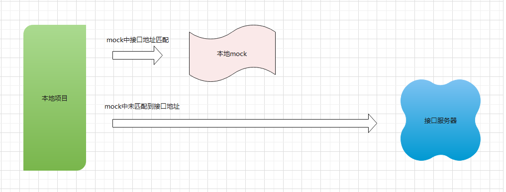
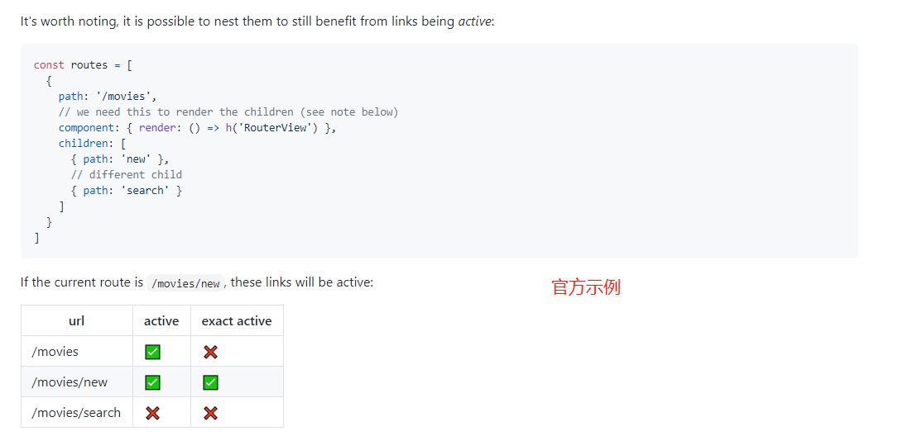
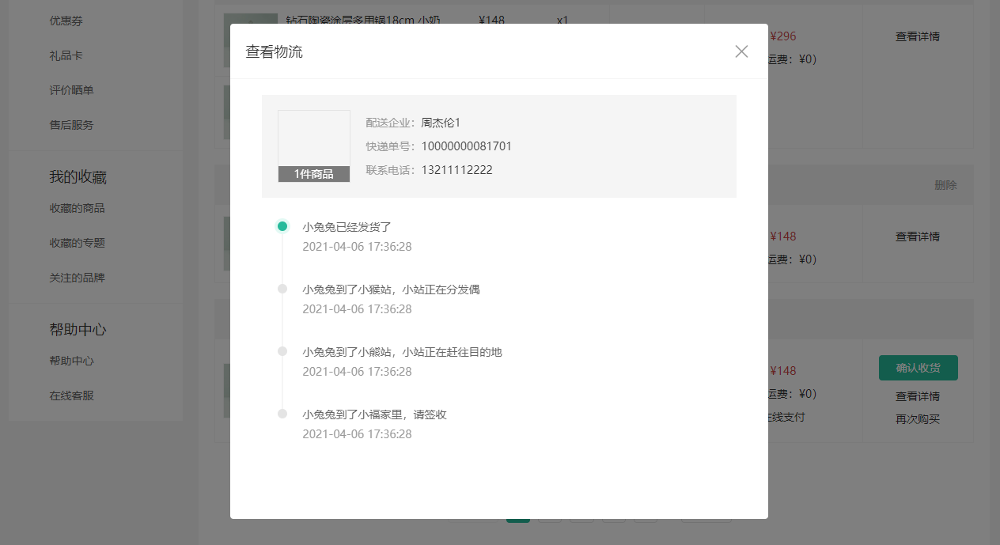
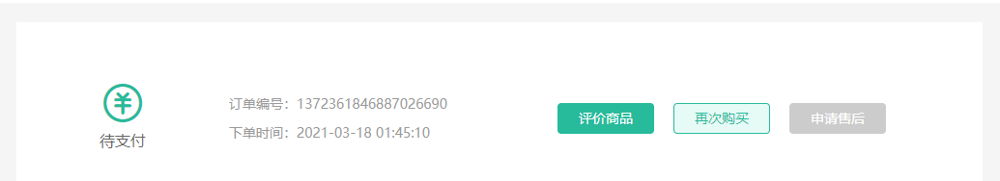
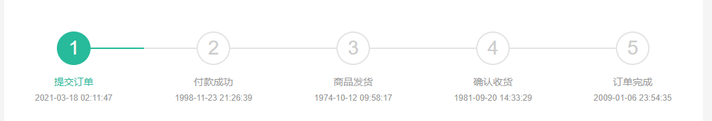

# 个人中心


## 01-个人中心-布局容器

> 目的：完成个人中心页面基础架子，配置路由。


大致步骤：

- 准备个人中心左菜单组件
- 准备个人中心布局容器组件
- 准备个人中心首页组件
- 配置路由规则


落的代码：

1. 准备个人中心左菜单组件

`src/components/app-member-aside.vue`

```vue
<template>
  <div class="xtx-member-aside">
    <div class="user-manage">
      <h4>我的账户</h4>
      <div class="links">
        <a href="javascript:;">个人中心</a>
        <a href="javascript:;">消息通知</a>
        <a href="javascript:;">个人信息</a>
        <a href="javascript:;">安全设置</a>
        <a href="javascript:;">地址管理</a>
        <a href="javascript:;">我的积分</a>
        <a href="javascript:;">我的足迹</a>
        <a href="javascript:;">邀请有礼</a>
        <a href="javascript:;">幸运抽奖</a>
      </div>
      <h4>交易管理</h4>
      <div class="links">
        <a href="javascript:;">我的订单</a>
        <a href="javascript:;">优惠券</a>
        <a href="javascript:;">礼品卡</a>
        <a href="javascript:;">评价晒单</a>
        <a href="javascript:;">售后服务</a>
      </div>
      <h4>我的收藏</h4>
      <div class="links">
        <a href="javascript:;">收藏的商品</a>
        <a href="javascript:;">收藏的专题</a>
        <a href="javascript:;">关注的品牌</a>
      </div>
      <h4>帮助中心</h4>
      <div class="links">
        <a href="javascript:;">帮助中心</a>
        <a href="javascript:;">在线客服</a>
      </div>
    </div>
  </div>
</template>

<script>
export default {
  name: 'XtxMemberAside'
}
</script>

<style scoped lang='less'>
.xtx-member-aside {
  width: 220px;
  margin-right: 20px;
  border-radius: 2px;
  .user-manage {
    background-color: #fff;
    h4 {
      font-size: 18px;
      font-weight: 400;
      padding: 20px 52px 5px;
      border-top: 1px solid #f6f6f6;
    }

    .links {
      padding: 0 52px 10px;
    }

    a {
      display: block;
      line-height: 1;
      padding: 15px 0;
      font-size: 14px;
      color: #666;
      position: relative;

      &:hover{
        color: @xtxColor;
      }
      &.active {
        color: @xtxColor;

        &:before {
          display: block;
        }
      }

      &:before {
        content: "";
        display: none;
        width: 6px;
        height: 6px;
        border-radius: 50%;
        position: absolute;
        top: 19px;
        left: -16px;
        background-color: @xtxColor;
      }
    }
  }
}
</style>
```


2. 准备个人中心布局容器组件

`src/views/member/Layout.vue`

```vue
<template>
  <div class="container">
    <AppMemberAside />
    <article class="article">
      <RouterView />
    </article>
  </div>
</template>
<script>
import AppMemberAside from '@/components/app-member-aside'
export default {
  name: 'MemberLayout',
  components: {
    AppMemberAside
  }
}
</script>
<style scoped lang="less">
.container {
  display: flex;
  padding-top: 20px;
  .article {
    width: 1000px;
  }
}
</style>
```


3. 准备个人中心首页组件

`src/views/member/home/index.vue`

```vue
<template>
  <div class="member-home">
      个人中心
  </div>
</template>
<script>
export default {
  name: 'MemberHome'
}
</script>
<style scoped lang="less">
.member-home {

}
</style>
```


4. 配置路由规则

`src/views/member/home/index.vue`

```js
const MemberLayout = () => import('@/views/member/Layout')
const MemberHome = () => import('@/views/member/home')
```

```diff
const routes = [
  {
    path: '/',
    component: Layout,
    children: [
      { path: '/', component: Home },
+	  ... 省略
+      {
+        path: '/member',
+        component: MemberLayout,
+        children: [
+          { path: '/member', component: MemberHome }
+        ]
+      }
    ]
  },
+	  ... 省略
]
```


## 02-个人中心-基础布局

> 目的：完成个人中心-首页基础布局


大致步骤：

- 准备概览组件
- 组件面板组件
  - 我的收藏-商品
  - 我的足迹
- 使用猜你喜欢组件


落的代码：

1. 准备概览组件

`src/views/member/home/components/home-overview.vue`

```vue
<template>
  <!-- 概览 -->
  <div class="home-overview">
    <!-- 用户信息 -->
    <div class="user-meta">
      <div class="avatar">
        
      </div>
      <h4>徐菲菲</h4>
    </div>
    <div class="item">
      <a href="javascript:;">
        <span class="iconfont icon-hy"></span>
        <p>会员中心</p>
      </a>
      <a href="javascript:;">
        <span class="iconfont icon-aq"></span>
        <p>安全设置</p>
      </a>
      <a href="javascript:;">
        <span class="iconfont icon-dw"></span>
        <p>地址管理</p>
      </a>
    </div>
  </div>
</template>
<script>
export default {
  name: 'MemberHomeOverview'
}
</script>
<style scoped lang="less">
.home-overview {
  height: 132px;
  background: url(../../../../assets/images/center-bg.png) no-repeat center / cover;
  display: flex;
  .user-meta {
    flex: 1;
    display: flex;
    align-items: center;
    .avatar {
      width: 85px;
      height: 85px;
      border-radius: 50%;
      overflow: hidden;
      margin-left: 60px;
      img {
        width: 100%;
        height: 100%;
      }
    }
    h4 {
      padding-left: 26px;
      font-size: 18px;
      font-weight: normal;
      color: white;
    }
  }
  .item {
    flex: 1;
    display: flex;
    align-items: center;
    justify-content: space-around;
    &:first-child {
      border-right: 1px solid #f4f4f4;
    }
    a {
      color: white;
      font-size: 16px;
      text-align: center;
      .iconfont {
        font-size: 32px;
      }
      p {
        line-height: 32px;
      }
    }
  }
}
</style>
```


2. 组件面板组件

`src/views/member/home/components/home-panel.vue`

```vue
<template>
  <div class="home-panel">
    <div class="header">
      <h4>{{ title }}</h4>
      <XtxMore to="/" />
    </div>
    <!-- 商品列表 -->
    <div class="goods-list">
      <slot></slot>
    </div>
  </div>
</template>
<script>
export default {
  name: 'MemberHomePanel',
  props: {
    title: {
      type: String,
      default: ''
    }
  }
}
</script>
<style scoped lang="less">
.home-panel {
  background-color: #fff;
  padding: 0 20px;
  margin-top: 20px;
  height: 400px;
  .header {
    height: 66px;
    border-bottom: 1px solid #f5f5f5;
    padding: 18px 0;
    display: flex;
    justify-content: space-between;
    align-items: baseline;
    h4 {
      font-size: 22px;
      font-weight: normal;
    }
  }
}
</style>
```

3. 使用面板组件，猜你喜欢组件

`src/views/member/home/index.vue`

```vue
<template>
  <div class="member-home">
    <!-- 概览 -->
    <HomeOverview />
    <!-- 收藏 -->
    <HomePanel title="我的收藏"></HomePanel>
    <!-- 足迹 -->
    <HomePanel title="我的足迹"></HomePanel>
    <!-- 猜你 -->
    <GoodsRelevant />
  </div>
</template>
<script>
import HomeOverview from './components/home-overview'
import HomePanel from './components/home-panel'
import GoodsRelevant from '@/views/goods/components/goods-relevant'
export default {
  name: 'MemberHome',
  components: {
    HomeOverview,
    HomePanel,
    GoodsRelevant
  }
}
</script>
<style scoped lang="less">
:deep(.xtx-carousel) .carousel-btn.prev {
  left: 5px;
}
:deep(.xtx-carousel) .carousel-btn.next {
  right: 5px;
}
</style>
```

## 03-个人中心-渲染页面

> 目的：用户信息展示，面板内商品展示。

大致步骤：

- 渲染概览组件
- 渲染，我的收藏，我的足迹


落地代码：

`src/views/member/home/components/home-overview.vue`

```vue
    <!-- 用户信息 -->
    <div class="user-meta">
      <div class="avatar">
        
      </div>
      <h4>{{$store.state.user.profile.account</h4>
    </div>
```

`src/views/member/home/index.vue`

```vue
    <!-- 收藏 -->
    <HomePanel title="我的收藏">
      <GoodsItem v-for="i in 4" :key="i" :goods="goods" />
    </HomePanel>
    <!-- 足迹 -->
    <HomePanel title="我的足迹">
      <GoodsItem v-for="i in 4" :key="i" :goods="goods" />
    </HomePanel>
```

```diff
+import GoodsItem from '@/views/category/components/goods-item'
export default {
  name: 'MemberHome',
  components: {
    HomeOverview,
    HomePanel,
    GoodsRelevant,
+    GoodsItem
  },
```

```js
  setup () {
    const goods = {
      id: '1',
      name: '自煮火锅不排队 麦饭石不粘鸳鸯火锅',
      picture: 'https://yanxuan-item.nosdn.127.net/fcdcb840a0f5dd754bb8fd2157579012.jpg',
      desc: '清汤鲜香 红汤劲爽',
      price: '159.00'
    }
    return { goods }
  }
```

`src/views/member/home/components/home-panel.vue`

```less
  .goods-list {
    display: flex;
    justify-content: space-around;
    padding-top: 20px;
  }
```


## 04-个人中心-mock数据

> 目的：mockjs基本使用



`mockjs`可以模拟可更快的得到较为真实的数据，且可以拦截axios的接口调用，让我们的代码实现了调用接口的逻辑且得到模拟的数据，保存业务完整度。当然模拟数据有一定的规则请参考： http://mockjs.com/ 


目标：模拟 `/my/test` 接口，随机返回点数据。


基本使用步骤：

1. 安装

```bash
npm i mockjs
```

2. 配置 `src/mock/index.js`

```js
import Mock from 'mockjs'

// mock的配置
Mock.setup({
  // 随机延时500-1000毫秒
  timeout: '500-1000'
})
```

3. 使用 `src/main.js`

```diff
import 'normalize.css'
import '@/assets/styles/common.less'
+ import './mock'
```

4. 模拟接口，拦截请求

```js
// 拦截请求，
// 第一个参数：url，使用正则去匹配
// 第二个参数：请求方式
// 第三个参数： 生成数据的函数
Mock.mock(/\/my\/test/, 'get', () => {
  return { msg: '请求测试接口成功', result: [] }
})
```

5. 生成随机数据

```js
// 单个数据
Mock.mock('@integer(0,7)')
// 对象数据
Mock.mock({
    id: '@id',
    name: '@ctitle(2,4)'
})
```

具体规则：http://mockjs.com/examples.html

## 05-个人中心-模拟接口

> 目的：使用mockjs模拟我的收藏，我的足迹接口，完成渲染。

大致步骤：

- 定义API接口函数
- 准备mock的接口拦截
- 获取数据渲染


落地代码：

- API函数 `src/api/index.js`

```js
import request from '@/utils/request'

/**
 * 获取收藏分页数据
 * @param {Integer} collectType - 收藏类型，1为商品，2为专题，3为品牌
 * @returns
 */
export const findCollect = ({ page = 1, pageSize = 10, collectType = 1 }) => {
  return request('/member/collect', 'get', { page, pageSize, collectType })
}
```

- mock拦截

```js
import qs from 'qs'
```

```js
// 模拟 我的收藏
Mock.mock(/\/member\/collect/, 'get', config => {
  const queryString = config.url.split('?')[1]
  const queryObject = qs.parse(queryString)
  const items = []
  for (let i = 0; i < +queryObject.pageSize; i++) {
    items.push(Mock.mock({
      id: '@id',
      name: '@ctitle(10,20)',
      desc: '@ctitle(4,10)',
      price: '@float(100,200,2,2)',
      // http://zhoushugang.gitee.io/erabbit-client-pc-static/uploads/clothes_goods_7.jpg
      picture: `http://zhoushugang.gitee.io/erabbit-client-pc-static/uploads/clothes_goods_${Mock.mock('@integer(1,8)')}.jpg`
    }))
  }
  return {
    msg: '获取收藏商品成功',
    result: {
      counts: 35,
      pageSize: +queryObject.pageSize,
      page: +queryObject.page,
      items
    }
  }
})
```

- 获取数据渲染

```js
    // 调用模拟的接口
    const collectGoods = ref([])
    findCollect({
      page: 1,
      pageSize: 4
    }).then(data => {
      collectGoods.value = data.result.items
    })

    return { goods, collectGoods }
```

```diff
    <HomePanel title="我的收藏">
+      <GoodsItem v-for="item in collectGoods" :key="item.id" :goods="item" />
    </HomePanel>
```

足迹接口，可以自己练习下。


## 06-个人中心-菜单激活

> 目的：动态激活左侧菜单

大致步骤：

- 添加个人中心路由地址，设置精准匹配类名
- 添加我的订单路由与组件


```tex
router-link-active   当你的路由路径包含 router-link组件的to属性值，当前组件会加上它
router-link-exact-active   当你的路由路径完全和你的router-link组件的to属性值一致，当前组件会加上它
```

注意：vue3.0 router-link-active 加不上，路由路径包含 且  需要又路由嵌套关系。

- 例如：`/member`    `/member/other`   但是不是嵌套路由，不会加上这个类 router-link-active




`src/components/app-member-aside.vue`

```diff
      <h4>我的账户</h4>
      <div class="links">
+        <RouterLink to="/member" exact-active-class="active">个人中心</RouterLink>
        <a href="javascript:;">消息通知</a>
        <a href="javascript:;">个人信息</a>
        <a href="javascript:;">安全设置</a>
        <a href="javascript:;">地址管理</a>
        <a href="javascript:;">我的积分</a>
        <a href="javascript:;">我的足迹</a>
        <a href="javascript:;">邀请有礼</a>
        <a href="javascript:;">幸运抽奖</a>
      </div>
      <h4>交易管理</h4>
      <div class="links">
+        <RouterLink to="/member/order" exact-class="active">我的订单</RouterLink>
        <a href="javascript:;">优惠券</a>
```

`src/router/index.js`

```js
const MemberOrder = () => import('@/views/member/order')
```

```js
          {
            path: '/member/order/',
            // vue3.0 需要有嵌套关系才能模糊匹配    
            component: { render: () => h(<RouterView/>) },
            children: [
              { path: '', component: MemberOrder },
              { path: ':id', component: MemberOrderDetail }
            ]
          }
```


## 07-订单管理-tabs组件

> 目的：封装一个高可用tabs组件


大致步骤：

- `xtx-tabs` 组件容器 可以有多个 `xtx-tabs-panel` 组件面板
- `xtx-tabs-panel` 需要暴露  标题 `props.label`，名称 `props.name`，内容 `<slot />`
- `xtx-tabs`  组件组织结构，控制点击事件，标签页激活。


铺垫知识：

- `jsx` 语法，需要简单了解其基本使用 https://cn.vuejs.org/v2/guide/render-function.html

```js
render () {
    const name = 'tom'
    return <h3>{name}</h3>
}
```


落的代码：

`src/components/library/xtx-tabs.vue`

```vue
<script>
import { useVModel } from '@vueuse/core'
import { provide } from 'vue'
export default {
  name: 'XtxTabs',
  props: {
    modelValue: {
      type: String,
      default: ''
    }
  },
  setup (props, { emit }) {
    const activeName = useVModel(props, 'modelValue', emit)
    // 给xtx-tabs-panel传值
    provide('activeName', activeName)
    // 点击选项卡对应的处理函数
    const tabClick = (name, index) => {
      activeName.value = name
      // 触发一个点击自定义时间
      emit('tab-click', { name, index })
    }
    return { activeName, tabClick }
  },
  render () {
    // jsx语法，它能够让我们创建节点和写html一样
    // 1. 动态插值表达式{} 2. 尽量三元表示式做判断，使用map来遍历 3.事件使用原始方式绑定
    // 默认插槽节点
    const panels = this.$slots.default()
    console.log(panels)
    // 选项卡
    const nav = (
      <nav>
        {panels.map((item, i) => {
          return (
            <a
              onClick={() => this.tabClick(item.props.name, i)}
              class={{ active: item.props.name === this.activeName }}
              href="javascript:;"
            >
              {item.props.label}
            </a>
          )
        })}
      </nav>
    )
    return <div class="xtx-tabs">{[nav, panels]}</div>
  }
}
</script>
<style lang="less">
.xtx-tabs {
  background: #fff;
  > nav {
    height: 60px;
    line-height: 60px;
    display: flex;
    border-bottom: 1px solid #f5f5f5;
    > a {
      width: 110px;
      border-right: 1px solid #f5f5f5;
      text-align: center;
      font-size: 16px;
      &.active {
        border-top: 2px solid @xtxColor;
        height: 60px;
        background: #fff;
        line-height: 56px;
      }
    }
  }
}
</style>
```

`src/components/library/xtx-tabs-panel.vue`

```vue
<template>
  <!-- 装载是内容 -->
  <div class="xtx-tabs-panel" v-show="activeName===name">
    <slot />
  </div>
</template>
<script>
import { inject } from 'vue'
export default {
  name: 'XtxTabsPanel',
  props: {
    // 标签页标题文章
    label: {
      type: String,
      default: ''
    },
    // 唯一标识
    name: {
      type: String,
      default: ''
    }
  },
  setup () {
    // 当前组件该不该显示，取决于xtx-tabs组件的activeName数据是否和props.name一样
    const activeName = inject('activeName')
    return { activeName }
  }
}
</script>
<style scoped lang="less"></style>
```

`src/views/member/order/index.vue`

```vue
<template>
  <div class="member-order-page">
    <XtxTabs v-model="activeName" @click-tab="clickTab">
      <XtxTabsPanel name="all" label="全部订单">全部订单</XtxTabsPanel>
      <XtxTabsPanel name="unpay" label="待付款">待付款</XtxTabsPanel>
      <XtxTabsPanel name="deliver" label="待发货">待发货</XtxTabsPanel>
      <XtxTabsPanel name="receive" label="待收货">待收货</XtxTabsPanel>
      <XtxTabsPanel name="comment" label="待评价">待评价</XtxTabsPanel>
      <XtxTabsPanel name="complete" label="已完成">已完成</XtxTabsPanel>
      <XtxTabsPanel name="cancel" label="已取消">已取消</XtxTabsPanel>
    </XtxTabs>
  </div>
</template>
<script>
import { ref } from 'vue'
export default {
  name: 'MemberOrder',
  setup () {
    const activeName = ref('all')
    const clickTab = (name) => {
      console.log(name)
    }
    return { activeName, clickTab }
  }
}
</script>
<style scoped lang="less"></style>

```


组件升级：

- 弊端，动态生成的xtx-tabs-panel无法正常运行。 
- 补丁，动态判断节点类型，组织tabs列表

`src/components/library/xtx-tabs.vue`

```diff
    const panels = this.$slots.default()
    const dynamicPanels = []
+    panels.forEach(item => {
+      if (item.type.name === 'XtxTabsPanel') {
+        dynamicPanels.push(item)
+      } else {
+        item.children.forEach(com => {
+          dynamicPanels.push(com)
+        })
+      }
+    })
    // 选项卡
    const nav = (
      <nav>
+        {dynamicPanels.map((item, i) => {
```

`src/views/member/order/index.vue`

```vue
<template>
  <div class="member-order-page">
    <XtxTabs v-model="activeName">
      <XtxTabsPanel
        v-for="item in orderStatus"
        :key="item.name"
        :label="item.label"
        :name="item.name"
        >{{item.label}}</XtxTabsPanel
      >
    </XtxTabs>
  </div>
</template>
<script>
import { ref } from 'vue'
import { orderStatus } from '@/api/constants'
export default {
  name: 'MemberOrderPage',
  setup () {
    const activeName = ref('all')
    return { activeName, orderStatus }
  }
}
</script>
<style scoped lang="less"></style>

```

`src/api/constant.js`   订单状态常量数据

```js
// 订单状态
export const orderStatus = [
  { name: 'all', label: '全部订单' },
  { name: 'unpay', label: '待付款' },
  { name: 'deliver', label: '待发货' },
  { name: 'receive', label: '待收货' },
  { name: 'comment', label: '待评价' },
  { name: 'complete', label: '已完成' },
  { name: 'cancel', label: '已取消' }
]

```


## 08-订单管理-基础布局

> 目的：完成订单静态布局。


基础样式：

```less
.order-list {
  background: #fff;
  padding: 20px;
}
.order-item {
  margin-bottom: 20px;
  border: 1px solid #f5f5f5;
  .head {
    height: 50px;
    line-height: 50px;
    background: #f5f5f5;
    padding: 0 20px;
    overflow: hidden;
    span {
      margin-right: 20px;
      &.down-time {
        margin-right: 0;
        float: right;
        i {
          vertical-align: middle;
          margin-right: 3px;
        }
        b {
          vertical-align: middle;
          font-weight: normal;
        }
      }
    }
    .del {
      margin-right: 0;
      float: right;
      color: #999;
    }
  }
  .body {
    display: flex;
    align-items: stretch;
    .column {
      border-left: 1px solid #f5f5f5;
      text-align: center;
      padding: 20px;
      > p {
        padding-top: 10px;
      }
      &:first-child {
        border-left: none;
      }
      &.goods {
        flex: 1;
        padding: 0;
        align-self: center;
        ul {
          li {
            border-bottom: 1px solid #f5f5f5;
            padding: 10px;
            display: flex;
            &:last-child {
              border-bottom: none;
            }
            .image {
              width: 70px;
              height: 70px;
              border: 1px solid #f5f5f5;
            }
            .info {
              width: 220px;
              text-align: left;
              padding: 0 10px;
              p {
                margin-bottom: 5px;
                &.name {
                  height: 38px;
                }
                &.attr {
                  color: #999;
                  font-size: 12px;
                  span {
                    margin-right: 5px;
                  }
                }
              }
            }
            .price {
              width: 100px;
            }
            .count {
              width: 80px;
            }
          }
        }
      }
      &.state {
        width: 120px;
        .green {
          color: @xtxColor;
        }
      }
      &.amount {
        width: 200px;
        .red {
          color: @priceColor;
        }
      }
      &.action {
        width: 140px;
        a {
          display: block;
          &:hover {
            color: @xtxColor;
          }
        }
      }
    }
  }
}
```

基础结构：

```vue
    <div class="order-list">
      <div class="order-item">
        <div class="head">
          <span>下单时间：2018-01-08 15:02:00</span>
          <span>订单编号：62205697599</span>
          <span class="down-time">
            <i class="iconfont icon-down-time"></i>
            <b>付款截止：28分20秒</b>
          </span>
        </div>
        <div class="body">
          <div class="column goods">
            <ul>
              <li v-for="i in 2" :key="i">
                <a class="image" href="javascript:;">
                  
                </a>
                <div class="info">
                  <p class="name ellipsis-2">原创设计一体化机身,精致迷你破壁机350mL</p>
                  <p class="attr ellipsis">
                    <span>颜色：绿色</span>
                    <span>尺寸：10寸</span>
                  </p>
                </div>
                <div class="price">¥9.50</div>
                <div class="count">x1</div>
              </li>
            </ul>
          </div>
          <div class="column state">
            <p>待付款</p>
          </div>
          <div class="column amount">
            <p class="red">¥19.00</p>
            <p>（含运费：¥10.00）</p>
            <p>在线支付</p>
          </div>
          <div class="column action">
            <XtxButton type="primary" size="small">立即付款</XtxButton>
            <p><a href="javascript:;">查看详情</a></p>
            <p><a href="javascript:;">取消订单</a></p>
          </div>
        </div>
      </div>
            <div class="order-item">
        <div class="head">
          <span>下单时间：2018-01-08 15:02:00</span>
          <span>订单编号：62205697599</span>
          <a href="javascript:;" class="del">删除</a>
        </div>
        <div class="body">
          <div class="column goods">
            <ul>
              <li>
                <a class="image" href="javascript:;">
                  
                </a>
                <div class="info">
                  <p class="name ellipsis-2">原创设计一体化机身,精致迷你破壁机350mL</p>
                  <p class="attr ellipsis">
                    <span>颜色：绿色</span>
                    <span>尺寸：10寸</span>
                  </p>
                </div>
                <div class="price">¥9.50</div>
                <div class="count">x1</div>
              </li>
            </ul>
          </div>
          <div class="column state">
            <p>已取消</p>
          </div>
          <div class="column amount">
            <p class="red">¥9.50</p>
            <p>（含运费：¥0.00）</p>
          </div>
          <div class="column action">
            <p><a href="javascript:;">查看详情</a></p>
          </div>
        </div>
      </div>
    </div>
```


## 09-订单管理-列表渲染

> 目的：完成订单列表默认渲染。


大致步骤：

- 定义API接口函数
- 抽取单条订单组件
- 获取数据进行渲染


落的代码：

1. 获取订单列表API借口

```js
/**
 * 查询订单列表
 * @param {Number} orderState - 订单状态，1为待付款、2为待发货、3为待收货、4为待评价、5为已完成、6为已取消，未传该参数或0为全部
 * @param {Number} page - 页码
 * @param {Number} pageSize - 每页条数
 * @returns
 */
export const findOrderList = ({ orderState, page, pageSize }) => {
  return request('/member/order', 'get', { orderState, page, pageSize })
}
```

2. 组件初始化获取订单信息

```js
import { reactive, ref } from 'vue'
import { findOrderList } from '@/api/order'
```

```js
    // 查询订单参数
    const requestParams = reactive({
      page: 1,
      pageSize: 5,
      orderState: 0
    })
    // 订单列表
    const orderList = ref([])
	// 查询订单
    findOrderList(requestParams).then(data => {
        orderList.value = data.result.items
    })
	return { activeName, tabClick, orderTabs, orderList }
```

3. 渲染列表

提取order-item组件 `order/components/order-item.vue`

```vue
<template>
  <div class="order-item">
    <div class="head">
      <span>下单时间：{{order.createTime}}</span>
      <span>订单编号：{{order.id}}</span>
      <!-- 未付款，倒计时时间还有 -->
      <span class="down-time" v-if="order.orderState===1">
        <i class="iconfont icon-down-time"></i>
        <b>付款截止：{{countdownText}}</b>
      </span>
      <!-- 已完成 已取消 -->
      <a v-if="[5,6].includes(order.orederState)" href="javascript:;" class="del">删除</a>
    </div>
    <div class="body">
      <div class="column goods">
        <ul>
          <li v-for="goods in order.skus" :key="goods.id">
            <a class="image" href="javascript:;">
              
            </a>
            <div class="info">
              <p class="name ellipsis-2">{{goods.name}}</p>
              <p class="attr ellipsis">{{goods.attrsText}}</p>
            </div>
            <div class="price">¥{{goods.realPay}}</div>
            <div class="count">x{{goods.quantity}}</div>
          </li>
        </ul>
      </div>
      <div class="column state">
        <p>{{orderStatus[order.orderState].label}}</p>
        <!-- 待收货：查看物流 -->
        <!-- 待评价：评价商品 -->
        <!-- 已完成：查看评价 -->
        <p v-if="order.orderState===3"><a href="javascript:;" class="green">查看物流</a></p>
        <p v-if="order.orderState===4"><a href="javascript:;" class="green">评价商品</a></p>
        <p v-if="order.orderState===5"><a href="javascript:;" class="green">查看评价</a></p>
      </div>
      <div class="column amount">
        <p class="red">¥{{order.payMoney}}</p>
        <p>（含运费：¥{{order.postFee}}）</p>
        <p>在线支付</p>
      </div>
      <div class="column action">
        <!-- 待支付：立即付款，查看详情，取消订单 -->
        <!-- 待发货：查看详情，再次购买 -->
        <!-- 待收货：确认收货，查看详情，再次购买 -->
        <!-- 待评价：查看详情，再次购买，申请售后 -->
        <!-- 已完成：查看详情，再次购买，申请售后 -->
        <!-- 已取消：查看详情 -->
        <XtxButton v-if="order.orderState===1" type="primary" size="small">立即付款</XtxButton>
        <XtxButton v-if="order.orderState===3" type="primary" size="small">确认收货</XtxButton>
        <p><a href="javascript:;">查看详情</a></p>
        <p v-if="order.orderState===1"><a href="javascript:;">取消订单</a></p>
        <p v-if="[2,3,4,5].includes(order.orderState)"><a href="javascript:;">再次购买</a></p>
        <p v-if="[4,5].includes(order.orderState)"><a href="javascript:;">申请售后</a></p>
      </div>
    </div>
  </div>
</template>
<script>
import { orderStatus } from '@/api/constants'
import { ref } from 'vue'
import { usePayTime } from '@/hooks'
export default {
  name: 'OrderItem',
  props: {
    order: {
      type: Object,
      default: () => ({})
    }
  },
  setup (props) {
    const { start, timeText } = usePayTime()
    start(props.order.countdown)
    return { orderStatus, timeText }
  }
}
</script>
<style scoped lang="less">
.order-item {
  margin-bottom: 20px;
  border: 1px solid #f5f5f5;
  .head {
    height: 50px;
    line-height: 50px;
    background: #f5f5f5;
    padding: 0 20px;
    overflow: hidden;
    span {
      margin-right: 20px;
      &.down-time {
        margin-right: 0;
        float: right;
        i {
          vertical-align: middle;
          margin-right: 3px;
        }
        b {
          vertical-align: middle;
          font-weight: normal;
        }
      }
    }
    .del {
      margin-right: 0;
      float: right;
      color: #999;
    }
  }
  .body {
    display: flex;
    align-items: stretch;
    .column {
      border-left: 1px solid #f5f5f5;
      text-align: center;
      padding: 20px;
      > p {
        padding-top: 10px;
      }
      &:first-child {
        border-left: none;
      }
      &.goods {
        flex: 1;
        padding: 0;
        align-self: center;
        ul {
          li {
            border-bottom: 1px solid #f5f5f5;
            padding: 10px;
            display: flex;
            &:last-child {
              border-bottom: none;
            }
            .image {
              width: 70px;
              height: 70px;
              border: 1px solid #f5f5f5;
            }
            .info {
              width: 220px;
              text-align: left;
              padding: 0 10px;
              p {
                margin-bottom: 5px;
                &.name {
                  height: 38px;
                }
                &.attr {
                  color: #999;
                  font-size: 12px;
                  span {
                    margin-right: 5px;
                  }
                }
              }
            }
            .price {
              width: 100px;
            }
            .count {
              width: 80px;
            }
          }
        }
      }
      &.state {
        width: 120px;
        .green {
          color: @xtxColor;
        }
      }
      &.amount {
        width: 200px;
        .red {
          color: @priceColor;
        }
      }
      &.action {
        width: 140px;
        a {
          display: block;
          &:hover {
            color: @xtxColor;
          }
        }
      }
    }
  }
}
</style>
```

使用order-item组件 `order/index.vue`

```diff
+import OrderItem from './components/order-item'
export default {
  name: 'MemberOrder',
+  components: { OrderItem },
```

```vue
    <div class="order-list">
      <OrderItem v-for="item in orderList" :key="item.id" :order="item" />
    </div>
    <div v-else class="loading"></div>
```

```vue
<style scoped lang="less">
.order-list {
  padding: 20px;
}
</style>
```


 ## 10-订单管理-条件查询

> 目的：根据状态切换，页码切换，加载数据。


大致步骤：

- 完成tab切换加载
- 完成加载中，无数据处理
- 完成分页加载


落地代码：

1. tab切换加载数据

```vue
    <!-- tabs组件 -->
    <XtxTabs v-model="activeName" @tab-click="tabClick">
```

```js
    const tabClick = (tab) => {
      // 此时：tab.index 就是订单的状态
      requestParams.orderState = tab.index
      requestParams.page = 1
    }
```

```js
    const orderList = ref([])
    watch(requestParams, () => {
      findOrderList(requestParams).then(data => {
        orderList.value = data.result.items
      })
    }, { immediate: true })
```

2. 加载状态，暂无数据

```diff
    // 订单列表
    const orderList = ref([])
    const total = ref(0)
+    const loading = ref(true)
    // 初始化后，查询条件更改后，查询。
    watch(requestParams, () => {
+      loading.value = true
      findOrderList(requestParams).then(data => {
        orderList.value = data.result.items
+        loading.value = false
      })
    }, { immediate: true })
```

```diff
    <div class="order-list">
+      <div v-if="loading" class="loading"></div>
+      <div class="none" v-if="!loading && orderList.length === 0">暂无数据</div>
      <OrderItem v-for="item in orderList" :key="item.id" :order="item" />
    </div>
```

```less
.order-list {
  padding: 20px;
  position: relative;
  min-height: 400px;
}
.loading {
  height: 100%;
  width: 100%;
  position: absolute;
  left: 0;
  top: 0;
  background: rgba(255,255,255,.9) url(../../../assets/images/loading.gif) no-repeat center;
}
.none {
  height: 400px;
  text-align: center;
  line-height: 400px;
  color: #999;
}
```

3. 分页实现

```diff
    // 订单列表
    const orderList = ref([])
+    const total = ref(0)
    const loading = ref(true)
    // 初始化后，查询条件更改后，查询。
    watch(requestParams, () => {
      loading.value = true
      findOrderList(findOrderList).then(data => {
        orderList.value = data.result.items
+        total.value = data.result.counts
        loading.value = false
      })
    }, { immediate: true })
```

```vue
    <XtxPagination
      v-if="total > requestParams.pageSize"
      @current-change="requestParams.page=$event"
      :total="total"
      :page-size="requestParams.pageSize"
      :current-page="requestParams.page"  />
```

4. 返回的数据给模版使用

```js
    return {
      activeName,
      orderStatus,
      tabClick,
      requestParams,
      orderList,
      loading,
      total,
      changePager,
    }
```


## 11-订单管理-取消订单


> 目的：完成取消订单操作

大致步骤：

- 准备取消原因的常量数据
- 准备取消订单的API接口函数
- 订单列表准备一个取消订单组件
  - 提取取消订单组件
  - 取消订单逻辑封装
- 单条订单组件触发取消订单事件
- 立即付款，查看详情，给上链接即可。


`src/api/order.js`

```js
/**
 * 取消订单
 * @param {String} orderId - 订单ID
 * @param {String} cancelReason - 取消原因
 * @returns Promise
 */
export const cancelOrder = (orderId, cancelReason) => {
  return request(`/member/order/${orderId}/cancel`, 'put', { cancelReason })
}

```

`src/api/constants.js`

```js
export const cancelReason = [
  '配送信息有误',
  '商品买错了',
  '重复下单/误下单',
  '忘记使用优惠券、兔币等',
  '其他渠道价格更低',
  '不想买了'
]
```

`views/member/order/components/order-cancel.vue`

```vue
<template>
  <XtxDialog title="取消订单" v-model="visibleDialog">
    <!-- 组件内容 -->
    <div class="cancel-info">
        <p>取消订单后，本单享有的优惠可能会一并取消，是否继续？</p>
        <p class="tip">请选择取消订单的原因（必选）：</p>
        <div class="btn">
          <a
            @click="curText = item"
            v-for="item in cancelReason"
            :key="item"
            href="javascript:;"
            :class="{ active: curText === item }"
          >
            {{ item }}
          </a>
        </div>
    </div>
    <!-- 按钮操作 -->
    <template #footer>
      <XtxButton type="gray" @click="visibleDialog=false" style="margin-right:20px">取消</XtxButton>
      <XtxButton type="primary" @click="submit">确认</XtxButton>
    </template>
  </XtxDialog>
</template>
<script>
import { ref } from 'vue'
import { cancelReason } from '@/api/constants'
import Message from '@/components/library/Message'
import { cancelOrder } from '@/api/order'
export default {
  name: 'OrderCancel',
  setup () {
    const visibleDialog = ref(false)
    // 打开对话框，提供给其他组件调用
    const order = ref(null)
    const open = (item) => {
      visibleDialog.value = true
      // 记录订单ID
      order.value = item
      // 清除之前选中原因
      curText.value = ''
    }
    // 选中的取消原因
    const curText = ref('')
    // 确认函数
    const submit = () => {
      // 1. 根据订单ID和取消原因发请求
      if (!curText.value) return Message({ text: '请选择取消订单的原因' })
      cancelOrder(order.value.id, curText.value).then(() => {
        // 取消订单成功
        Message({ text: '取消订单成功', type: 'success' })
        // 更新订单状态
        order.value.orderState = 6
        // 关闭对话框
        visibleDialog.value = false
      })
    }
    return { visibleDialog, submit, cancelReason, curText, open }
  }
}
</script>
<style scoped lang="less">
 .xtx-dialog ::v-deep .wrapper {
  width: 620px;
}
.cancel-info {
  p {
    font-size: 16px;
    line-height: 35px;
    &.tip {
      color: #999;
    }
  }
  .btn {
    padding-top: 21px;
    display: flex;
    flex-wrap: wrap;
    a {
      width: 256px;
      height: 45px;
      line-height: 45px;
      text-align: center;
      background-color: #ffffff;
      border: 1px solid #e4e4e4;
      margin-right: 20px;
      margin-bottom: 20px;
      color: #666;
      &:nth-child(2n){
        margin-right: 0;
      }
      &:hover,&.active {
        background-color: #e3f9f4;
        border-color: @xtxColor;
      }
    }
  }
}
</style>
```

`views/member/order/index.vue`  封装取消订单逻辑，使用取消订单组件，利用teleport组件将结构放在#app容器外

```diff
+    // setup中的return
    return {
      activeName,
      orderStatus,
      tabClick,
      requestParams,
      orderList,
      loading,
      total,
      changePager,
+      ...useCancelOrder()
    }
```

```js
// 封装逻辑-取消订单
const useCancelOrder = () => {
  const orderCancelCom = ref(null)
  const onCancelOrder = (item) => {
    // item 就是你要取消的订单
    orderCancelCom.value.open(item)
  }
  return { onCancelOrder, orderCancelCom }
}

```

```vue
    <!-- 对于像：对话框，消息提示，确认提示，通知组件 适合使用传送门 Teleport -->
    <Teleport to="#dailog">
      <OrderCancel ref="orderCancelCom" />
    </Teleport>
```

```diff
      <OrderItem
        v-for="item in orderList"
        :key="item.id"
        :order="item"
+        @on-cancel-order="onCancelOrder(item)"
      />
```

`public/index.html`

```html
    <div id="app"></div>
    <div id="dailog"></div>
```

`views/member/order/components/order-item.vue`   触发自定义事件，申明自定义事件

```diff
        <!-- 待支付：立即付款，查看详情，取消订单 -->
        <!-- 待发货：查看详情，再次购买 -->
        <!-- 待收货：确认收货，查看详情，再次购买 -->
        <!-- 待评价：查看详情，再次购买，申请售后 -->
        <!-- 已完成：查看详情，再次购买，申请售后 -->
        <!-- 已取消：查看详情 -->
+        <XtxButton @click="$router.push(`/member/pay?orderId=${order.id}`)" v-if="order.orderState===1" type="primary" size="small">立即付款</XtxButton>
        <XtxButton v-if="order.orderState===3" type="primary" size="small">确认收货</XtxButton>
+        <p><a @click="$router.push(`/member/order/${order.id}`)" href="javascript:;">查看详情</a></p>
+        <p @click="$emit('on-cancel-order')" v-if="order.orderState===1"><a href="javascript:;">取消订单</a></p>
        <p v-if="[2,3,4,5].includes(order.orderState)"><a href="javascript:;">再次购买</a></p>
        <p v-if="[4,5].includes(order.orderState)"><a href="javascript:;">申请售后</a></p>
```

```js
  // 组件本身触发的自定义事件可以在这里申明
  emits: ['on-cancel-order'],
```


## 12-订单管理-删除订单

> 目的：完成删除订单操作

大致步骤：

- `order-item` 组件触发自定义时间通知父组件
- 再父组件实现删除逻辑，需要提前定义API函数

`src/api/order.js`

```js
/**
 * 删除订单
 * @param {Array<string>} ids - 删除订单，id集合
 * @returns
 */
export const delteOrder = (ids) => {
  return request('/member/order', 'delete', { ids })
}
```

`src/views/member/order/components/order-item.vue`

```diff
      </span>
      <!-- 已完成 已取消 -->
+      <a @click="$emit('on-delete-order')" v-if="[5,6].includes(order.orderState)" href="javascript:;" class="del">删除</a>
    </div>
```

```diff
  // 组件本身触发的自定义事件可以在这里申明
+  emits: ['on-cancel-order', 'on-delete-order'],
```

`src/views/member/order/index.vue`

```diff
      <OrderItem
        v-for="item in orderList"
        :key="item.id"
        :order="item"
        @on-cancel-order="onCancelOrder(item)"
+        @on-delete-order="onDeleteOrder(item)"
      />
```

```diff
import { reactive, ref, watch } from 'vue'
import { orderStatus } from '@/api/constants'
import { delteOrder, findOrderList } from '@/api/order'
import OrderItem from './components/order-item'
import OrderCancel from './components/order-cancel'
import Confirm from '@/components/library/Confirm'
import Message from '@/components/library/Message'
export default {
  name: 'MemberOrderPage',
  components: {
    OrderItem,
    OrderCancel
  },
  setup () {
    const activeName = ref('all')
    const tabClick = (tab) => {
      // 此时：tab.index 就是订单的状态
      requestParams.orderState = tab.index
      requestParams.page = 1
    }
    // 筛选条件
    const requestParams = reactive({
      page: 1,
      pageSize: 5,
      orderState: 0
    })
    // 发请求获取数据
    const orderList = ref([])
    const loading = ref(false)
    const total = ref(0)
    // 使用侦听器，监听 requestParams 的改变
+   const findOrderListFn = () => {
+     loading.value = true
+     findOrderList(requestParams).then(data => {
+       orderList.value = data.result.items
+       total.value = data.result.counts
+       loading.value = false
+     })
+   }
    watch(requestParams, () => {
+      findOrderListFn()
    }, { immediate: true })

    // 分页事件
    const changePager = (np) => {
      requestParams.page = np
    }

+    // 删除订单
+    const onDeleteOrder = (item) => {
+      Confirm({ text: '您确认删除该条订单吗？' }).then(() => {
+        delteOrder([item.id]).then(() => {
+          Message({ text: '删除订单成功', type: 'success' })
+          findOrderListFn()
+        })
+      }).catch(e => {})
+    }

    return {
      activeName,
      orderStatus,
      tabClick,
      requestParams,
      orderList,
      loading,
      total,
      changePager,
+      onDeleteOrder,
      ...useCancelOrder()
    }
  }
}
```


## 13-订单管理-确认收货


温馨提示：

-  接口服务器地址 + member/order/consignment/ + 订单ID
- 改成已发货状态，后面订单号改成，自己的订单编号。

```
http://pcapi-xiaotuxian-front-devtest.itheima.net//member/order/consignment/1394116427400613890
```


大致步骤：

- 定义确认收货API接口
- 完成确认收货业务逻辑

落的代码：

`src/views/member/order/index.vue`

```js
// 封装逻辑-确认收货
const useConfirmOrder = () => {
  const onConfirmOrder = (item) => {
    // item 就是你要确认收货的订单
    Confirm({ text: '您确认收到货吗？确认后货款将会打给卖家。' }).then(() => {
      confirmOrder(item.id).then(() => {
        Message({ text: '确认收货成功', type: 'success' })
        // 确认收货后状态变成 待评价
        item.orderState = 4
      })
    })
  }
  return { onConfirmOrder }
}
```

```diff
    return {
      activeName,
      orderStatus,
      tabClick,
      requestParams,
      orderList,
      loading,
      total,
      changePager,
      onDeleteOrder,
      ...useCancelOrder(),
+      ...useConfirmOrder()
    }
```

```diff
      <OrderItem
        v-for="item in orderList"
        :key="item.id"
        :order="item"
        @on-cancel-order="onCancelOrder(item)"
        @on-delete-order="onDeleteOrder(item)"
+        @on-confirm-order="onConfirmOrder(item)"
      />
```

`src/views/member/order/components/order-item.vue`

```vue
        <p @click="$emit('on-cancel-order')" v-if="order.orderState===1"><a href="javascript:;">取消订单</a></p>
```

```js
  // 组件本身触发的自定义事件可以在这里申明
  emits: ['on-cancel-order', 'on-delete-order', 'on-confirm-order'],
```


## 14-订单管理-查看物流

> 目的：再订单列表，订单待收货，查询物流信息。



大致步骤：

- 定义查询物流的API函数
- 定义一个查看物流组件
- 在 `order-item.vue`  组件触发查看物流自定义事件
- 在 `index.vue` 列表组件封装查看物理逻辑


落的代码：

`views/member/order/components/order-logistics.vue`

```js
/**
 * 查看物理
 * @param {String} id - 订单ID
 * @returns
 */
export const logisticsOrder = (id) => {
  return request(`/member/order/${id}/logistics`, 'get')
}
```

```vue
<template>
  <XtxDialog v-model:visible="visibleDialog" title="查看物流">
    <div class="order-logistics-goods" v-if="logistics">
      <a class="image" href="javascript:;"
        >
        <p>{{logistics.count}}件商品</p></a
      >
      <div class="info" v-if="logistics.company">
        <p><span>配送企业：</span>{{logistics.company.name}}</p>
        <p><span>快递单号：</span>{{logistics.company.number}}</p>
        <p><span>联系电话：</span>{{logistics.company.tel}}</p>
      </div>
    </div>
    <div class="order-logistics-list" v-if="logistics">
      <div class="item" v-for="(item, i) in logistics.list" :key="item.id">
        <div class="line" :class="{ active: i === 0 }"></div>
        <div class="logistics">
          <p>{{ item.text }}</p>
          <p>{{ item.time }}</p>
        </div>
      </div>
    </div>
  </XtxDialog>
</template>
<script>
import { ref } from 'vue'
import { logisticsOrder } from '@/api/order'
export default {
  name: 'OrderLogistics',
  setup () {
    const visibleDialog = ref(false)
    // 物流信息对象
    const logistics = ref(null)
    // 打开对话框
    const open = (item) => {
      visibleDialog.value = true
      // 查询物理信息
      logisticsOrder(item.id).then(data => {
        logistics.value = data.result
      })
    }
    return { visibleDialog, open, logistics }
  }
}
</script>
<style scoped lang="less">
.xtx-dialog ::v-deep .wrapper {
  width: 680px;
}
.order-logistics-goods {
  display: flex;
  background-color: #f5f5f5;
  height: 130px;
  align-items: center;
  padding: 0 20px;
  margin-bottom: 20px;
  font-size: 14px;
  .image {
    width: 92px;
    height: 92px;
    border: 1px solid #e4e4e4;
    position: relative;
    p {
      position: absolute;
      left: 0;
      bottom: 0;
      width: 100%;
      height: 20px;
      line-height: 20px;
      color: #fff;
      background-color: rgba(0,0,0,.5);
      text-align: center;
    }
  }
  .info {
    flex: 1;
    padding-left: 20px;
    line-height: 30px;
    span {
      color: #999;
    }
  }
}
.order-logistics-list {
  position: relative;
  padding-top: 10px;
  font-size: 14px;
  .item {
    display: flex;
    &:last-child {
      .line {
        border-color: transparent;
        &::before{
          top: 0;
        }
      }
    }
    .line {
      width: 27px;
      border-right: 2px solid #f5f5f5;
      margin-right: 25px;
      position: relative;
      &::before {
        content: "";
        position: absolute;
        top: 0;
        right: 0;
        transform: translate(7px, 0);
        border-radius: 50%;
      }
      &::before {
        width: 12px;
        height: 12px;
        background: #e4e4e4;
      }
      // 激活
      &.active {
        &::before {
          background: @xtxColor;
          z-index: 1;
        }
        &::after {
          content: "";
          position: absolute;
          top: 0;
          right: 0;
          transform: translate(11px, -4px);
          border-radius: 50%;
          width: 20px;
          height: 20px;
          background: #E3F9F4;
        }
      }
    }
    .logistics {
      flex: 1;
      padding-bottom: 35px;
      position: relative;
      top: -3px;
      p {
        &:first-child {
          color: #666;
        }
        &:last-child {
          color: #999;
          margin-top: 6px;
        }
      }
    }
  }
}
</style>
```

`views/member/order/index.vue`

```js
// 封装逻辑-查看物流
const useLogisticsOrder = () => {
  const logisticsOrderCom = ref(null)
  const onLogisticsOrder = (item) => {
    logisticsOrderCom.value.open(item)
  }
  return { onLogisticsOrder, logisticsOrderCom }
}
```

```diff
    return {
      activeName,
      orderStatus,
      tabClick,
      requestParams,
      orderList,
      loading,
      total,
      changePager,
      onDeleteOrder,
      ...useCancelOrder(),
      ...useConfirmOrder(),
+      ...useLogisticsOrder()
    }
```

```vue
    <!-- 查看物理组件 -->
    <Teleport to="#dailog">
      <OrderLogistics ref="logisticsOrderCom" />
    </Teleport>
```

```diff
+import OrderLogistics from './components/order-logistics'
import Confirm from '@/components/library/confirm'
import Message from '@/components/library/message'
export default {
  name: 'MemberOrder',
+  components: { OrderItem, OrderCancel, OrderLogistics },
```


## 15-订单详情-头部展示

> 目的：完成订单详情头部展示




大致步骤：

- 完成基础布局
- 获取订单详情数据
- 按照订单状态显示图标和状态
- 显示编号和下单时间
- 按照订单状态显示按钮


落的代码：

1. 完成基础布局

`src/view/member/order/index.vue`

```vue
<template>
  <div class="order-detail-page" v-if="order">
    <!-- 操作栏 -->
    <DetailAction :order="order" />
    <!-- 步骤条 组件xtx-steps.vue-->
    <!-- 物流栏 -->
    <!-- 订单商品信息 -->
  </div>
</template>
<script>
import DetailAction from './components/detail-action'
export default {
  name: 'OrderDetailPage',
  components: { DetailAction }
}
</script>
<style scoped lang="less">
.order-detail-page {
  background: #fff;
}
</style>
```

 `src/views/member/order/components/detail-action.vue`

```vue
<template>
    <div class="detail-action">
      <div class="state">
        <span class="iconfont icon-order-unpay"></span>
        <p>待支付</p>
      </div>
      <div class="info">
        <p>订单编号：1372361846887026690</p>
        <p>下单时间：2021-03-18 01:45:10</p>
      </div>
      <div class="btn">
        <XtxButton type="primary" size="small">评价商品</XtxButton>
        <XtxButton type="plain" size="small">再次购买</XtxButton>
        <XtxButton type="gray" size="small">申请售后</XtxButton>
      </div>
    </div>
</template>
<script>
export default {
  name: 'OrderDetailAction'
}
</script>
<style scoped lang="less">
.detail-action {
  height: 180px;
  width: 100%;
  display: flex;
  align-items: center;
  .state {
    width: 220px;
    text-align: center;
    .iconfont {
      font-size: 40px;
      color: @xtxColor;
    }
    p {
      font-size: 16px;
      color: #666;
      margin-bottom: 10px;
    }
  }
  .info {
    width: 240px;
    line-height: 30px;
    p {
      color: #999;
    }
  }
  .btn {
    flex: 1;
    text-align: right;
    margin-right: 100px;
    .xtx-button {
      margin-left: 20px;
    }
  }
}
</style>
```

2. 获取订单详情数据   `src/views/member/order/index.vue`

```js
import { ref } from 'vue'
import { findOrder } from '@/api/order'
import { useRoute } from 'vue-router'
import DetailAction from './components/detail-action'
export default {
  name: 'OrderDetailPage',
  components: { DetailAction },
  setup () {
    const order = ref(null)
    const route = useRoute()
    findOrder(route.params.id).then(data => {
      order.value = data.result
    })
    return { order }
  }
}
```

```vue
  <div class="order-detail-page" v-if="order">
    <!-- 操作栏 -->
    <DetailAction :order="order" />
    <!-- 步骤条-->
    <!-- 物流栏 -->
    <!-- 订单商品信息 -->
  </div>
```

3. 按照订单状态显示图标  `src/views/member/order/components/detail-action.vue`

```js
import { orderStatus } from '@/api/constants'
export default {
  name: 'OrderDetailPage',
  props: {
    order: {
      type: Object,
      default: () => ({})
    }
  },
  setup () {

    return { orderStatus }
  }
}
```

```vue
      <div class="state">
      <span class="iconfont" :class="[`icon-order-${orderStatus[order.orderState].name}`]"></span>
      <p>{{orderStatus[order.orderState].label}}</p>
      </div>
```

4. 显示编号和下单时间   `src/views/member/order/components/detail-action.vue`

```vue
      <div class="info">
        <p>订单编号：{{order.id}}</p>
        <p>下单时间：{{order.createTime}}</p>
      </div>
```

5. 按照订单状态显示按钮   `src/views/member/order/components/detail-action.vue`
   1. 待付款：立即付款，取消订单
   2. 待发货：再次购买
   3. 待收货：确认收货，再次购买
   4. 待评价：评价商品，再次购买，申请售后
   5. 已完成：查看评价，再次购买，申请售后
   6. 已取消：-

```vue
    <div class="btn">
      <!-- 待付款 -->
      <template v-if="order.orderState === 1">
        <XtxButton @click="$router.push('/member/pay?id='+order.id)" type="primary" size="small">立即付款</XtxButton>
        <XtxButton type="gray" size="small">取消订单</XtxButton>
      </template>
      <!-- 待发货 -->
      <template v-if="order.orderState === 2">
        <XtxButton type="primary" size="small">再次购买</XtxButton>
      </template>
      <!-- 待收货 -->
      <template v-if="order.orderState === 3">
        <XtxButton type="primary" size="small">确认收货</XtxButton>
        <XtxButton type="plain" size="small">再次购买</XtxButton>
      </template>
      <!-- 待评价 -->
      <template v-if="order.orderState === 4">
        <XtxButton type="primary" size="small">再次购买</XtxButton>
        <XtxButton type="plain" size="small">评价商品</XtxButton>
        <XtxButton type="gray" size="small">申请售后</XtxButton>
      </template>
      <!-- 已完成 -->
      <template v-if="order.orderState === 5">
        <XtxButton type="primary" size="small">再次购买</XtxButton>
        <XtxButton type="plain" size="small">查看评价</XtxButton>
        <XtxButton type="gray" size="small">申请售后</XtxButton>
      </template>
      <!-- 已取消 -->
    </div>
```


## 16-订单详情-steps组件

> 目的：封装一个高可用的步骤条组件



大致步骤：

- xtx-steps 封装一个静态步骤条
- xtx-steps-item 封装步骤条-条目
- xtx-steps 组织组件结构
- xtx-steps 设置激活步骤
- 使用steps组件显示订单进度


落的代码：

1. xtx-steps 封装一个静态步骤条

```vue
<template>
  <div class="xtx-steps">
    <div class="xtx-steps-item active" v-for="i in 5" :key="i">
      <div class="step"><span>{{i}}</span></div>
      <div class="title">提交订单</div>
      <div class="desc">2021-03-18 02:11:47</div>
    </div>
  </div>
</template>
<script>
export default {
  name: 'XtxSteps'
}
</script>
<style lang="less">
.xtx-steps {
  display: flex;
  text-align: center;
  &-item {
    flex: 1;
    &:first-child {
      .step {
        &::before {
          display: none;
        }
      }
    }
    &:last-child {
      .step {
        &::after {
          display: none;
        }
      }
    }
    &.active {
      .step {
        > span {
          border-color: @xtxColor;
          background: @xtxColor;
          color: #fff
        }
        &::before,&::after {
          background: @xtxColor;
        }
      }
      .title {
        color: @xtxColor;
      }
    }
    .step {
      position: relative;
      > span {
        width: 48px;
        height: 48px;
        font-size: 28px;
        border: 2px solid #e4e4e4;
        background: #fff;
        border-radius: 50%;
        line-height: 44px;
        color: #ccc;
        display: inline-block;
        position: relative;
        z-index: 1;
      }
      &::after,&::before{
        content: "";
        position: absolute;
        top: 23px;
        width: 50%;
        height: 2px;
        background: #e4e4e4;
      }
      &::before {
         left: 0;
      }
      &::after {
         right: 0;
       }
    }
    .title {
      color: #999;
      padding-top: 12px;
    }
    .desc {
      font-size: 12px;
      color: #999;
      padding-top: 6px;
    }
  }
}
</style>
```

2. xtx-steps-item 封装步骤条-条目

`xtx-steps-item.vue`

```js
<script>
export default {
  name: 'XtxStepsItem',
  props: {
    title: {
      type: String,
      default: ''
    },
    desc: {
      type: String,
      default: ''
    }
  }
}
</script>
```

3. xtx-steps 组织组件结构

`xtx-steps.vue`

```vue
<script>
import { getCurrentInstance } from 'vue'
export default {
  name: 'XtxSteps',
  render () {
    const { ctx } = getCurrentInstance()
    const items = ctx.$slots.default()
    const dynamicItems = []
    items.forEach(item => {
      if (item.type.name === 'XtxStepsItem') {
        dynamicItems.push(item)
      } else {
        item.children.forEach(c => {
          dynamicItems.push(c)
        })
      }
    })
    const itemsJsx = dynamicItems.map((item, i) => {
      return <div class="xtx-steps-item">
        <div class="step"><span>{i + 1}</span></div>
        <div class="title">{item.props.title}</div>
        <div class="desc">{item.props.desc}</div>
      </div>
    })
    return <div class="xtx-steps">{itemsJsx}</div>
  }
}
</script>
```

使用

```vue
    <!-- 步骤条-->
    <XtxSteps>
      <XtxStepsItem title="提交订单" desc="2021-03-18 02:11:47" />
      <XtxStepsItem title="付款成功" desc="2021-03-18 02:11:47" />
      <XtxStepsItem title="商品发货" desc="2021-03-18 02:11:47" />
      <XtxStepsItem title="确认收货" />
      <XtxStepsItem title="订单完成" />
    </XtxSteps>
```

4. xtx-steps 设置激活步骤

```js
  props: {
    active: {
      type: Number,
      default: 1
    }
  },
```

```diff
    const itemsJsx = dynamicItems.map((item, i) => {
+      return <div class="xtx-steps-item" class={{ active: i < props.active }}>
        <div class="step"><span>{i + 1}</span></div>
        <div class="title">{item.props.title}</div>
        <div class="desc">{item.props.desc}</div>
      </div>
    })
```

使用

```vue
<XtxSteps :active="3">
```


5. 使用steps组件显示订单进度  

`src/views/member/order/components/detail-steps.vue`

```vue
<template>
  <div class="detail-steps" style="padding:20px">
    <XtxSteps :active="order.orderState===6?1:order.orderState">
      <XtxStepsItem title="提交订单" :desc="order.createTime" />
      <XtxStepsItem title="付款成功" :desc="order.payTime" />
      <XtxStepsItem title="商品发货" :desc="order.consignTime" />
      <XtxStepsItem title="确认收货" :desc="order.evaluationTime" />
      <XtxStepsItem title="订单完成" :desc="order.endTime" />
    </XtxSteps>
  </div>
</template>
<script>
export default {
  props: {
    order: {
      type: Object,
      default: () => ({})
    }
  },
  name: 'DetailSteps'
}
</script>
<style scoped lang="less"></style>
```

`src/views/member/order/index.vue`

```vue
    <!-- 步骤条-->
    <DetailSteps :order="order" />
```

```js
import DetailSteps from './components/detail-steps'
export default {
  name: 'OrderDetailPage',
  components: { DetailAction, DetailSteps },
```


## 17-订单详情-物流信息

大致步骤：

- 基础布局
- 获取数据，渲染
- 使用  suspense  渲染 async setup 的组件
- 复用订单列表的查看物流逻辑


落的代码：

1. 基础布局

```vue
<template>
  <div class="detail-logistics">
    <p>
      <span>2016-09-14 15:00:32</span>
      <span>浦东转运中心公司 已收入</span>
    </p>
    <a href="javascript:;">查看物流</a>
  </div>
</template>
<script>
export default {
  name: 'DetailLogistics'
}
</script>
<style scoped lang="less">
.detail-logistics {
  height: 50px;
  display: flex;
  align-items: center;
  padding: 0 30px;
  background-color: #f5f5f5;
  margin: 30px 50px 0;
  > p {
    flex: 1;
    span {
      color: #999;
      &:first-child {
        margin-right: 30px;
      }
    }
  }
  > a {
    color: @xtxColor;
    text-align: center;
  }
}
</style>

```

2. 获取数据，渲染

```vue
<template>
  <div class="detail-logistics" v-if="logistics">
    <p>
      <span>{{logistics.list[0].time}}</span>
      <span>{{logistics.list[0].text}}</span>
    </p>
    <a href="javascript:;">查看物流</a>
  </div>
  <!-- 查看物流组件 -->
  <Teleport to="#dailog">
    <OrderLogistics ref="logisticsOrderCom" />
  </Teleport>
</template>
<script>
import { ref } from 'vue'
import { logisticsOrder } from '@/api/order'
export default {
  name: 'DetailLogistics',
  props: {
    order: {
      type: Object,
      default: () => ({})
    }
  },
  async setup (props) {
    const logistics = ref(null)
    // 模拟加载时间
    const $sleep = () => new Promise((resolve, reject) => {
      setTimeout(() => {
        resolve()
      }, 2000)
    })
    await $sleep()
    const data = await logisticsOrder(props.order.id)
    logistics.value = data.result
    return { logistics }
  }
}
</script>
<style scoped lang="less">
.detail-logistics {
  height: 50px;
  display: flex;
  align-items: center;
  padding: 0 30px;
  background-color: #f5f5f5;
  margin: 30px 50px 0;
  > p {
    flex: 1;
    span {
      color: #999;
      &:first-child {
        margin-right: 30px;
      }
    }
  }
  > a {
    color: @xtxColor;
    text-align: center;
  }
}
</style>

```

3. 使用

```diff
    <!-- 物流区块 -->
+    <Suspense  v-if="[3,4,5].includes(order.orderState)">
+      <!-- 组件加载完毕 -->
+      <template #default>
+        <DetailLogistics :order="order" />
+      </template>
+      <!-- 组件加载中显示 -->
+      <template #fallback>
+        <div class="loading">loading</div>
+      </template>
+    </Suspense>
    <!-- 订单商品信息 -->
  </div>
</template>
<script>
+import DetailLogistics from './components/detail-logistics'
export default {
  name: 'OrderDetailPage',
+  components: { DetailAction, DetailSteps, DetailLogistics },
```

4. 使用订单列表的查看物理逻辑

 `src/views/memner/order/index.vue`

```js
// 封装逻辑-查看物流
export const useLogisticsOrder = () => {
```

 `src/views/memner/order/components/detail-logistics.vue`

```js
import OrderLogistics from './order-logistics'
import { useLogisticsOrder } from '../index'
```

```diff
export default {
  name: 'DetailLogistics',
+  components: { OrderLogistics },
```

```diff
    const data = await logisticsOrder(props.order.id)
    logistics.value = data.result
+    return { logistics, ...useLogisticsOrder() }
```

```diff
+    <a href="javascript:;" @click="onLogisticsOrder(order)">查看物流</a>
  </div>
  <!-- 查看物流组件 -->
+  <Teleport to="#dailog">
+    <OrderLogistics ref="logisticsOrderCom" />
+  </Teleport>
```


## 18-订单详情-商品信息


落地代码：

1. 基础布局

```vue
<template>
  <div class="order-info">
    <!-- 商品列表 -->
    <h3>订单商品</h3>
    <table class="goods-table">
      <thead>
        <tr>
          <th width="400">商品信息</th>
          <th>单价</th>
          <th>数量</th>
          <th>小计</th>
          <th>实付</th>
        </tr>
      </thead>
      <tbody>
        <tr v-for="i in 3" :key="i">
          <td>
            <a href="javascript:;" class="product">
              
              <div class="info">
                <p class="name ellipsis">小米电视4A 32英寸</p>
                <p class="attrs ellipsis">颜色：黑色 尺寸：32寸</p>
              </div>
            </a>
          </td>
          <td>¥1899</td>
          <td>1</td>
          <td>¥1899</td>
          <td>¥1899</td>
        </tr>
      </tbody>
    </table>
    <!-- 收货信息 -->
    <h3>收货信息</h3>
    <div class="info-box">
      <dl>
        <dt>收<i></i>货<i></i>人：</dt>
        <dd>周杰伦</dd>
      </dl>
      <dl>
        <dt>联系方式：</dt>
        <dd>180****1849</dd>
      </dl>
      <dl>
        <dt>收货地址：</dt>
        <dd>北京海淀区黄平路金燕龙</dd>
      </dl>
    </div>
    <!-- 支付方式及送货时间 -->
    <h3>支付方式及送货时间</h3>
    <div class="info-box">
      <dl>
        <dt>支付方式：</dt>
        <dd>180****1849</dd>
      </dl>
      <dl>
        <dt>送货时间：</dt>
        <dd>双休日、假日送货(适合于家庭地址)</dd>
      </dl>
    </div>
    <!-- 发票信息 -->
    <h3>发票信息</h3>
    <div class="info-box">
      <dl>
        <dt>发票类型：</dt>
        <dd>电子发票</dd>
      </dl>
      <dl>
        <dt>发票内容：</dt>
        <dd>日用品</dd>
      </dl>
      <dl>
        <dt>发票抬头：</dt>
        <dd>个人</dd>
      </dl>
    </div>
    <!-- 订单信息 -->
    <h3>订单信息</h3>
    <div class="info-box">
      <dl>
        <dt>订单编号：</dt>
        <dd>在线支付</dd>
      </dl>
      <dl>
        <dt>下单时间：</dt>
        <dd>2018-01-06 17:09:35</dd>
      </dl>
    </div>
    <!-- 汇总信息 -->
    <div class="sum-info">
      <div class="info">
        <div class="item">
          <label>商品件数：</label>
          <span>5件</span>
        </div>
        <div class="item">
          <label>商品总价：</label>
          <span>¥5697</span>
        </div>
        <div class="item">
          <label>运<i></i>费：</label>
          <span>0</span>
        </div>
        <div class="item">
          <label>应付总额：</label>
          <span class="price">¥5697</span>
        </div>
      </div>
    </div>
  </div>
</template>

<script>
export default {
  name: 'OrderInfo'
}
</script>

<style scoped lang='less'>
.order-info {
  padding: 0 50px;
  h3 {
    font-weight: normal;
    font-size: 16px;
    padding: 25px 5px;
  }
}
// 商品表格
.goods-table {
  width: 100%;
  border-collapse: collapse;
  border-spacing: 0;
  margin: 0 auto;
  th {
    font-weight: normal;
    line-height: 60px;
    background: #f5f5f5;
    &:first-child {
      text-align: left;
      padding-left: 20px;
    }
  }
  td {
    border-bottom: 1px solid #f5f5f5;
    text-align: center;
    &:first-child {
      padding-left: 20px;
      border-left: 1px solid #f5f5f5;
    }
    &:last-child {
      border-right: 1px solid #f5f5f5;
    }
  }
  .product {
    display: flex;
    padding: 20px 0;
    img {
      width: 70px;
      height: 70px;
      border: 1px solid #f5f5f5;
    }
    .info {
      align-self: center;
      padding-left: 20px;
      text-align: left;
      p {
        margin-bottom: 5px;
        width: 280px;
      }
      .attrs {
        color: #999;
      }
    }
  }
}
// 信息盒子
.info-box {
  border:1px solid #f5f5f5;
  padding: 20px;
  dl {
    display: flex;
    line-height: 30px;
    dt {
      width: 80px;
      color: #999;
      font-size: 14px;
      i {
        display: inline-block;
        width: 0.5em;
      }
    }
    dd {
      flex: 1;
    }
  }
}
// 汇总信息
.sum-info {
  padding: 30px 30px 100px 30px;
  overflow: hidden;
  .info {
    width: 250px;
    height: 160px;
    float: right;
    font-size: 16px;
    .item {
      line-height: 40px;
      display: flex;
      label {
        width: 90px;
        i {
          display: inline-block;
          width: 2em;
        }
      }
      span {
        flex: 1;
        text-align: right;
        padding-right: 30px;
        &.price {
          font-size: 20px;
          color: @priceColor;
        }
      }
    }
  }
}
</style>
```

2. 完成渲染

```vue
<template>
  <div class="order-info">
    <!-- 商品列表 -->
    <h3>订单商品</h3>
    <table class="goods-table">
      <thead>
        <tr>
          <th width="400">商品信息</th>
          <th>单价</th>
          <th>数量</th>
          <th>小计</th>
          <th>实付</th>
        </tr>
      </thead>
      <tbody>
        <tr v-for="item in order.skus" :key="item.id">
          <td>
            <a href="javascript:;" class="product">
              
              <div class="info">
                <p class="name ellipsis">{{item.name}}</p>
                <p class="attrs ellipsis">{{item.attrsText}}</p>
              </div>
            </a>
          </td>
          <td>¥{{item.curPrice}}</td>
          <td>{{item.quantity}}</td>
          <td>¥{{item.realPay}}</td>
          <td>¥{{item.realPay}}</td>
        </tr>
      </tbody>
    </table>
    <!-- 收货信息 -->
    <h3>收货信息</h3>
    <div class="info-box">
      <dl>
        <dt>收<i></i>货<i></i>人：</dt>
        <dd>{{order.receiverContact}}</dd>
      </dl>
      <dl>
        <dt>联系方式：</dt>
        <dd>{{order.receiverMobile}}</dd>
      </dl>
      <dl>
        <dt>收货地址：</dt>
        <dd>{{order.receiverAddress}}</dd>
      </dl>
    </div>
    <!-- 支付方式及送货时间 -->
    <h3>支付方式及送货时间</h3>
    <div class="info-box">
      <dl>
        <dt>支付方式：</dt>
        <dd>180****1849</dd>
      </dl>
      <dl>
        <dt>送货时间：</dt>
        <dd>双休日、假日送货(适合于家庭地址)</dd>
      </dl>
    </div>
    <!-- 发票信息 -->
    <h3>发票信息</h3>
    <div class="info-box">
      <dl>
        <dt>发票类型：</dt>
        <dd>电子发票</dd>
      </dl>
      <dl>
        <dt>发票内容：</dt>
        <dd>日用品</dd>
      </dl>
      <dl>
        <dt>发票抬头：</dt>
        <dd>个人</dd>
      </dl>
    </div>
    <!-- 订单信息 -->
    <h3>订单信息</h3>
    <div class="info-box">
      <dl>
        <dt>订单编号：</dt>
        <dd>在线支付</dd>
      </dl>
      <dl>
        <dt>下单时间：</dt>
        <dd>{{order.createTime}}</dd>
      </dl>
    </div>
    <!-- 汇总信息 -->
    <div class="sum-info">
      <div class="info">
        <div class="item">
          <label>商品件数：</label>
          <span>{{order.totalNum}}件</span>
        </div>
        <div class="item">
          <label>商品总价：</label>
          <span>¥{{order.totalMoney}}</span>
        </div>
        <div class="item">
          <label>运<i></i>费：</label>
          <span>{{order.postFee}}</span>
        </div>
        <div class="item">
          <label>应付总额：</label>
          <span class="price">¥{{order.payMoney}}</span>
        </div>
      </div>
    </div>
  </div>
</template>

<script>
export default {
  name: 'OrderInfo',
  props: {
    order: {
      type: Object,
      default: () => ({})
    }
  }
}
</script>
```


## 19-订单详情-取消订单

> 完成订单详情的取消订单

`src/views/member/order/index.vue`

```diff
// 封装逻辑-取消订单
+ export const useCancelOrder = () => {
```

`src/views/member/order/components/order-action.vue`

````js
import OrderCancel from './order-cancel'
import { useCancelOrder } from '../index'
````

```diff
  setup () {
+    return { orderStatus, ...useCancelOrder() }
  }
```

```vue
    <!-- 取消订单组件 -->
    <Teleport to="#dailog">
      <OrderCancel ref="orderCancelCom" />
    </Teleport>
```

```diff
      <template v-if="order.orderState===1">
        <XtxButton @click="$router.push('/member/pay?id='+order.id)" type="primary" size="small">立即付款</XtxButton>
+       <XtxButton @click="onCancelOrder(order)" type="gray" size="small">取消订单</XtxButton>
      </template>
```


## 20-订单详情-确认收货

> 完成订单详情的确认收货

`src/views/member/order/index.vue`

```diff
// 封装逻辑-确认收货
+ export const useConfirmOrder = () => {
```

`src/views/member/order/components/order-action.vue`

```diff
+import { useCancelOrder, useConfirmOrder } from '../index'
```

```diff
  setup () {
+    return { orderStatus, ...useCancelOrder(), ...useConfirmOrder() }
  }
```

````vue
        <XtxButton @click="onConfirmOrder(order)" type="primary" size="small">确认收货</XtxButton>

````


## 21-再次购买

> 目的：完成再次购买


大致步骤：

- 当你点击再次购物车，传递订单ID到结算页面
- 在结算页码根据地址栏是否又订单ID来判断结算方式
  - 没有ID：结算购物车种选中的商品
  - 如有ID：结算该订单ID下的商品
    - 提供一个API函数去生成结算信息


落的代码：

`src/api/order.js`  订单商品结算函数

```js
/**
 * 获取再次购买的订单结算信息
 * @param {String} id - 订单ID
 * @returns
 */
export const findOrderRepurchase = (id) => {
  return request(`/member/order/repurchase/${id}`, 'get')
}
```

所有的再次购买跳转到结算页面

`order-item.vue`

```vue
        <p v-if="[2,3,4,5].includes(order.orderState)"><a @click="$router.push(`/member/checkout?orderId=${order.id}`)" href="javascript:;">再次购买</a></p>

```

`detail-action.vue`

```diff
     <template v-if="order.orderState===2">
+        <XtxButton @click="$router.push(`/member/checkout?orderId=${order.id}`)" type="plain" size="small">再次购买</XtxButton>
      </template>
      <template v-if="order.orderState===3">
        <XtxButton @click="onConfirmOrder(order)" type="primary" size="small">确认收货</XtxButton>
+        <XtxButton @click="$router.push(`/member/checkout?orderId=${order.id}`)" type="plain" size="small">再次购买</XtxButton>
      </template>
      <template v-if="order.orderState===4">
        <XtxButton type="primary" size="small">评价商品</XtxButton>
+        <XtxButton @click="$router.push(`/member/checkout?orderId=${order.id}`)" type="plain" size="small">再次购买</XtxButton>
        <XtxButton type="gray" size="small">申请售后</XtxButton>
      </template>
      <template v-if="order.orderState===5">
        <XtxButton type="primary" size="small">查看评价</XtxButton>
+        <XtxButton @click="$router.push(`/member/checkout?orderId=${order.id}`)" type="plain" size="small">再次购买</XtxButton>
        <XtxButton type="gray" size="small">申请售后</XtxButton>
      </template>
```

来到结算页码，区分下结算场景 `src/views/member/pay/checkout.vue`

```js
    const route = useRoute()
    if (route.query.orderId) {
      // 再次购买结算
      findOrderRepurchase(route.query.orderId).then(data => {
        checkoutInfo.value = data.result
        // 设置订单商品数据
        order.goods = data.result.goods.map(({ skuId, count }) => ({ skuId, count }))
      })
    } else {
      // 购物车结算
      findOrderPre().then(data => {
        checkoutInfo.value = data.result
        // 设置订单商品数据
        order.goods = data.result.goods.map(({ skuId, count }) => ({ skuId, count }))
      })
    }
```


