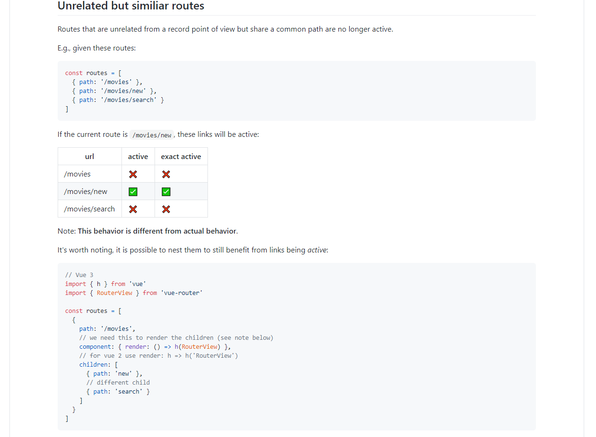
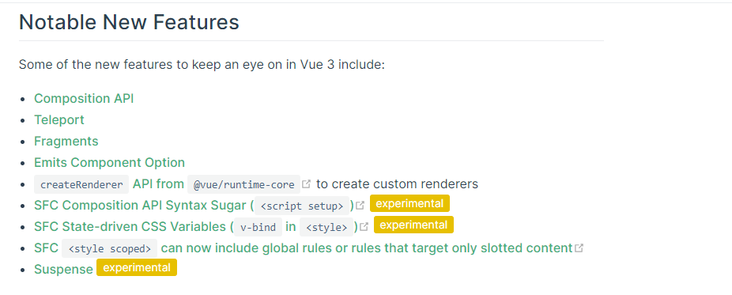

# 项目总结

## 业务总结

#### 01-首页

- mockjs模拟数据+骨架屏+数据懒加载+图片懒加载+轮播图组件

#### 02-分类

- 复选框组件+面包屑组件+无限加载组件

#### 03-商品详情

- 商品图预览组件+**SKU组件**+数量选择组件+按钮组件

#### 04-购物车

- 本地购物车+服务端购物车

#### 05-结算&支付

- 对话框组件 + 支付宝沙箱支付

#### 06-订单管理

- 标签页组件 + 步骤条组件


## VUE 3.0

#### 01-踩过的坑

**问题01：**`currentRoute`已经是`ref`包装的数据类型

```js
/* vue2.0 版本用法 */
router.currentRoute.fullPath
```

```js
/* vue3.0 版本用法 */
router.currentRoute.value.fullPath
```


**问题02：**`<style scoped>` 中  `@keyframes` 动画序列 `vue-cli` 编译后异常   参考[issues](https://github.com/vuejs/vue-loader/issues/1807)

编译前代码：

```css
<style scoped lang="less">
.order-list {
  animation: test 4s infinite;
}
@keyframes test {
  0% {
    opacity: 0;
  }
  100% {
    opacity: 1;
  }
}
</style>
```

编译后代码：

```css
.order-list {
  animation: test-7dc8ef14 4s infinite;
}
@keyframes test-7dc8ef14 {
  0%[7dc8ef14] {
    opacity: 0;
  }
  100%[7dc8ef14] {
    opacity: 1;
  }
}
```

处理方案：

- 第一种：定义为全局样式，注意序列名称，别被覆盖即可。
- 第二种：安装 `@vue/compiler-sfc` 为 `3.0.1` 版本。


**问题03：** `<style scoped vars={color} >`  给style传入变量，开发环境好使，生成环境失败。

编译前代码：

```vue
<script>
export default {
    setup () {
        const color = ref('#000000')
        return { color }
    }
}
</script>
<style scoped vars={color}>
    .box {
        color: var(--color)
    }
</style>
```

`npm run serve`  编译后代码：

```css
element.style {
    --60f10c3c-color: #000000;	
}
.box {
    color: var(--60f10c3c-color)
}
```

`npm run build`  编译后代码：

```css
element.style {
    --60f10c3c-color: #000000;	
}
.box {
    color: var(--color)
}
```


处理方案：

- 第一种：不使用`vars`新特性，自己通过 `:style` 绑定样式。
- 第二种：官方最新特性中已经采用 `v-bind` 在css中使用变量，参考 [RFCS](https://github.com/vuejs/rfcs/blob/style-vars-2/active-rfcs/0000-sfc-style-variables.md)


**问题4：** `vue-router-next` 中 `router-link-active` 的追加条件更加苛刻。

vue2.0 中：

```js
// 路由规则
const routes = [
    {'/orders', component: OrderList},
    {'/orders/:id', component: OrderDetail}
]
```

```vue
<template>
<router-link to="/orders">订单列表</router-link>
<router-view></router-view>
</template>
```

当路由地址是 `/orders/10086` 的时候 `router-link` 解析后会追加 `router-link-acitve` 类名


vue3.0 中：

当路由地址是 `/orders/10086` 的时候 `router-link` 解析后**不会**追加 `router-link-acitve` 类名

参考 [RFCS](https://github.com/vuejs/rfcs/blob/master/active-rfcs/0028-router-active-link.md#unrelated-but-similiar-routes)




#### 02-关注功能

> VUE3.0 值的关注的[新特性](https://v3.vuejs.org/guide/migration/introduction.html#notable-new-features)




